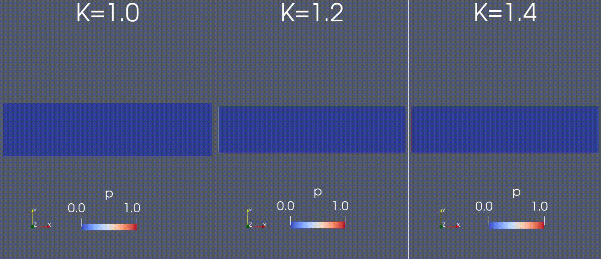

Crystal solidification using phase field modeling
------------------------------------------
### Overview
This code solves the solidification problem based in the famous work by Ryo Kobayashi (1993) [1]. 
The model is based on the Allen-Cahn [2] phase field equation coupled with the transient heat 
equation Though we have covered only the isotropic directional solidification from the paper in the 
results, the same code can be modified and used for other types of solidification problems. Let us 
quickly go through the governing equations and the boundary conditions solved in this problem.

### Problem Definition
@f{align*}{
\tau \frac{\partial p}{\partial t} = \nabla \cdot( \left(\epsilon^2\right)\nabla p) + p(1-p)(p-\frac{1}{2}+m) \label{heateq} \\
\frac{\partial T}{\partial t}=\nabla^2T+K\frac{\partial p}{\partial t}
@f}
where $m(t) = \frac{a}{\pi}\tan^{-1}(\gamma(T_e-T))$

The problem is subjected to the boundary conditions:
@f{align*}{
p(0,y,t)= 1 \\
T(0,y,t)= T_\gamma -\Delta T
@f}
and the initial conditions:
@f{align*}{
p(x,y,0)= 0 \\
T(x,y,0)= T_\gamma -\Delta T
@f}
Here, $\Delta T$ is the degree of undercooling.

### Dendritic Growth
Using this code, we have reproduced one of the study from Koabayashi's work regarding the dendritic 
behaviour during directional solidification. The latent heat parameter 'K' in the equation determines 
the amount of heat released as the phase solidifies. If this value is high enough, we would observe an 
unstable interface between the solid and liquid phase, which would lead to the formation of dendrites 
as shown in these images. To assist this growth we need to add a random perterbation term 
'$a \chi p (1-p)$' to the dynamic term of the phase field equation.

### References
[1]  Kobayashi, R. (1993). Modeling and numerical simulations of dendritic crystal growth. Physica D: Nonlinear Phenomena, 63(3–4), 410–423. https://doi.org/10.1016/0167-2789(93)90120-P

[2] Allen, S. M., & Cahn, J. W. (1979). A microscopic theory for antiphase boundary motion and its application to antiphase domain coarsening. Acta Metallurgica, 27(6), 1085–1095. https://doi.org/10.1016/0001-6160(79)90196-2
