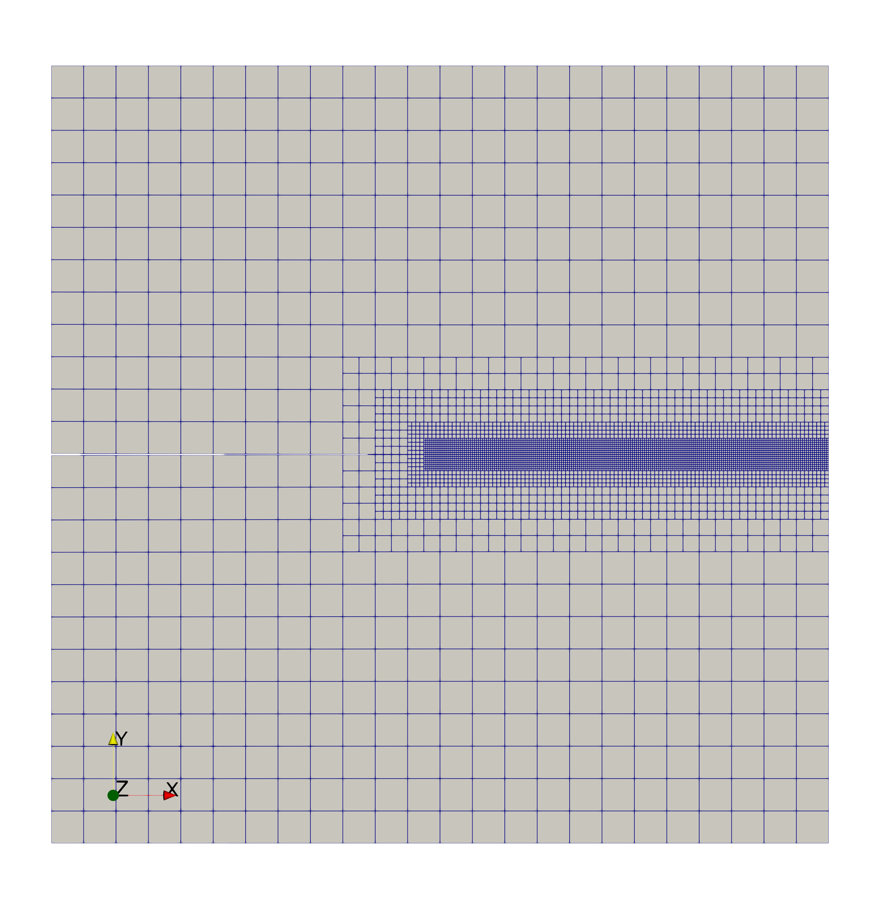
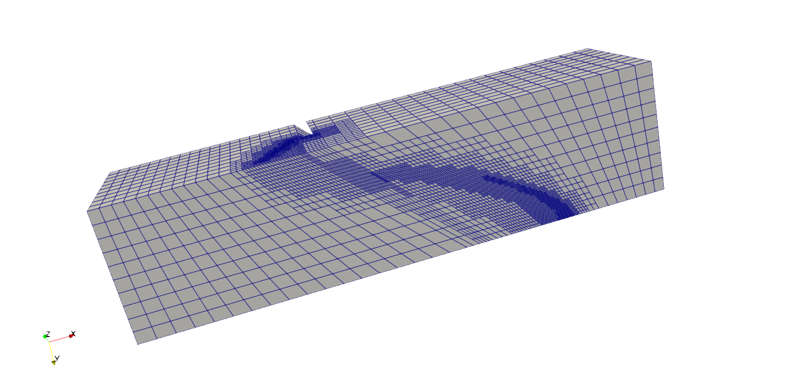
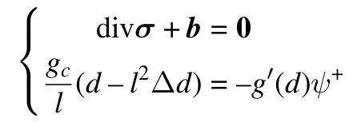

## Phasefield L-BFGS monolithic solver
A monolithic solver based on the limited-memory BFGS (L-BFGS) method for phase-field fracture simulations.

### Purpose
This repository provides the source code and the input files for the numerical examples used in the paper titled “A novel phase-field monolithic scheme for brittle crack propagation based on the limited-memory BFGS method with adaptive mesh refinement”. The L-BFGS monolithic solver has the following features:
1. It uses the limited-memory BFGS (L-BFGS) method to overcome the non-convexity of the total energy functional of the phase-field fracture formulation.
2. It uses the history variable (the maximum of the positive strain energy in history) approach to enforce the phase-field irreversibility.
3. It adopts an adaptive mesh refinement technique to reduce computational cost.
4. It works for both 2D and 3D phase-field fracture simulations.

### Content
The repository contains the following content:
1. the source code of the L-BFGS method for the phase-field monolithic solver.
2. the input files for several 2D and 3D phase-field fracture simulations included in the aforementioned manuscript.

### Latest update:
1. (Sept. 10th, 2025) Add a compiler macro so that the code works for the older version of deal.ii due to the interface change of the function `interpolate()` in the `SolutionTransfer` class.
2. (Sept. 1st, 2025) Add a new gradient-based line search method. Comparing with the previously implemented Strong Wolfe line search, the new line search method could reduce the wall-clock time by 30 to 50 percent.

### Representative results
A series of widely adopted phase-field crack benchmark problems are included in this code. Here are some examples:
1. Simple tension test (pre-refined mesh):
<p align="center">

</p>
2. Simple shear test (adpatively refined mesh):
<p align="center">

</p>
3. 3D torsion test (adpatively refined mesh):
<p align="center">

</p>

### Phase-field model adopted in this work
The phase-field fracture approach aims to minimize the following energy functional:
<p align="center">

</p>
where the approximated crack surface is defined as
<p align="center">

</p>
the strain energy density function is based on the isotropic linear elasticity and the additive decomposition
<p align="center">

</p>
and the phase-field degradation function adopts the following qudratic form
<p align="center">

</p>

Using the divergence theorem and the technique of integration by parts, the corresponding Euler-Lagrange equations are written as
<p align="center">

</p>
In the actual implementation, however, the governing equations of the cracked solid system are modified as
<p align="center">

</p>
where a viscosity regularization term is introduced to stabilize the numerical treatment. Even though this regularization term might not be necessary, we still include it in the formulation for flexibility. This term can always be turned off by setting the viscosity coefficient as zero. Among various approaches to enforce the phase-field irreversibility, the approach based on the history variable of the positive strain energy is adopted due to its relative simplicity,
<p align="center">

</p>

### Main idea of the limited-memory BFGS (L-BFGS) solver
The classical BFGS method (a type of quasi-Newton method) involves the following approximate Hessian matrix update during each iteration:
<p align="center">

</p>

**The problem of this update in the context of finite element simulations is that the second term and the third term both generate a fully dense matrix of n by n needs to be stored, where n represents the number of degrees of freedom.** The above Hessian matrix update is too restrictive even for a mid-size finite element problem due to the required memory for the storage of the fully dense matrix. This limitation motivated this work to introduce the limited-memory feature for the phase-field crack simulations. The limited-memory BFGS method implemented in this work follows the algorithm represented in Chapter 7.2 (page 176) of the following textbook by *Nocedal J, Wright SJ. Numerical optimization (2nd edition). Springer New York, NY, 2006*.

### How to compile
The L-BFGS finite element procedure is implemented in [deal.II](https://www.dealii.org/) (originally with version 9.4.0 and also works for 9.5.1, it is also tested with the develop branch as Sept. 10th, 2025). In order to use the code (**main.cc**) provided here, deal.II should be configured with MPI and at least with the interfaces to BLAS, LAPACK, Threading Building Blocks (TBB), and UMFPACK. For optional interfaces to other software packages, see https://www.dealii.org/developer/readme.html.

Once the deal.II library is compiled, for instance, to "~/dealii-dev/bin/", follow the steps listed below:
1. cmake -DDEAL_II_DIR=~/dealii-dev/bin/  .
2. make debug or make release
3. make

### How to run
1. Go into one of the examples folders.
2. For instance, to run a 2D test case: go into examples/simple_tension_test/
3. Run via ./../../main 2
4. For instance, to run a 3D test case: go into examples/3D_torsion/
5. Run via ./../../main 3

### How to expand this code
If you want to use the current code to solve new 2D or 3D phase-field crack problems, you need to do the following:
1. Add a new mesh under the function `void make_grid()`.
2. Add the boundary conditions for your new mesh in the function `void make_constraints(const unsigned int it_nr)`.
3. Modify the text file `timeDataFile` for the load/time step sizes and the text file `materialDataFile` for the material properties.
4. Modify the input file `parameters.prm` accordingly.

If you want to use a new phase-field degradation function (the current code uses the standard quadratic degradation function), you can modify the following functions `double degradation_function(const double d)`, `double degradation_function_derivative(const double d)`, and `double degradation_function_2nd_order_derivative(const double d)`.

If you want to modify the phase-field model completely but still use the L-BFGS monolithic solver, you need to modify the calculations of the initial BFGS matrix
```
void assemble_system_B0_one_cell(
      const typename DoFHandler<dim>::active_cell_iterator &cell,
      ScratchData_ASM &                                     scratch,
      PerTaskData_ASM &                                     data) const;
```
and the residuals
```
void assemble_system_rhs_BFGS_one_cell(
      const typename DoFHandler<dim>::active_cell_iterator &cell,
      ScratchData_ASM_RHS_BFGS &                           scratch,
      PerTaskData_ASM_RHS_BFGS &                           data) const;
```

### How to cite this work:
Jin T, Li Z, Chen K. A novel phase-field monolithic scheme for brittle crack propagation based on the limited-memory BFGS method with adaptive mesh refinement. Int J Numer Methods Eng. 2024;e7572. doi: 10.1002/nme.7572
```
@Article{2024:jin.li.ea:novel,
  author  = {Jin, Tao and Li, Zhao and Chen, Kuiying},
  title   = {A novel phase-field monolithic scheme for brittle crack propagation based on the limited-memory BFGS method with adaptive mesh refinement},
  journal = {International Journal for Numerical Methods in Engineering},
  year    = 2024,
  volume  = 125,
  number  = 22,
  pages   = {e7572},
  month   = nov,
  issn    = {1097-0207},
  url     = {https://onlinelibrary.wiley.com/doi/10.1002/nme.7572},
  doi     = {10.1002/nme.7572},
  publisher = {Wiley}
}
```
