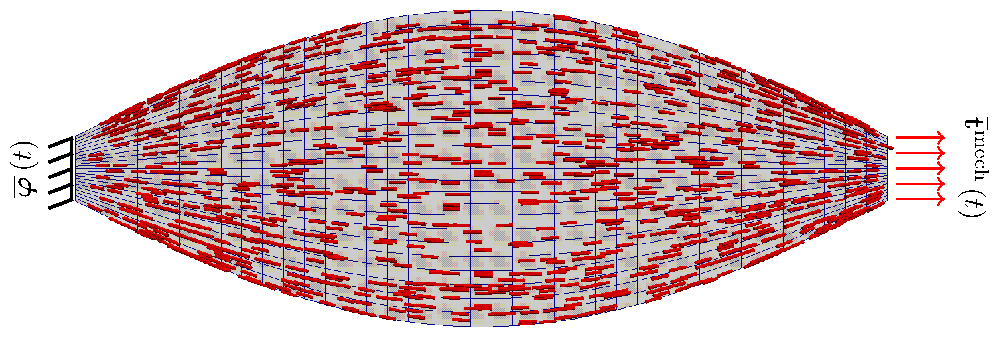
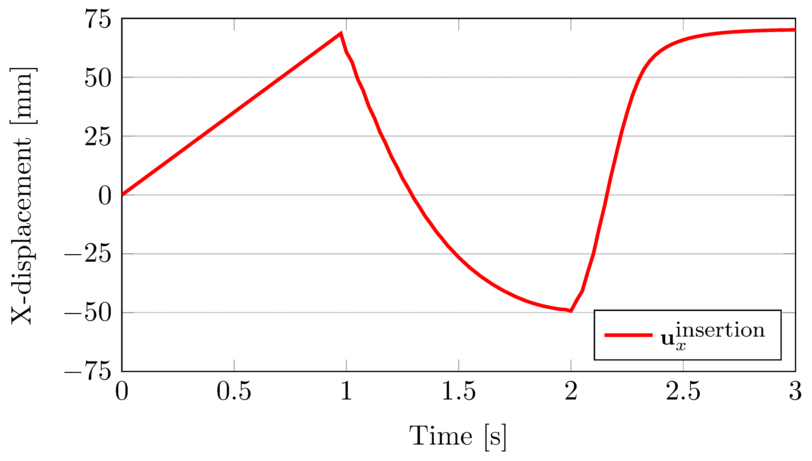
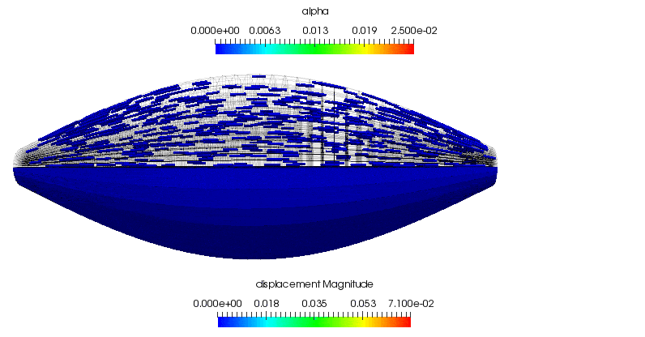
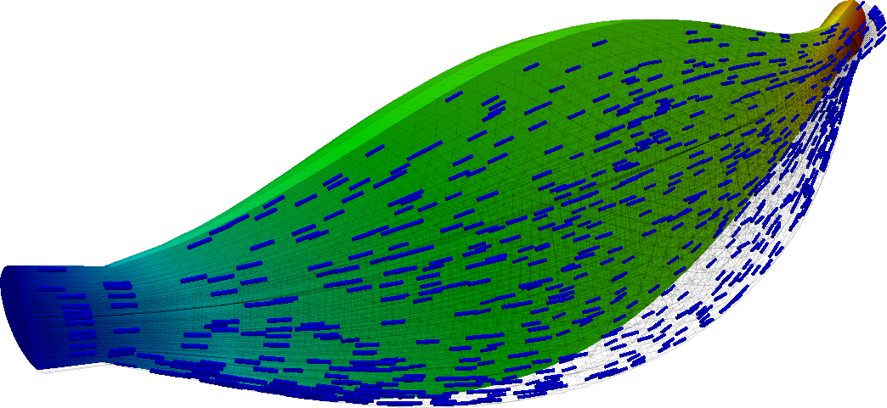
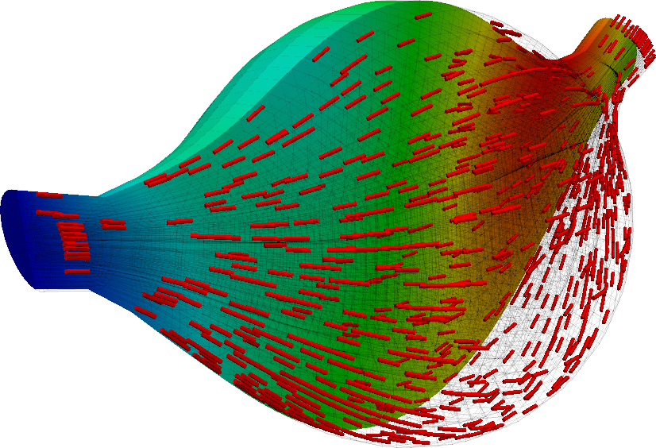

## Overview
The complex interaction of muscles with their surrounding anatomy and
environment plays a vital role in the many activities that are required for
animals to live and survive.
Skeletal muscle composes a large portion of that musculo-skeletal
system, and is controlled by the central nervous system in a conscious or
unconscious manner.
For humans in particular, the construction of- and control mechanisms behind
skeletal muscle allows us to accomplish complex tasks ranging from those
that are physically exerting to those that are delicate and require great
dexterity.

As an introduction into the biomechanics of the human muscular system, we
combine a well known load-activation pattern taken from well established
literature on the topic (both in the fields of human physiology and the
computational simulation thereof) with an idealised model of a part of the
human anatomy that most can easily identify with, namely the biceps brachii.

### An idealised model of the human biceps brachii
To tackle this problem, we do not deviate particularly far from the approach
that is comprehensively documented in `step-8`.
The primary differences between this code-gallery example and the tutorial
is the alteration of the geometry and boundary conditions that accompany it,
as well as the extension of the constitutive law to include the transversely
isotropic active muscle model.
We thus present both the theory and associated nomenclature (which is
mimicked in the code itself) in the
[accompanying document.](./doc/theory/theory-linear_elastic_active_muscle_model.pdf)
There you can observe the additional contributions to both the left- and
right-hand sides of the linear system due to the integration of the
rate-dependent, linearised muscle model.
Although such linear model models are valid only under conditions of small
deformations, in this scenario we will (with a healthy dose of skepticism)
make a very coarse-grained first approximation of the muscles behaviour in
the large deformation regime.

The basic problem configuration, including a depiction of the underlying
muscle microstructural orientation, is (loosely) summarised in the following
image.

Note that the driver for the deformation of the muscle tissue are the applied
traction alone when the muscle is in a passive state.
However, during active contraction, as governed by the prescribed input
neural signal, the muscle works against the applied traction.
This condition, where the traction applied to a muscle is constant during
periods of muscle activation, is known as isotonic contraction.
More specifically, since overall the muscle shortens during contraction we
are in fact modelling concentric contraction of the biceps.

As for the specific geometry of the problem, we consider an idealised human
biceps with a length of `250mm`, insertion and origin diameter of `20mm` and
a diameter of `80mm` at its mid-point.
We assume that there exists a single muscle fibre family orientated axially.
The orientation of the underlying muscle fibres is, however, not parallel,
but rather follows the curvature of the macroscopic anatomy.
The longitudinal profile of the muscle is generated using a trignometric
function, as opposed to being extracted from medical images.
The benefit to doing so is that the geometry can be (parametrically) created
in `deal.II` itself and the associated microstructural orientation can be
directly linked to the user-defined geometry.

## Requirements
* Version `8.5` or greater of `deal.II`

There are no other requirements with regards to the third-party packages that
`deal.II` can link to.


## Compiling and running
Similar to the example programs, run
```
cmake -DDEAL_II_DIR=/path/to/deal.II .
```
in this directory to configure the problem.  
You can switch between debug and release mode by calling either
```
make debug
```
or
```
make release
```
The problem may then be run with
```
make run
```

Some simulation parameters may be changed by adjusting the `parameters.prm`
file.
Notably, its possible to switch between the model of the biceps and the
reduced geometry used to reproduce the linearised counterpart of the isotonic
contraction numerical experiments conducted by Martins.


## Recommended Literature
* Kajee, Y. and Pelteret, J-P. V. and Reddy, B. D. (2013),
The biomechanics of the human tongue.
International Journal for Numerical Methods in Biomedical Engineering
29 , 4, 492-514.
DOI: [10.1002/cnm.2531](http://doi.org/10.1002/cnm.2531);

* J-P. V. Pelteret, A computational neuromuscular model of the human upper airway with application to the study of obstructive sleep apnoea. PhD Thesis, University of Cape Town, 2013. [http://hdl.handle.net/11427/9519](http://hdl.handle.net/11427/9519);

* Martins, J. A. C. and Pires, E. B. and Salvado, R. and Dinis, P. B. (1998),
A numerical model of passive and active behaviour of skeletal muscles.
Computer Methods in Applied Mechanics and Engineering
151 , 419-433.
DOI: [10.1016/S0045-7825(97)00162-X](http://doi.org/10.1016/S0045-7825(97)00162-X);

* Martins, J. A. C. and Pato, M. P. M. and Pires, E. B. (2006),
A finite element model of skeletal muscles. Virtual and Physical Prototyping
1 , 159-170.
DOI: [10.1080/17452750601040626](http://doi.org/10.1080/17452750601040626);

* Pandy, M. G. and Zajac, F. E. and Sim, E. and Levine, W. S. (1990),
An optimal control model for maximum-height human jumping.
Journal of Biomechanics
23 , 1185-1198.
DOI: [10.1016/0021-9290(90)90376-E](http://doi.org/10.1016/0021-9290(90)90376-E);

* T.J.R. Hughes (2000),
The Finite Element Method: Linear Static and Dynamic Finite Element Analysis, Dover.
ISBN: [978-0486411811](http://store.doverpublications.com/0486411818.html)


## Results
The displacement of the central point on the insertion surface (i.e. the
traction boundary) is plotted against the simulation time when the muscle
is made to undergo concentric contraction.
Within the first second, when the muscle is completely passive, the
displacement increases linearly due to the applied pressure that ramps to a
maximum over this duration.
This response is not entirely unsurprising for this geometrically symmetric,
linear elastic body.
When the muscle is activated, it shortens considerably until during the `1s`
for which the neural signal is applied.
The activation level increases exponentially until is saturates near the
`2s` mark.
At this point the neural signal is removed and the muscle starts to relax.
The contractile level decreases exponentially and the muscle is nearly
completely relaxed by the end of the simulation.


As a supplement to the above, the following animation shows the concentric
contraction (under the assumption that it experiences no additional
gravitational loading is present).
All of the highlights that are discussed above can be observed in the
gross displacement of the body, as well as the activation level that is
visualised through the depiction of the underlying microstructure directions.
This also shows how the muscle's cross-section influences the shortening
along the length of the muscle.



### Influence of gravity
Just for fun, we can repeat the above experiment with a fraction of the full
gravitational loading applied in the transverse direction.
We apply only a fraction of the full load because the muscle is not sufficiently
well constrained and does not see the support of its surrounding anatomy.
The loading condition is thus somewhat unphysical and, due to the lack of
constraint, the application of the full load results in excessive deformation.

Here we see the fully passive muscle with partial gravitational loading and a
full traction load

and its counterpart solution when in the active stage.

The asymmetry of the solution is clearly observed, although the length change
that it exhibits curing the concentric contraction cycle remains somewhat
similar to that demonstrated before.
