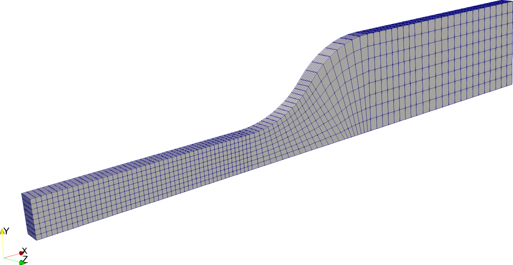
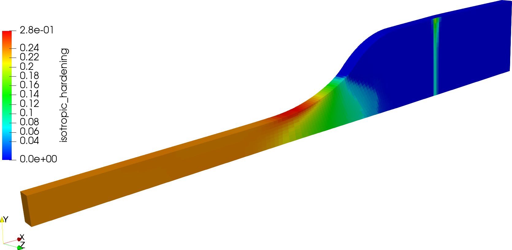
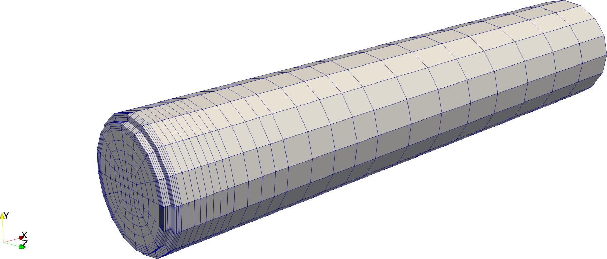
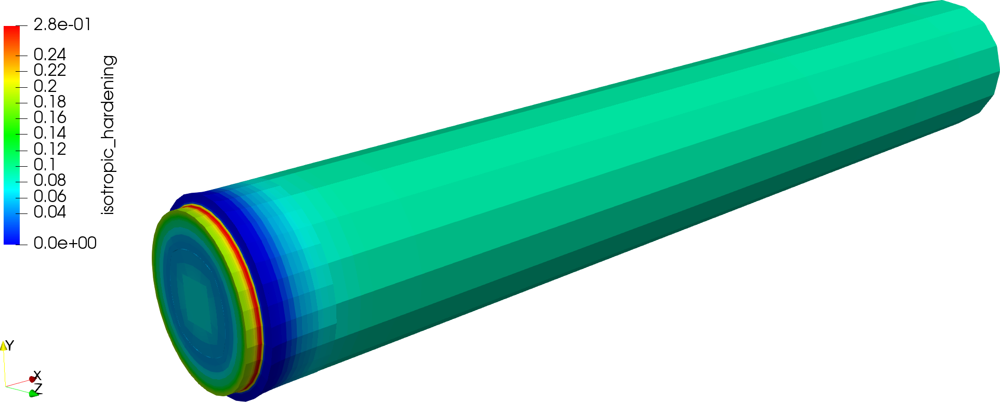

## Overview
There are some well-established experimental procedures that are commonly employed to investigate the plastic reponse of metals and similar materials. They are typically setup such that the stress and strain field in a region of the domain is predictable, which means that (i) the experiments are reliable and reproducable, and (ii) that can be more easily correlated to microstructural studies and numerical simulations, or vice versa. This is particularly useful when the materials exhibit complex constitutive responses (such as anisotropic plastic behaviour, or viscoplastic behaviour), as a well defined set of experiments can be used to understand the nature of the material response on both the macroscopic and microscopic levels.

In this code we have implemented basic linear elasticity with linear isotropic hardening. Although this is a very simple model of plasticity, it is useful as a stepping-stone to fortify one's understanding of the steps necessary to implement more elaborate models. The constiutive model(s) are used to examine the behaviour of two geometries, namely a notched cylindrical specimen and a tensile specimen that conforms to a certified standard.

## Theory
The theory of linear elastoplasticity, starting from the absolute fundamentals moving all the way to the numerical model, involved several distinct topic that deserve thorough explanation. This includes:
* the governing equations of quasi-static elasticity,
* a generalised continuum framework for elastoplasticity,
* constiutive laws for elasticity and elastoplasticity with linear isotropic hardening (including the derivation of the elastoplastic tangent modulus in the continuous setting),
* time integration algorithms for elasto-plasticity (leading to the time-discrete setting and algorithmically correct elastoplastic tangent modulus), and finally
* the finite element discretisation itself.
Since its easier to do so, we have provided a [summary of the fundamental theory](./doc/theory/theory-linear_elastoplasticity.pdf) in the supplied PDF document. Unfortunately, though, the reader will have to satisfied with a marginally condensed (bullet point) form of the elastoplastic framework, constitutive laws and integration algorithms.

## Recommended Literature
* J. C. Simo, and T. J. R. Hughes (2000), Computational Inelasticity. Springer Science & Business Media. ISBN: 978-0-387-97520-7. DOI: [10.1007/b98904](http://doi.org/10.1007/b98904)
* O. C. Zienkiewicz and R. L. Taylor (2005), The finite element method for solid and structural mechanics. Butterworth-Heinemann. ISBN: 978-1-85617-634-7. DOI: [10.1016/C2009-0-26332-X](https://doi.org/10.1016/C2009-0-26332-X)
* B. D. Reddy  (2016) Theoretical and Numerical Elastoplasticity. In: J. Schroeder, P. Wriggers (eds) Advanced Finite Element Technologies. CISM International Centre for Mechanical Sciences (Courses and Lectures), vol 566, pp 177-194. Springer, Cham.  ISBN: 978-3-319-31923-0. DOI: [10.1007/978-3-319-31925-4_7](https://doi.org/10.1007/978-3-319-31925-4_7)

## Compiling and running
Similar to the example programs, run
```
cmake -DDEAL_II_DIR=/path/to/deal.II .
```
in this directory to configure the problem.  
You can switch between debug and release mode by calling either
```
make debug
```
or
```
make release
```
The problem may then be run with
```
make run
```

## Problem setup and results
In this code we have two toy test cases set up to demonstrate either purely elastic (fully recoverable) material behaviour or elastoplasticity (dissipative) with linear isotropic hardening.
The constitutive parameters are entirely fictitious, and were chosen such that plastic flow would be easily observed in both cases.

### Tensile specimen
In the first example, we investigate plastic behaviour of a dumbbell-shaped tensile specimen, which is dimensioned according the DIN 53504 type S3 specification. The supplied geometry is shown in the figure below.

Due to the symmetry of the geometry, only one-eigth of the geometry need be modelled.
Naturally, the cut planes around which the model is reflected must be treated as symmetry boundary conditions. Note that we also attach manifolds to the curved surface in order to maintain the accuracy of the geometry upon refinement.

These specimens are typically clamped in a tensile test machine, and stretched according to some experimental protocol. Accordingly, a portion of the wider surface of the specimen has a prescribed displacement in the axial direction (aligned with the X-Cartesian basis vector), while the out of plane displacement over the same subregion of the boundary is not permitted. The second condition is a rudimentary approximation to the real physical conditions, as the thickness of the specimen would change during clamping and during the course of the experiment itself.

The next figure shows the geometry after it is lengthened by 20%. The plotted contours depict the local values of the isotropic hardening variable, which is an indicator of how much (non-recoverable) plastic flow has occured.

There are three regions where distinct and interesting behaviour may be noted. The first is the thin part of the specimen, where necking occurs. The strain in this region is nearly constant (which is precisely the intention of the design of the specimen); this leads to near uniform plastic flow in this region, which is ideal for experimental observations. The second interesting region is where the specimen starts to thicken. The change in curvature of the geometry causes a slight stress concentration in this location, leading to increased plastic flow. Again, by design this occurs out of the region of experimental observation. The third place where plastic flow is observed is near the clamped surface. This is a numerical artefact caused by the simplified boundary conditions. In reality, the thickness of the sample would reduce here and the amount of out-of-plane deformation would be less than that predicted here.

### Notched cylinder
In the second example we model cylindrical specimen that is also placed in tension. However, a defect in the form of a notch is introduced into the specimen, with the idea that this will induce a localised stress concentration that will, in turn, lead to plastic flow.
The geometry is shown below; we may again apply symmetry arguments to reduce the size of the problem to be modelled. In this case (for which the geometry is created inside `deal.II`), we model only a half of the specimen. With a little effort, this could also be reduced to a one-eigth model.


Like before, the specimen is stretched along its axis such that its overall length increases by 20%. 
As anticipated, there is indeed a significant amount of plastic flow at the reentrant corner of the notch where the stress concentration is predicted to be.

We also observe that the majority of the specimen is predicted to undergo some plastic flow, although the larger-radius section adjacent to the notch undergoes no plastic deformation. This could be a real phenomenon, but could also be an experimental artefact. Due to the refinement strategy chosen for this case, the mesh around the notch is more refined than in the bulk of the specimen. This means that the boundary of the bulk geometry is captured with differing accuracy as one looks towards the notch, and may artifically be inducing some non-uniform stress response.Further investigation and mesh refinement studies could render the answer to this outstanding question.

## Future work / possibilities for extension
* Implement and investigate other hardening rules, such as kinematic hardening and anisotropic hardening.
* Many materials also exhibit rate-dependent responses, so using an elasto-viscoplastic constitutive law might be more appropriate in those cases.
* Due to the large deformation, it may be necessary to extend this model from the linear response regimen to one that incorporates the effects of geometric stiffening, i.e. finite strain elasto-plasticity.