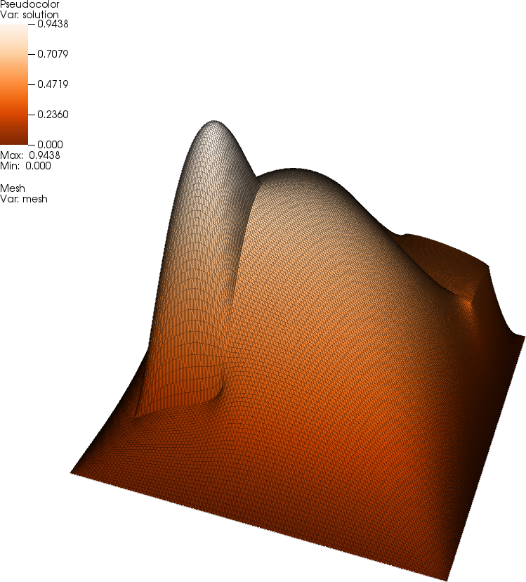
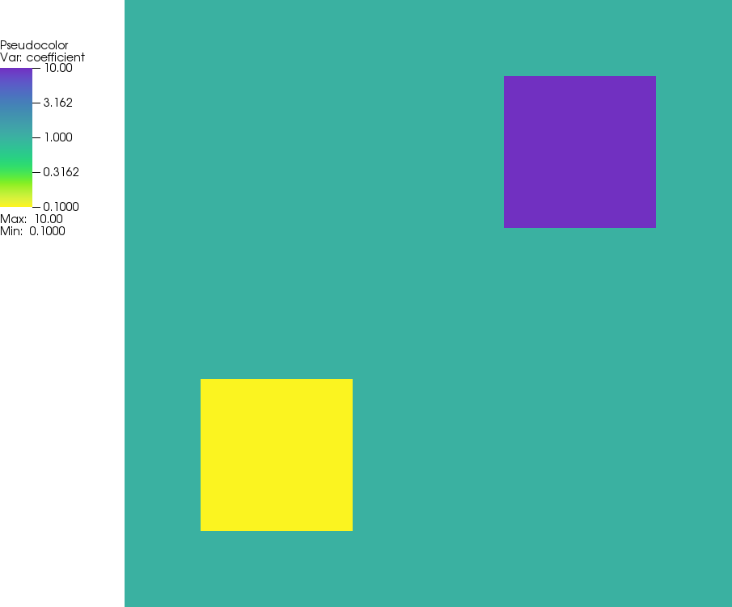

Readme file for MCMC-Laplace
============================

@note The intent and implementation of this program is extensively
  described in D. Aristoff and W. Bangerth: "A benchmark for the Bayesian
  inversion of coefficients in partial differential equations",
  submitted, 2021. A preprint can be found
  [here](https://arxiv.org/abs/2102.07263). See there for more information.

Motivation for project
----------------------

Inverse problems are problems in which one (typically) wants to infer
something about the internal properties of a body by measuring how it
reacts to an external stimulus. An example would be that you want to
determine the stiffness parameters of a membrane by applying an
external force to it and measuring how it deforms. A more complicated
inverse problem is determining the three-dimensional make-up of the
Earth by measuring the time it takes for seismic waves to travel
from the source of an Earthquake to far-away detectors. Most
biomedical imaging techniques are also inverse problems.

The traditional approach to inverse problems is to ask the question
which hypothesized make-up of the body would result in predicted
reactions that are "closest" to the measured one. This formulation of
the problem is what is now generally called the "deterministic inverse
problem", and it is an optimization problem: Among all possible
make-ups of the body, find the one which *minimizes* the difference between
predicted measurements and actual measurements.

Since the late 1990s, a second paradigm for the formulation has come
into play: "Bayesian inverse problems". It rests on the observation
that our measurements are not exact but rather that certain values are
just more or less likely to show up on the dial of the instrument we
measure with. For example, if a device measures the
deformation of a membrane as 2.85 cm, and if we know that the measuring
device has a Gaussian-distributed uncertainty with standard deviation
0.05 cm, then the Bayesian inverse problem asks for finding a probability
distribution among all of the make-ups of the body so that the
predicted measurements have the observed distribution of a Gaussian
with mean 2.85 cm and standard deviation 0.05 cm.

To make things more concrete, let us denote the parameters that
describe the internal make-up of the membrane as the vector $\mathbf
a$, and the measured deflections at a set of measurement points as
$\mathbf z$. Assume that we have measured a set of values $\hat
{\mathbf z}$,
and that we know that each of these measurements is normal distributed
with standard deviation $\sigma$, i.e., that the "real" values are
$\mathbf z \sim N(\hat {\mathbf z}, \sigma I)$ -- i.e., normally
distributed with mean $\hat {\mathbf z}$ and covariance matrix $\sigma
I$.

Let us further assume that for each set of parameters $\mathbf a$, we
can predict measurements $\mathbf z=\mathbf F(\mathbf a)$ with some
function $\mathbf F(\cdot)$ that in general will involve solving a
partial differential equation with known external applied force and
given trial coefficients $\mathbf a$. What we are interested in is
what the probability distribution $\pi(\mathbf a)$ is so that the
corresponding $\pi(\mathbf z)=\pi(\mathbf F(\mathbf a))=N(\hat{\mathbf
z},\sigma I)$. This problem can, in general, not be solved exactly
because we only know $\mathbf F$, the parameters-to-measurements map
that can be evaluated by solving the PDE and then evaluating the
solution at individual points, but not the inverse of $\mathbf
F$. But, it is possible to *sample* from the distribution $\pi(\mathbf
a)$ using Monte Carlo Markov Chain (MCMC) methods.

This is what this program does, in essence. The formulation of the
problem is marginally more complicated than outlined above, also
taking into account a prior distribution that describes some
assumptions we may have on the parameter. But in essence, this is what
we are doing:

- There is a Metropolis-Hastings that implements a Markov Chain to
  sample from $\pi(\mathbf a)$. The Markov chain that results from
  this is then a (very long) sequence of samples $\mathbf a_1, \mathbf
  a_2, \ldots$ that are written to a (potentially very large) output
  file. If you don't know what a Metropolis-Hastings sampler is, or
  how a sequence of samples approximates a probability distribution,
  then you will probably want to take a look at the Wikipedia pages
  for
  [Markov Chain Monte
  Carlo](https://en.wikipedia.org/wiki/Markov_chain_Monte_Carlo)
  methods and for the
  [Metropolis-Hastings
  algorithm](https://en.wikipedia.org/wiki/Metropolis%E2%80%93Hastings_algorithm).

- As part of the sampling process, we need to solve the PDE that
  describes the physical system here.

- The remainder of the program is devoted to the description of the
  distribution $\pi(\mathbf z)$ we provide as input, as well as a
  number of other pieces of information that enter into the definition
  of what exactly the Metropolis-Hastings sampler does here.

@note This program computes samples the brute force way. We want to
  compute billions of samples using a simple algorithm because we want
  a benchmark that smarter algorithms can be tested again. The point
  isn't that the Metropolis-Hastings algorithm as implemented here
  (using, in particular, an isotropic proposal distribution) is the
  sharpest tool in the shed -- it isn't -- but that it is reliable and
  robust. We want to see what it converges to, and how fast, so that
  we can test better sampling methods against this baseline.


More detailed properties of the code in MCMC-Laplace
----------------------------------------------------

To be concise, the problem we are considering is the following: We are
assuming that the membrane we are deforming through an external force
is a square with edge length 1 (i.e., the domain is
$\Omega=(0,1)^2$) and that it is made up of $8\times 8$ smaller
squares each of which has a constant stiffness $a_k,
k=0,\ldots,63$. In other words, we would like to find the vector
$\mathbf a=(a_0,\ldots,a_{63})^T$ for which the predicted deformation
matches our measurements $\hat{\mathbf z}$ in the sense discussed
above.

The model of deformation we consider is the Poisson equation with a
non-constant coefficient:
@f{align*}{
  -\nabla \cdot (a(\mathbf x) \nabla u(\mathbf x) &= f(\mathbf x)
  \qquad\qquad &&\text{in}\ \Omega,
  \\
  u(\mathbf x) &= 0
  \qquad\qquad &&\text{on}\ \partial\Omega.
@f}
Here, the spatially variable coefficient $a(\mathbf x)$ corresponds to
the 64 values in $\mathbf a$ by mapping the elements of $\mathbf a$ to
regions of the mesh. We choose $f=10$, which results in a solution
that is approximately equal to one at its maximum. The following
picture shows this solution $u$:

The coefficient values that correspond to this solution (the "exact"
coefficient from which the measurements $\hat{\mathbf z}$ were
generated) looks as follows:


For every given coefficient $\mathbf a$, the corresponding measurement
values $z_i, i=0,\ldots,168$ are then obtained by evaluating the
solution $u$ on a $13\times 13$ grid of equidistance points $\mathbf
x_i$.

You will find these concepts mapped into the code as part of the
`PoissonSolver` class. Of particular interest may be the fact that the
computation of $\mathbf z$ by evaluating $u$ at individual points is a
linear operation, and consequently can be represented using a matrix
applied to the solution vector. (In the code, this corresponds to the
`PoissonSolver::measurement_matrix` member variable.) Furthermore, we
make the assumption that the mesh used in solving the PDE is at least
as fine as the $8\times 8$ mesh used to represent the coefficient
$\mathbf a$ we would like to infer; then, the coefficient is constant
on each cell, and we can get the value of the coefficient on a given
cell by looking up the corresponding value of the element of the
vector $\mathbf a$. We store the index of this vector element in the
`user_index` property that deal.II provides for each cell, and set
this connection up in `PoissonSolver::setup_system()`.

The only other part worth discussing about this program is that it is
set up for *speed*. This program implementing a benchmark, we are
interested generating as many samples as possible -- the paper
mentioned at the top of this page shows data obtained from more than
$10^{10}$ samples. To compute this many samples, solving the PDE
cannot take too long or we would never finish the paper. The question
then is how, given a set of coefficients $\mathbf a$, we can assemble
and solve the linear systems for the Poisson equation as quickly as
possible. In the current program, this is done using the observation
that the local contribution to the global matrix is simply a matrix
that is the same for every cell (because we are using a mesh in which
every cell looks the same) times the coefficient for the current
cell. This is because we know that the coefficient is constant on
every cell, as discussed above. As a consequence, we compute the local
matrix (with a unit coefficient) only once, in
`PoissonProblem::setup_system()`, using the very first cell. We do the
same with the local right hand side vector, which is again the same
for every cell because the right hand side function is constant.

During assembly of the linear system, we then only need to recall
these local matrix and right hand side contributions, multiply the
local matrix by the coefficient of the current cell, and then copy
everything into the global matrix as usual.


To run the code
---------------

After running `cmake` and compiling via `make` (or, if you have used
the `-G ...` option of `cmake`, compiling the program via your
favorite integrated development environment), you can run the
executable by either just saying `make run` or using `./mcmc-laplace`
on the command line. The default is to compile in "debug mode"; you
can switch to "release mode" by saying `make release` and then
compiling everything again.

The program as is will run in around 40 seconds on a current machine
at the time of writing this program when compiled in release
mode. This is in the test mode that is the default setting selected in
the `main()` function, and it produces 10,000 samples. This is enough
to get an idea of what the program does. For real simulations, such as
those discussed in the paper referenced at the top, one of course
wants to have many many more samples; if you select `testing = false`
at the top of `main()`, the program will create
250*60*60*24*30=648,000,000 samples, which will take around a month to
run in release mode. That may be more than you've bargained for, but
you can always terminate the program, or just select a smaller number
of samples at the bottom of `main()`.

When not in testing mode, the program initializes all random number
generators that are part of the Metropolis-Hastins algorithms with a
seed that is created using the
[`std::random_device()`](https://en.cppreference.com/w/cpp/numeric/random/random_device)
function, a function that uses the operating system to create a seed
that may take into account the current time, the amount of data
written to disk over the past hour, the amount of internet traffic
that has gone through the machine in the last hour, and similar pieces
of pretty much random information. As a consequence, the seed is then
pretty much guaranteed to be different from program invokation to
program invokation, and consequently we will get different random
number sequences every time. The output file is tagged with a string
representation of this random seed, so that it is safe to run the same
program multiple times at the same time in the same directory, with
each running program writing a different sequence of samples into
separate files.

The end result of the program is a file that contains the
samples. Each line has 66 entries:
- The first entry is the logarithm of the (non-normalized) posterior
  probability of the sample; because the posterior is only known up to
  a normalization constant, the absolute value is not relevant, but
  the relative values of different samples are informative.
- The second entry is the number of samples accepted up to this
  point. By counting how many lines one is into a given file (i.e.,
  counting the total number of samples up to this point), this number
  is useful to compute the acceptance rate of the Metropolis-Hastings
  algorithm.
- The remaining 64 numbers are the entries of the current sample
  vector.


Testing modifications and alternative implementations
-----------------------------------------------------

In order to verify that modifications made to this code are correct,
or that alternative implementations of the benchmark in other programming
languages produce the expected results, it is useful to have known outputs
for certain inputs. To this end, the `testing/` directory contains ten
files with 64-dimensional input vectors: Each of the files `testing/input.X.txt`
contains a vector of coefficients (_theta_) for which the corresponding
`testing/output.X.z.txt` contains the corresponding output at the evaluation
points (the _z_ vector that corresponds to the _theta_ vector, as described 
in the paper linked to at the very top of this page). Furthermore, the
`testing/output.X.likelihood.txt` file contains the corresponding likelihood 
value for this _theta_ vector that can be computed from the _z_ vector, and
the `testing/output.X.prior.txt` file contains the prior associated with
this _theta_ vector. The values in these last two files are not normalized,
and so care must be taken when comparing these values between implementations:
An implementation (or a patched version of this program) may compute a different
value, but the ratio of the values between different inputs must be the
same -- in other words, the outputs must be like the ones stored in these
files *up to a constant* for an implementation to be correct.

The ten inputs are chosen as follows:

* The `testing/input.0.txt` file corresponds to a 64-dimensional vector of
  all ones.
* The `testing/input.1.txt` file corresponds to a 64-dimensional vector of
  coefficients _theta_ that are all equal to 10. This implies a membrane
  that is ten times as stiff as the one in the first input file, and consequently
  the outputs (the _z_ values) must all be exactly one tenth of the ones
  for the first input file.
* The `testing/input.2.txt` file corresponds to a 64-dimensional vector of
  values that are increasing in integer steps from 1 to 64.
* The remaining input files all have 64-dimensional vectors with random
  entries that were chosen as _10^x_ where _x_ is a randomly distributed
  number between -1 and 1. In other words, the entries of the vectors stored
  in these remaining seven input files are all between 0.1 and 10. (Note that
  this choice of randomly generated numbers _does not_ correspond to drawing
  from the prior probability distribution used in this program and discussed
  in the paper. However, for the purposes of testing, this is of course also
  not necessary.)

The stored output files were generated with the reference implementation of
the solver by replacing the `main()` function with the following code:
```
int main()
{
  const Vector<double> exact_solution(
    {   0.06076511762259369, 0.09601910120848481,
        0.1238852517838584,  0.1495184117375201,
        0.1841596127549784,  0.2174525028261122,
        0.2250996160898698,  0.2197954769002993,
        0.2074695698370926,  0.1889996477663016,
        0.1632722532153726,  0.1276782480038186,
        0.07711845915789312, 0.09601910120848552,
        0.2000589533367983,  0.3385592591951766,
        0.3934300024647806,  0.4040223892461541,
        0.4122329537843092,  0.4100480091545554,
        0.3949151637189968,  0.3697873264791232,
        0.33401826235924,    0.2850397806663382,
        0.2184260032478671,  0.1271121156350957,
        0.1238852517838611,  0.3385592591951819,
        0.7119285162766475,  0.8175712861756428,
        0.6836254116578105,  0.5779452419831157,
        0.5555615956136897,  0.5285181561736719,
        0.491439702849224,   0.4409367494853282,
        0.3730060082060772,  0.2821694983395214,
        0.1610176733857739,  0.1495184117375257,
        0.3934300024647929,  0.8175712861756562,
        0.9439154625527653,  0.8015904115095128,
        0.6859683749254024,  0.6561235366960599,
        0.6213197201867315,  0.5753611315000049,
        0.5140091754526823,  0.4325325506354165,
        0.3248315148915482,  0.1834600412730086,
        0.1841596127549917,  0.4040223892461832,
        0.6836254116578439,  0.8015904115095396,
        0.7870119561144977,  0.7373108331395808,
        0.7116558878070463,  0.6745179049094283,
        0.6235300574156917,  0.5559332704045935,
        0.4670304994474178,  0.3499809143811,
        0.19688263746294,    0.2174525028261253,
        0.4122329537843404,  0.5779452419831566,
        0.6859683749254372,  0.7373108331396063,
        0.7458811983178246,  0.7278968022406559,
        0.6904793535357751,  0.6369176452710288,
        0.5677443693743215,  0.4784738764865867,
        0.3602190632823262,  0.2031792054737325,
        0.2250996160898818,  0.4100480091545787,
        0.5555615956137137,  0.6561235366960938,
        0.7116558878070715,  0.727896802240657,
        0.7121928678670187,  0.6712187391428729,
        0.6139157775591492,  0.5478251665295381,
        0.4677122687599031,  0.3587654911000848,
        0.2050734291675918,  0.2197954769003094,
        0.3949151637190157,  0.5285181561736911,
        0.6213197201867471,  0.6745179049094407,
        0.690479353535786,   0.6712187391428787,
        0.6178408289359514,  0.5453605027237883,
        0.489575966490909,   0.4341716881061278,
        0.3534389974779456,  0.2083227496961347,
        0.207469569837099,   0.3697873264791366,
        0.4914397028492412,  0.5753611315000203,
        0.6235300574157017,  0.6369176452710497,
        0.6139157775591579,  0.5453605027237935,
        0.4336604929612851,  0.4109641743019312,
        0.3881864790111245,  0.3642640090182592,
        0.2179599909280145,  0.1889996477663011,
        0.3340182623592461,  0.4409367494853381,
        0.5140091754526943,  0.5559332704045969,
        0.5677443693743304,  0.5478251665295453,
        0.4895759664908982,  0.4109641743019171,
        0.395727260284338,   0.3778949322004734,
        0.3596268271857124,  0.2191250268948948,
        0.1632722532153683,  0.2850397806663325,
        0.373006008206081,   0.4325325506354207,
        0.4670304994474315,  0.4784738764866023,
        0.4677122687599041,  0.4341716881061055,
        0.388186479011099,   0.3778949322004602,
        0.3633362567187364,  0.3464457261905399,
        0.2096362321365655,  0.1276782480038148,
        0.2184260032478634,  0.2821694983395252,
        0.3248315148915535,  0.3499809143811097,
        0.3602190632823333,  0.3587654911000799,
        0.3534389974779268,  0.3642640090182283,
        0.35962682718569,    0.3464457261905295,
        0.3260728953424643,  0.180670595355394,
        0.07711845915789244, 0.1271121156350963,
        0.1610176733857757,  0.1834600412730144,
        0.1968826374629443,  0.2031792054737354,
        0.2050734291675885,  0.2083227496961245,
        0.2179599909279998,  0.2191250268948822,
        0.2096362321365551,  0.1806705953553887,
        0.1067965550010013                         });

  ForwardSimulator::PoissonSolver<2> laplace_problem(
    /* global_refinements = */ 5,
    /* fe_degree = */ 1,
    "");
  LogLikelihood::Gaussian        log_likelihood(exact_solution, 0.05);
  LogPrior::LogGaussian          log_prior(0, 2);

  const unsigned int n_theta = 64;
  for (unsigned int test=0; test<10; ++test)
    {
      std::cout << "Generating output for test " << test << std::endl;

      // For each test, read the input file...
      std::ifstream test_input ("../testing/input." + std::to_string(test) + ".txt");
      Assert (test_input, ExcIO());

      Vector<double> theta(n_theta);
      for (unsigned int i=0; i<n_theta; ++i)
        test_input >> theta[i];

      // ...run it through the forward simulator to get the
      // z vector (which we then output to a file)...
      const Vector<double> z = laplace_problem.evaluate(theta);
      std::ofstream test_output_z ("output." + std::to_string(test) + ".z.txt");
      z.print(test_output_z, 16);

      // ...and then also evaluate prior and likelihood for these
      // theta vectors:
      std::ofstream test_output_likelihood ("output." + std::to_string(test) + ".likelihood.txt");
      test_output_likelihood.precision(12);
      test_output_likelihood << log_likelihood.log_likelihood(z) << std::endl;

      std::ofstream test_output_prior ("output." + std::to_string(test) + ".prior.txt");
      test_output_prior.precision(12);
      test_output_prior << log_prior.log_prior(theta) << std::endl;
    }
}
```
This code reads in each of the input files (assuming that the executable is located in a
build directory parallel to the `testing/` directory) and outputs its results into the
current directory. The inputs you get from a modified program should then be compared
against the ones stored in the `testing/` directory. They should match to several digits.


An alternative implementation in Matlab
---------------------------------------

To facilitate experiments, this directory also contains alternative
implementations of the benchmark. The first one was written by David
Aristoff in Matlab and can be found in the `Matlab/` directory. As is
common in Matlab programs, each function is provided in its own
file. We have verified that the program generates the same results (to
12 or more digits) as the C++ program, using the tests mentioned in
the previous section.


An alternative implementation in Python
---------------------------------------

Another alternative, written by Wolfgang Bangerth, can be found in the
`Python/` directory and uses Python3. As is common for Python
programs, the whole program is provided in one file. As for the Matlab
version, we have verified that the program generates the same results
(to 12 or more digits) as the C++ program, using the tests mentioned
in the previous section. In fact, if you just execute the program
as-is, it runs diagnostics that output the errors.

This Python version is essentially a literal translation of the Matlab
code. It is not nearly as efficient (taking around 5 times as much
time for each function evaluation) and could probably be optimized
substantially if desired. A good starting point is the insertion of
the local elements into the global matrix in the line
```
            A[np.ix_(dof,dof)] += theta_loc * A_loc
```
that takes up a substantial fraction of the overall run time.
