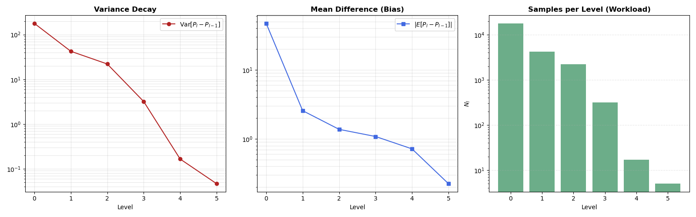
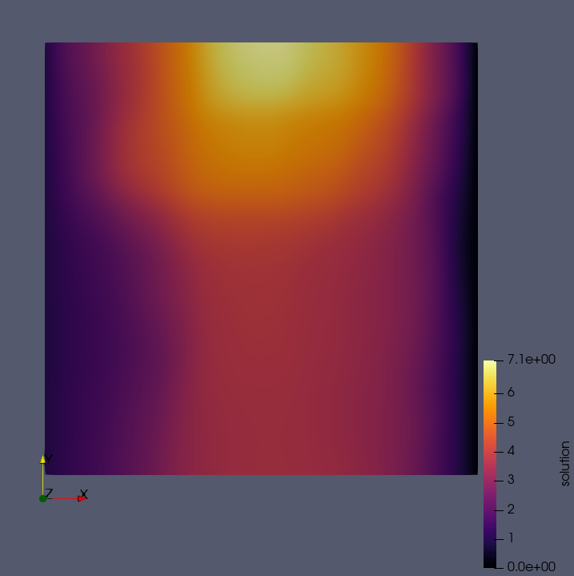

# Multilevel Monte Carlo for random Darcy flow
This code is an implementation of the Multilevel Monte Carlo (MLMC) approach described in the amazing paper by Cliffe et al. [3]. While many Darcy flow solvers in porous media research rely on the Finite Volume Method (FVM), this project specifically utilizes the Finite Element Method (FEM), leveraging the `deal.II` library for spatial discretization.
## Motivation
Numerical simulations rely on input parameters such as material data, boundary conditions, and geometry. These parameters are almost always derived from measurements and are therefore subject to uncertainty. Some PDEs, such as the [Kardar-Parisi-Zhang equation](https://en.wikipedia.org/wiki/Kardar%E2%80%93Parisi%E2%80%93Zhang_equation) [1], even incorporate uncertainty directly into the governing equation. This uncertainty propagates through the simulation; consequently, quantifying its impact on the solution is of great interest.

However, this can be a costly undertaking. The standard Monte Carlo estimator, which simply solves the equation $N$ times with different realizations of the random noise and then averages the $N$ solutions, converges at a rate of @f[ \mathcal{O}(N^{-\frac{1}{2}}) @f], potentially requiring tens of thousands of samples for a reasonable estimate of the mean. This is often infeasible for complex problems where computing a single sample on a fine mesh may take hours.

This is where the Multilevel Monte Carlo (MLMC) estimator is utilized. The method exploits a simple identity: to estimate the expectation of a problem on a fine mesh @f[ \mathcal{E}[Q_M]@f], we can use the linearity of expectation to expand the estimator as a telescoping sum: @f[ \mathcal{E}[Q_M] = \mathcal{E}[Q_0] + \sum_{l=1}^{M} \mathcal{E}[Q_l - Q_{l-1}] @f].

One run on level @f[ M-1 @f] is significantly cheaper than one run on level @f[ M @f]. Furthermore, the difference between @f[ Q_M @f] and @f[ Q_{M-1} @f] is likely to be small, as the solutions will be similar when using the same realizations of the random field. By running the discretized PDE on several mesh levels, we can allocate more samples to the inexpensive coarse levels and fewer samples to the expensive fine levels. This significantly reduces the total computational effort.

A prominent application for this method is Darcy's Law [2], which describes flow through porous media. In this context, randomness is introduced via the hydraulic conductivity tensor.

## Problem statement
Let the infinite probability space be @f[(\Omega, \mathcal{F}, \mathbb{P})@f] and the domain be @f[D \subset \mathbb{R}^d, d=1,2,3 @f]. We model the hydraulic conductivity as a random field @f[ k = k(x, \omega)@f] on @f[D \times \Omega @f] with a defined mean and covariance. The governing equation is:
@f[
-\nabla \cdot ( k(x,\omega)\nabla p(x, \omega)) = f(x).
@f]
We assume the right-hand side @f[f(x) @f] is deterministic. Solving this general form is challenging; therefore, we assume @f[ k(x, \omega) @f] follows a log-normal distribution. This involves replacing the conductivity tensor with a scalar-valued field whose logarithm is Gaussian, which guarantees that @f[ k > 0 @f] almost surely [3]. Additionally, for an exponential kernel, analytical solutions for the integral eigenvalue problem are available.

We approximate this random field using a Karhunen-Loève Expansion and set a pressure difference of 1 between the left and right boundaries.

It is easy to observe that the actual PDE code is very similar to the one demonstrated in step-5. This is on purpose. In recent years, invasive techniques have fallen out of favor since they, as the name suggests, require reprogramming of existing finite element codes. 

## Results
The following plots illustrate the convergence rate of our MLMC implementation.

In the left image, the variance significantly decreases with each additional level. This supports the observation that solutions become increasingly similar as the discretization is refined for the same samples. The central plot shows the change in the mean with each level. The fact that the mean continues to shift substantially at levels 2 and 3 suggests that the initial mesh may have been too coarse. This is further supported by the right plot, which shows a sharp drop in the total number of samples required to reach the target tolerance. While the number of samples required for levels 1 and 2 is similar—again suggesting an overly coarse initial discretization—there is a significant reduction in samples for the higher levels. We conclude that the implementation successfully achieves the expected MLMC convergence behavior.

These plots can be generated using the Python script located in `utils/`.

Finally, a single realization of the solution is shown below.

## References
* [1] https://en.wikipedia.org/wiki/Kardar-Parisi-Zhang_equation
* [2] https://en.wikipedia.org/wiki/Darcy%27s_law
* [3] Cliffe, K.A., Giles, M.B., Scheichl, R. et al. Multilevel Monte Carlo methods and applications to elliptic PDEs with random coefficients. Comput. Visual Sci. 14, 3 (2011). https://doi.org/10.1007/s00791-011-0160-x