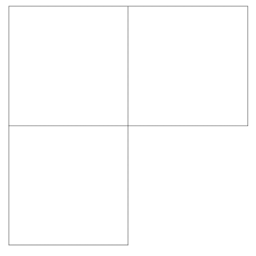
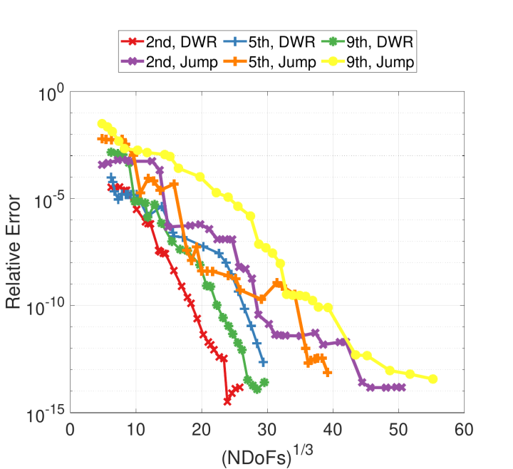
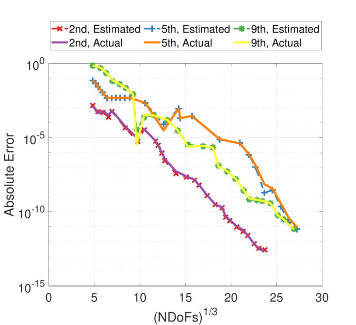
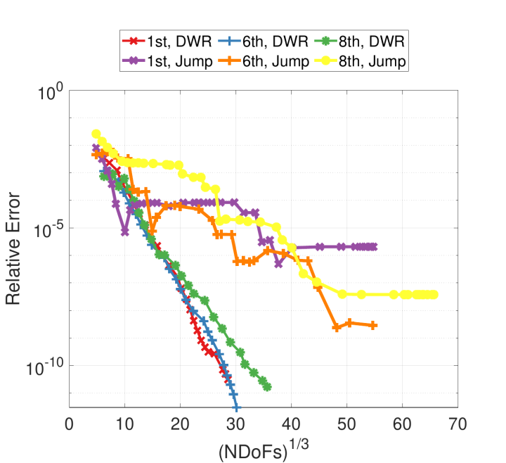
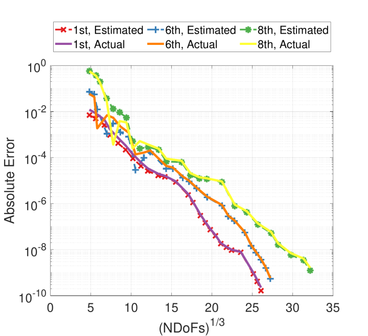

Readme file for Maxwell-Eigenvallue-hp-Refinement
============================

@note The implementation of this program is in part based on [1].

Motivation for project
----------------------

From the source free Maxwell equations in differential form, we may find the following eigenvalue problem involving the electric field $\mathbf{E}$,
$$ \nabla\times(\mu_r^{-1}\nabla\times\mathbf{E})-k_0^2\varepsilon_r\mathbf{E} = 0 \textrm{ in } \Omega, $$
 where $\mu_r$ and $\varepsilon_r$ denote, respectively, the relative permeability and permitivity of the medium (which we assume to be homogeneous), and $k_0$ signifies the free space wavenumber, for some $\Omega \subset \mathbb{R}^d, \, d = 2,3.$ Finding (approximate) solutions of this eigenvalue problem poses a number of challenges computationally; for those interested, we refer to the excellent thesis of S. Zaglmayr [2].

 In the remainder of this project, we assume $d=2$, though the methodology is largely unaffected by this choice. We further assume perfect electrical conductor (PEC) boundary conditions: $\hat{\textbf{n}}\times\textbf{E}=0 \textrm{ on }\partial\Omega$, $\hat{\textbf{n}}$ being the outward normal vector.

 In the standard way, we consider *weak* solutions by solving the variational form of the eigenvalue problem, which, in the 2-D case, is found to be the following after Galerkin testing:
 $$ \textrm{Find } U_{hp}=\left\{ \mathbf{u}_{hp},\,\lambda_{hp}\right\}\in V_{hp}\times \mathbb{R}_{>0} \textrm{ such that}
 $$ a(\textbf{u}_{hp},\,\boldsymbol{\phi}_{hp}) = \lambda_{hp} m(\textbf{u}_{hp},\,\boldsymbol{\phi}_{hp}) \quad \forall\boldsymbol{\phi}\in V_{hp}, $$
 with $a(\textbf{u}_{hp},\,\boldsymbol{\phi}_{hp}) = \langle \nabla_t\times\textbf{u}_{hp},\,\nabla_t\times\boldsymbol{\phi}_{hp}\rangle$ (note: $\nabla_t$ represents the transversal gradient operator and $\langle \cdot ,\, \cdot \rangle$ represents the $L^2$ inner-product), and $m(\textbf{u}_{hp},\,\boldsymbol{\phi}_{hp}) = \langle \textbf{u}_{hp},\,\boldsymbol{\phi}_{hp} \rangle$. The finite dimensional subspace $V_{hp}$ will be further specified below along with its infinite dimensional analog $V$ associated with an exact solution $U=\left\{ \textbf{u},\, \lambda \right\}$.

For this problem, we consider a single family of quantities of interest (QoIs), namely the approximation error of the approximate eigenvalue $\lambda_{hp}$, i.e.,
$$ e_{\lambda_{hp}} := \lambda-\lambda_{hp}. $$

Some comments on the discretization of Maxwell's equations
----------------------------------------------------------
In the proper solution of variational problem, $V_{hp}$ is not arbitrary, but should instead a subspace of $H(\mathrm{curl};\,\Omega)$ or, with the boundary conditions indicated above, $H_{0}(\mathrm{curl};\,\Omega)$, where
$$ H(\mathrm{curl};\,\Omega) = \left\{\textbf{u}\in \left[ L_2(\Omega)\right]^d \, \mathrm{s.t.} \, \nabla\times\textbf{u}\in \left[ L_2(\Omega)\right]^{2d-3} \right\}$$
and 
$$
H_{0}(\mathrm{curl};\,\Omega) = \left\{ \textbf{u}\in H(\mathrm{curl};\,\Omega) \, \mathrm{s.t.} \, \hat{\textbf{n}}\times\textbf{u} = 0 \text{ on $\partial\Omega$}\right\}.
$$

The convergence of the discrete problem (e.g., as $h\rightarrow 0$) to the continuous one may be proved via a discrete compactness property [3]. It is also possible for other choices of finite element spaces to *converge*, just not necessarily to the *correct* solution, which was the case for discretizations (which typically treated the components of $\textbf{u}$ as belonging to $H^1$) of the Maxwell PDE prior to the work of Nédélec.

It should be noted that while the choice of the appropriate finite element space eliminates most spurious solutions to the generalized eigenvalue problem above, not all are absent. Specifically, those which do not satisfy the source free divergence condition on the electric field $\textbf{E}$ $$\nabla\cdot\textbf{E} = 0$$ still cluster around $\lambda = 0$. For $\lambda > 0$, corresponding to physical eigenpairs, the divergence condition is automatically satisfied.

A variety of techniques may be leveraged to enforce the divergence condition explicitly, e.g., mixed finite element formulations. However (as noted above), we instead restate the variational problem, restricting our eigenvalues to $\lambda\in\mathbb{R}_{>0}$, which implies some additional mechanics in how we solve the eigenvalue problem. Solving for interior eigenvalues, as is required for this approach, is less than ideal; however, formalizing the divergence condition in the discretization is left as an extension of this project by the reader.

On the adaptivity
-----------------
While adaptive refinement based on pure error indicators may perform (surprisingly) well, in many cases we are interested in stricter interpretations of the mesh adaption problem that rely on error estimates and error contribution estimates. When the relationship between the accuracy of the goal-functional and the error indicator weakens (if it ever existed), refinement instructions may yield useless changes, even, as  we will see, to the extent of converging to the wrong value.

Galerkin projection, being a global process, is *not* interpolation. The question, then, is how to relate the accuracy of our QoI, which may formally be a global quantity (e.g., the radar cross section of a target from a certain look angle) or a local one (e.g., value of the solution at a point), on the approximation quality throughout the discretization. Solving a secondary *global* problem, the adjoint (or dual) problem, provides exactly the mechanism we need via the adjoint solution, a generalized Green's function. Specifically, we study a goal-oriented error estimate based on the Dual Weighted Residual (DWR), similar to that  studied in step-14.

<strong>For this section of project, we strongly recommended the following readings: [4] (W. Bangerth and R. Rannacher; 2003), Chapter 3, 7; [5] (V. Heuveline and R. Rannacher; 2001).</strong>

Several assumptions as outlined in [5], some of which may likely not be satisfied, should be stated first. Firstly, the algorithm assumes that the eigenvalues are simple. Secondly, for approximating $\lambda$, $\lambda_h$ should be closer to $\lambda$ than any other eigenvalue of the approximate problem. This outlines a necessarily vague condition on the coarseness/fineness of the starting discretization, provided the natural assumption that $\lambda_{h}\rightarrow\lambda$ as $h\rightarrow 0$ holds.

With this in mind, the error may be expressed in DWR-form:
$$ e_{\lambda_{hp}}(1-\sigma_{hp}) = a(\textbf{u}_{hp},\, \textbf{u} - \boldsymbol{\psi}_{hp}) - \lambda_{hp}m(\textbf{u}_{hp},\, \textbf{u}-\boldsymbol{\psi}_{hp})$$
for arbitrary $\boldsymbol{\psi}_{hp}\in V_{hp}$, with $\sigma_{hp} = \frac12m(\textbf{u}-\textbf{u}_{hp},\,\textbf{u}-\textbf{u}_{hp})$.

It is important to note that the expression above assumes normalization such that
$$ \langle \textbf{u},\,\textbf{u}\rangle = 1, $$
and likewise for $\textbf{u}_{hp}$, though naturally, given that our solutions are eigenfunctions, this normalization is not a unique choice.

That $\boldsymbol{\psi}_{hp}$ is arbitrary *does not* imply that any choice is equally good (i.e., informative) for generating refinement indicators. Certainly the most obvious and easiest choice of $\boldsymbol{\psi_{hp}} = 0$ yields the same global error, yet in the accumulation of error *contributions* retains irrelevant "contributions" that hamper adaptivity.

As a result we extract from $\textbf{u}$ the portions that belong to $V_{hp}$ by some interpolation or projection. According to the hierarchical nature of the `FENedelec` cell we can simply retain the coefficients associated with higher-order shape functions and discard the rest.

In any event, the global error estimate (in DWR-form) is accumulated in a cellwise fashion. Based on the continuity requirements of the Nédélec cell (continuous in the tangential direction), not every DoF is constrained to a single cell, motivating some "sharing" of contributions. One way is through integration-by-parts, producing a cell and boundary residual. The sharing is conducted by averaging the boundary term for one cell with its neighbor. In total, the error is computed over every cell $K$ as
$$\begin{align} e_{\lambda_{hp}}(1-\sigma_{hp}) = &\sum_K {\langle \nabla\times\nabla\times\textbf{u}_{hp},\,\textbf{u}-\boldsymbol\psi_{hp}\rangle}_K \\ &- \frac12 \left[ {\langle \hat{\textbf{n}}\times(\nabla\times\textbf{u}_{hp}),\,\textbf{u}-\boldsymbol\psi_{hp}\rangle}_{\partial K}\right. \\ &\,\,\,- \left. {\langle \hat{\textbf{n}}\times(\nabla\times\textbf{u}_{hp}),\,\textbf{u}-\boldsymbol\psi_{hp}\rangle}_{\partial K^{'}} \right] \\ &- \lambda_{hp} m_K(\textbf{u}_{hp}, \textbf{u}-\boldsymbol\psi_{hp}),\end{align}$$
where $K^{'}$ denotes the neighbor cells to $K$.

Given the tangential continuity of $\textbf{u}-\boldsymbol{\psi}_{hp}$, its evaluation may be performed once for each edge/face.

The above expressions assume access to the exact solution $\textbf{u}$, which is not satisfiable in general (and if it were, why would we need refinement?) and therefore a substitution is necessary. Unfortunately, Galerkin orthogonality precludes taking $\textbf{u}_{hp}$. Instead, we replace $\textbf{u}$ by $\textbf{u}_{hp^+}\in V_{hp^+}$, $V_{hp^+}\supset V_{hp},$ where $\textbf{u}_{hp^+}$ belongs to an enriched finite element space generated by increasing the local expansions orders by 1 throughout the mesh.

For $h$- or $p$-refinement, we now have sufficient data. For $hp$-refinement, we either need further post-processing on the error contributions or an additional mechanism to distinguish between the profitability of $h$ versus $p$. Since the theoretical conditions for exponential convergence depend on the solution regularity, *smoothness indication* suggests a promising vehicle for the $hp$-decision.

A prevalent choice in the literature is the examination of the decay rates of Legendre expansions. Fourier expansions are similarly employed, though the non-polynomial integrands are slightly less convenient for numerical integration. The theory and methodology has been developed over the years, e.g., [6]-[8], culminating in the excellent work of M. Fehling [9], which is now included in the deal.II library. As such, we leave out further description except for the following: as the solution is vectorial, we apply smoothness indication to each component. As we consider only *isotropic* refinements, the smallest decay is propagated forward for the $hp$-decision, though directional refinements would benefit from retaining all decay rates.

As a final note for those that may extend this project to other problems or applications, the $hp$-decision herein is really only feasible for affine mappings between the reference cell and its images as the Legendre integrals are otherwise too burdensome. 

Numerical Results
-----------------
We finally arrive at the heart of the project.

As we are paying a price in computation and implementation by studying a goal-oriented approach, a comparison with error indication is warranted. The reference method is based on the Kelly error indicator (applied to each component of the solution), which we also refer to as the "Jump" approach. 

Except for the refinement indicators, the approaches are identical: the smoothness estimation is the same, the number of elements refined each iteration (20%) is the same, and the starting discretizations are the same. Since the DWR strategy utilizes the higher order solution, we use its approximation (and the higher number of DoFs required) for the comparison.

The starting discretization is shown below, consisting of three unit squares arranged in an 'L'-shape. This benchmark was originally proposed by M. Dauge in [10], which includes reference values for the first five eigenvalues.

The first nine eigenfunctions for this problem group equally into three classes: singular (unbounded electric field at the reentrant corner), sharp (nonsmooth but bounded at the reentrant corner), and globally smooth. The globally smooth eigenpairs may be resolved relatively easily and sufficiently accurately to determine that the eigenvalues are multiples of $\pi^2$. As such, we focus exclusively on the first two classes of eigenfunctions.

The adaption pipeline is summarized as follows:
1. Solve the forward problem (when using either the DWR or Kelly refinement strategies) and the adjoint problem (when using the DWR estimator)
2. Generate error contribution estimates (DWR) or error indicators (Kelly)
3. Mark the top 20% elements with the largest refinement indicators by magnitude
4. For those cells marked for refinement, estimate the local smoothness of the forward solution (Legendre decay rate)
5. According to the Legendre decay rate, reclassify the refinement to $p$ if necessary
6. Apply refinement instructions and return to 1.

Of course, this process is easily applied to alternative estimators, indicators, and selection criteria.

Approximate values of the three "sharp" eigenvalues are listed below:
- $\lambda_2 = 3.53403136678$
- $\lambda_5  = 11.3894793979$
- $\lambda_9 = 23.3443719571$

Approximate values of the three "singular" eigenvalues are listed below:
- $\lambda_1 = 1.47562182397$
- $\lambda_6 = 12.5723873200$
- $\lambda_8 = 21.4247335393$

We first examine application of the two approaches to the "sharp" eigenpairs. In the first figure below, we see that the DWR approach significantly outperforms  that of the jump-based Kelly approach. In the second figure, we illustrate the close agreement between the estimated relative error and the actual relative error, which applies exclusively to the DWR-based method. 

The $\log$-cuberoot scaling of the axes is based on the theoretical convergence rates for the eigenvalues as described in [11], such that a linear trend indicates exponential convergence.

We now examine the same procedure for the  "singular" eigenpairs. Here we see that while the DWR-based approach is robust and achieves consistent exponential convergence with respect to the number of degrees of freedom, the jump-based method fails to  converge to the benchmark values. Even before saturation of accuracy by the jump-based method, the DWR-method is several orders of magnitude more accurate for the same cost.

Once again, as shown directly above, the error estimate for the approximate eigenvalue provides close agreement with the actual error.

We encourage the reader to study these examples further, including the auxiliary tasks of selecting and tuning an appropriate generalized eigenvalue problem solver, etc, which are beyond the scope of this discussion. Furthermore, the selection of which cells to refine (namely, the top 20%) is a fair approach for this comparison, but is evidently suboptimal especially with access to the extremely high-quality DWR-based refinement indicators, and so we invite the reader to investigate alternative marking mechanisms in the context of $hp$-refinement.

To run the code
---------------

After running `cmake` and compiling via `make`, you can run the
executable by either executing `make run` or using `./maxwell-hp`
on the command line. Executing either `make debug` or `make release` 
swaps between "debug mode" and "release mode," respectively.

The parameters file "maxwell-hp.prm" may be modified to refine for different eigenvalues (by specifying the "set target eigenvalue" option).

The end results of the program are `.vtu` files for each iteration of the refinement procedure. All files are named according to the strategy employed (Kelly or DWR). The program also generates a text file with the eigenvalues and their cost (in terms of the number  of DoFs to attain said eigenvalues). Specifically, the text file has the following structure:
- The first column houses the eigenvalue from the lower-order discretization
- The second column houses the number of DoFs for that discretization
- In the case of the DWR-based method, the third and fourth columns match the first two, except they are for the higher-order discretization

Finally, for the DWR-based method, "error_estimates.txt" contains the estimated eigenvalue error (the signed sum of every error contribution estimate) at each cycle of the refinement procedure.

## References 
* [1] J. J. Harmon and B. M. Notaroš, "Adaptive hp-Refinement for 2-D Maxwell Eigenvalue Problems: Method and Benchmarks," *IEEE Transactions on Antennas and Propagation*, vol. 70, no. 6, pp. 4663-4673, June 2022.
* [2] S. Zaglmayr, “High order finite element methods for electromagnetic field computation,” Ph.D. dissertation, Institute for Numerical Mathematics, Johannes Kepler University Linz, Linz, Austria, 2006.
* [3] D. Boffi, M. Costabel, M. Dauge, and L. F. Demkowicz, “Discrete compactness for the hp version of rectangular edge finite elements,” *SIAM Journal on Numerical Analysis*, vol. 44, no. 3, pp. 979–1004, 2006.
* [4] W. Bangerth and R. Rannacher, *Adaptive Finite Element Methods for Differential Equations*. Birkhauser Basel, 2003.
* [5] V. Heuveline and R. Rannacher, “A posteriori error control for finite element approximations of elliptic eigenvalue problems,” *J. Adv. Comp. Math*, vol. 15, pp. 107–138, 2001.
* [6] C. Mavriplis, “Adaptive mesh strategies for the spectral element method,” *Computer Methods in Applied Mechanics and Engineering*, vol. 116, no. 1, pp. 77–86, 1994.
* [7] P. Houston, B. Senior, and E. Süli, “Sobolev regularity estimation for hp-adaptive finite element methods,” *Numerical Mathematics and Advanced Applications*, pp. 619–644, 2003.
* [8] T. Eibner and J. M. Melenk, “An adaptive strategy for hp-FEM based on testing for analyticity,” *Comput Mesh*, vol. 39, no. 39, pp. 575–595, 2007.
* [9] M. Fehling, “Algorithms for massively parallel generic hp-adaptive finite element methods,” Ph.D. dissertation, Univ. Wuppertal, 2020.
* [10] M. Dauge, “Benchmark computations for Maxwell equations for the approximation of highly singular solutions,” https://perso.univ-rennes1.fr/monique.dauge/benchmax.html, 2004.
* [11] J. Coyle and P. D. Ledger, “Evidence of exponential convergence in the computation of Maxwell eigenvalues,” *Computer Methods in Applied Mechanics and Engineering*, vol. 194, pp. 587–604, 02 2005.
