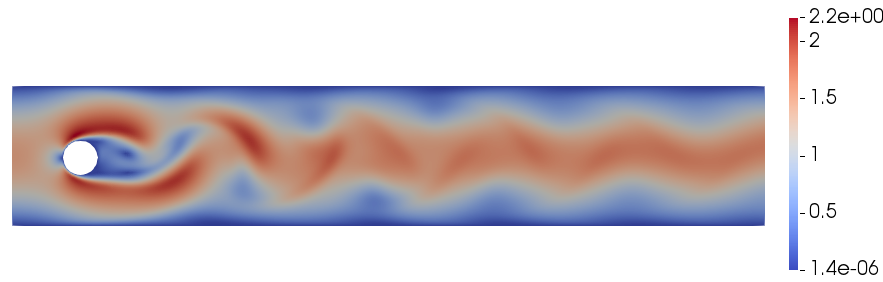
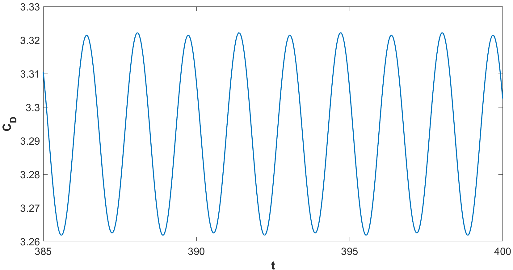
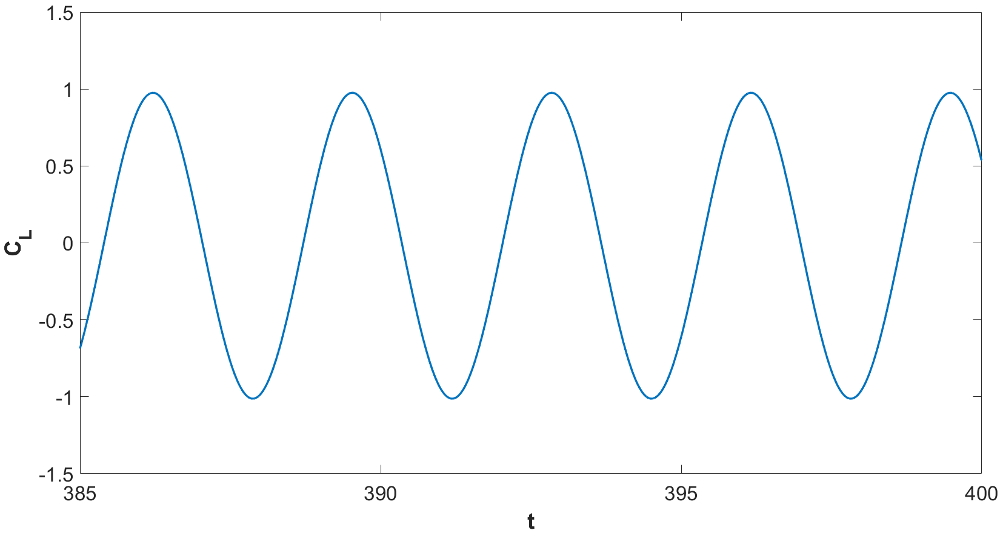
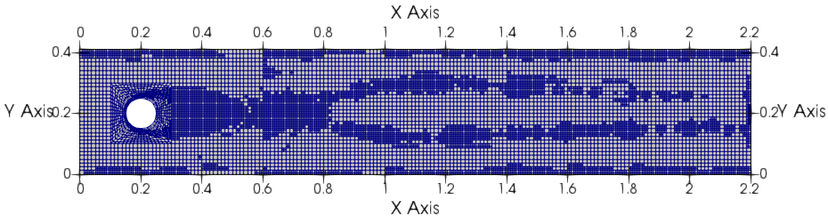

# TRBDF2-DG projection solver for the incompressible Navier-Stokes equations

## Compiling and Running
To generate a makefile for this code using CMake, type the following command into the terminal from the main directory:

	cmake . -DDEAL_II_DIR=/path/to/deal.II

To compile the code in release mode use:

	make release

This command will create the executable, <code>NS_TRBDF2_DG</code>.

To run the code on <code>N</code> processors type the following command into the terminal from the main directory,

	mpirun -np N ./NS_TRBDF2_DG

The output of the code will be in <code>.vtu</code> format and be written to disk in parallel. The results can be viewed using <a href="http://www.paraview.org/">ParaView</a>. A parameter file called <code>parameter-file.prm</code> has to be present in
the same folder of the executable, following the same structure employed in step-35. Two extra fields are present: <code>saving_directory</code> with the name of the folder where the results should be saved (which has therefore to be created before launching the program) and <code>refinement_iterations</code> that specifies how often the remeshing procedure has to be performed.

### The Navier-Stokes equations and the time discretization strategy ###

In this section, we briefly describe the problem and the approach employed. A detailed explanation of the numerical scheme is reported in [1]. We consider the classical unsteady incompressible Navier-Stokes equations, written in non-dimensional form as:
$$
\begin{align*}
\frac{\partial \mathbf{u}}{\partial t} + \nabla\cdot\left(\mathbf{u} \otimes\mathbf{u}\right) + \nabla p &= \frac{1}{Re}\Delta\mathbf{u} + \mathbf{f} \\
\nabla\cdot\mathbf{u} = 0,
\end{align*}
$$
where $Re$ denotes the Reynolds number. In the case of projection methods, difficulties arise in choosing the boundary conditions to be imposed for the Poisson equation which is to be solved at each time step to compute the pressure. An alternative that allows to avoid or reduce some of these problems is the so-called artificial compressibility formulation. In this formulation, the incompressibility constraint is relaxed and a time evolution equation for the pressure is introduced, which is characterized by an artificial sound speed $c$, so as to obtain:

$$
\begin{align*}
\frac{\partial\mathbf{u}}{\partial t} + \nabla\cdot\left(\mathbf{u}\otimes\mathbf{u}\right) + \nabla p &= \frac{1}{Re}\Delta\mathbf{u} + \mathbf{f} \\
\frac{1}{c^2}\frac{\partial p}{\partial t} + \nabla\cdot\mathbf{u} = 0.
\end{align*}
$$

For the sake of simplicity, we shall only consider $\mathbf{f} =
\mathbf{0}$. The numerical scheme is an extension of the projection
method introduced in [2] based on the TR-BDF2 method. For a generic
time-dependent problem $\mathbf{u}' = \mathcal{N}(\mathbf{u})$, the TR-BDF2 method can be described in terms of two stages as follows:

$$
\begin{align*}
\frac{\mathbf{u}^{n+\gamma} - \mathbf{u}^{n}}{\gamma\Delta t} &= \frac{1}{2}\mathcal{N}\left(\mathbf{u}^{n+\gamma}\right) + \frac{1}{2}\mathcal{N}\left(\mathbf{u}^{n}\right) \\
\frac{\mathbf{u}^{n+1} - \mathbf{u}^{n + \gamma}}{\left(1 - \gamma\right)\Delta t} &= \frac{1}{2 - \gamma}\mathcal{N}\left(\mathbf{u}^{n+1}\right) + \frac{1 - \gamma}{2\left(2 - \gamma\right)}\mathcal{N}\left(\mathbf{u}^{n+\gamma}\right) + \frac{1 - \gamma}{2\left(2 - \gamma\right)}\mathcal{N}\left(\mathbf{u}^{n}\right).
\end{align*}
$$

Following then the projection approach described in [2], the momentum predictor equation for the first stage reads:

$$
\begin{align*}
&&\frac{\mathbf{u}^{n+\gamma,\ast} - \mathbf{u}^{n}}{\gamma\Delta t} - \frac{1}{2Re}\Delta\mathbf{u}^{n+\gamma,\ast} + \frac{1}{2}\nabla\cdot\left(\mathbf{u}^{n+\gamma,\ast}\otimes\mathbf{u}^{n+\frac{\gamma}{2}}\right) = \nonumber \\
&&\frac{1}{2Re}\Delta\mathbf{u}^{n} - \frac{1}{2}\nabla\cdot\left(\mathbf{u}^{n}\otimes\mathbf{u}^{n+\frac{\gamma}{2}}\right) - \nabla p^n \nonumber \\
&&\mathbf{u}^{n+\gamma,\ast}\rvert_{\partial\Omega} = \mathbf{u}_D^{n+\gamma}. \nonumber
\end{align*}
$$

Notice that, in order to avoid solving a nonlinear system at each time step, an approximation is introduced in the nonlinear momentum advection term, so that $\mathbf{u}^{n + \frac{\gamma}{2}}$ is defined by extrapolation as

$$
\begin{align*}
\mathbf{u}^{n + \frac{\gamma}{2}} = \left(1 + \frac{\gamma}{2\left(1-\gamma\right)}\right)\mathbf{u}^{n} - \frac{\gamma}{2\left(1-\gamma\right)}\mathbf{u}^{n-1}.
\end{align*}
$$

For what concerns the pressure, we introduce the intermediate update
$\mathbf{u}^{n+\gamma,\ast\ast} = \mathbf{u}^{n+\gamma,\ast} + \gamma\Delta t\nabla  p^{n}$, and we solve the following Helmholtz equation

$$
\begin{align*}
\frac{1}{c^2}\frac{p^{n+\gamma}}{\gamma^2\Delta t^2} -\Delta p^{n+\gamma} = - \frac{1}{\gamma\Delta t} \nabla\cdot\mathbf{u}^{n+\gamma,\ast\ast}  + \frac{1}{c^2}\frac{p^{n }}{\gamma^2\Delta t^2}
\end{align*}
$$

and, finally, we set $\mathbf{u}^{n+\gamma} = \mathbf{u}^{n+\gamma,\ast\ast} - \gamma\Delta t\nabla  p^{n+\gamma}$.
The second stage of the TR-BDF2 scheme is performed in a similar manner (see [1] for all the details).

### Some implementation details ###

A matrix-free approach was employed like for step-37 or step-50. Another feature of the library which it is possible to employ during the numerical simulations is the mesh adaptation capability. On each element $K$ we define the quantity

$$
\eta_K = \text{diam}(K)^2\left\|\nabla \times \mathbf{u}\right\|^2_K
$$

that acts as local refinement indicator. The preconditioned conjugate gradient method implemented in the function <code>SolverCG</code> was employed to solve the Helmholtz equations, whereas, for the momentum equations, the GMRES solver
implemented in the function <code>SolverGMRES</code> was used.
A Jacobi preconditioner is used for the two momentum predictors, whereas a Geometric Multigrid preconditioner is employed for the Helmholtz equations (see step-37).

#### Test case ####

We test the code with a classical benchmark case, namely the flow past a cylinder in 2D at $Re = 100$ (see [1] for all the details). The image shows the contour plot of the velocity magnitude at $t = T_{f} = 400$. The evolution of the lift and drag coefficients from $t = 385$ to $t = T_{f}$ are also reported and the expected periodic behaviour is retrieved.

 

## References ##

[1] G. Orlando, A. Della Rocca, P.F. Barbante, L. Bonaventura, and
N. Parolini. An efficient and accurate implicit DG solver for the incompressible Navier-Stokes equations. International Journal for Numerical Methods in Fluids, 2022. DOI: 10.1002/FLD.5098

[2] A. Della Rocca. Large-Eddy Simulations of Turbulent Reacting Flows with Industrial Applications. PhD thesis. Politecnico di Milano, 2018. http://hdl.handle.net/10589/137775
