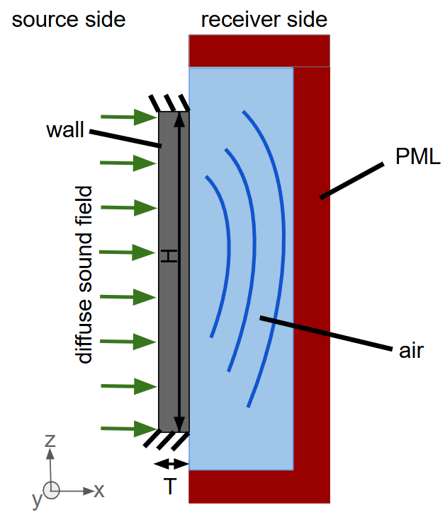
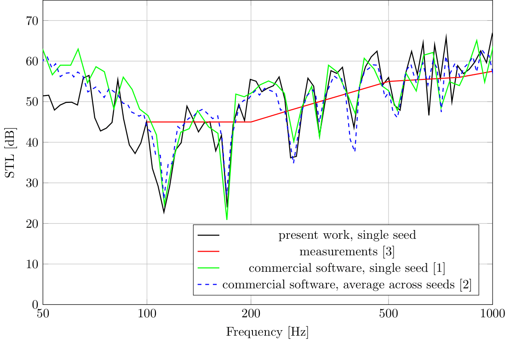
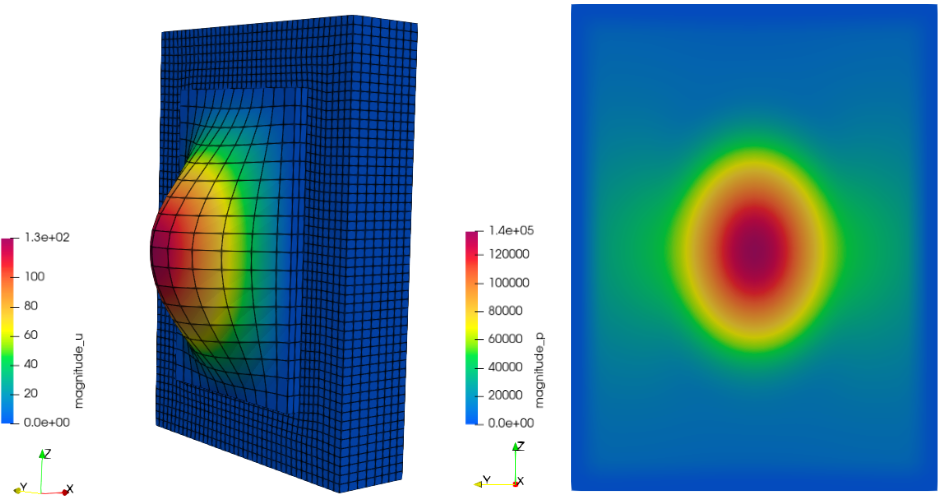

Overview
--------

The Sound Transmission Loss (STL) is a measure of the sound insulation of components and is therefore an important acoustic quantity.  Here, the STL of a concrete wall is calculated  by means of vibroacoustic FEM simulations. In the frequency domain, the elastodynamic equations are solved in the structural domain, while the Helmholtz equation is solved in the acoustic domain, with full coupling at the interface. The deal.II implementation is parallelized using MPI and MUMPS, employs the hp finite element method, and is mainly based on step-62 step-46, and step-27.

Elastodynamic equations
-----------------------

The behavior of the structure $ \Omega_S $ is modelled by means of the linear elastodynamic equations, which are given in strong form as
@f[
\rho_S \ddot{u}_i-\left( c_{ijkl} \epsilon_{kl} \right)_{,j} = f_i \qquad \text{in } \Omega_S \\
\qquad \qquad  \qquad   u_i = \bar{u}_i \qquad \text{on } \partial \Omega_{SD} \\
\qquad \qquad   \left( c_{ijkl} \epsilon_{kl} \right) n_j= \bar{t}_i \qquad \text{on } \partial \Omega_{SN} \\
@f]

Here, $u_i $ denotes the displacement, $ \rho $ is the mass density, $ f_i $ is the body force density, $ c_{ijkl} $ is the stiffness tensor,  $ n_i $ is the outwards pointing  normal unit vector, $ \bar{t}_i $ is the prescribed traction and $ \bar{u}_i $ is the prescribed displacement and the double dot represents the second derivative with respect to time. The linear strain tensor $ \epsilon_{ij} $ is defined as
@f[ \epsilon_{ij} = \frac{1}{2}\left( u_{i,j} + u_{j,i} \right) @f]
Multiplying by the test function $ \phi_i $, integration over the domain, applying integration by parts and the divergence theorem and introducing the boundary conditions results in the weak form
@f{align*}{ 
\int_{\Omega_S} \phi_j \rho_S \ddot{u}_j dV + \int_{\Omega_S} \phi_{j,i}  c_{ijkl} \epsilon_{kl}  dV - \int_{\partial \Omega_{SN} } \phi_j \bar{t}_j = 0
@f}

The time domain equation above is transferred into the frequency domain by performing a Fourier transform with regard to the time variable. Then, the weak form becomes
@f{align*}{ 
-\int_{\Omega_S}   \phi_j  \omega^2 \rho_S {u}_j dV +  \left[ 1 + i\mathcal{I} \right] \int_{\Omega_S} \phi_{j,i}  c_{ijkl} \epsilon_{kl}  dV - \int_{\partial \Omega_{SN} } \phi_j \bar{t}_j = 0
@f}
whereby $ \omega $ is the angular frequency. Here, the isotropic loss factor $ \mathcal{I} $ is introduced to account for  structural damping and $ i $ is the imaginary unit defined as $ i^2=-1 $.

Acoustic equations
------------------

The acoustic equation considered is the wave equation for pressure, given in strong form as
@f[
\frac{1}{c^2} \ddot{p} - p_{,ii} = 0 \qquad \text{in } \Omega_A \\
\qquad \qquad p = \bar{p} \qquad \text{on } \partial \Omega_{AD} \\
\qquad \qquad p_{,i} n_i = -\rho_A \dot{\bar{v}}_n \qquad \text{on } \partial \Omega_{AN} \\
@f]
Here, $ c $ is the sound speed and $ p $ is the acoustic pressure. As boundary conditions  the prescribed normal velocity  $ \bar{v}_n $ and the prescribed acoustic pressure $\bar p $ are considered.
Similar as for the elastodynamic equations, the weak form results as
@f{align*}{
\int_{\Omega_A} \eta \frac{1}{c^2} \ddot{p} dV + \int_{\Omega_A} \eta_{,i} p_{,i}  dV - \int_{\partial \Omega_{AN}} \eta \rho_A \dot{\bar{v}}_n dA = 0
@f}
whereby $ \eta $  denotes the test function.
Performing a Fourier transform with regard to the time variable results in the frequency domain weak form, given with the wave number $ k = \omega  / c $ as
@f{align*}{
-\int_{\Omega_A} \eta  k^2 {p} dV + \int_{\Omega_A} \eta_{,i} p_{,i}  dV - \int_{\partial \Omega_{AN}} \eta \rho_A i \omega {\bar{v}}_n dA = 0
@f}

A perfectly matched layer (PML) is used to simulate an open boundary. A PML is a complex coordinate stretch in the form of 
@f{align*}{
x \to x + \frac{i}{\omega} \int^{x} \sigma(x') dx'
@f}
where $ \sigma $ is the PML absorption function. It vanishes outside of the PML, where no absorption is desired but is turned on inside the PML resulting in an absorption of outgoing waves while minimizing reflections back into the domain. Considering the PML, the weak form becomes
@f[
-\int_{\Omega_A} \eta  k^2 {p} J dV + \int_{\Omega_A} \eta_{,i} p_{,i} \Lambda_i^2 J dV - \int_{\partial \Omega_{AN}} \eta \rho_A i \omega {\bar{v}}_n \frac{J}{\Lambda_n} dA = 0 \\
J = \prod_{i=1}^{\mathrm{dim}} s_i \\
\Lambda_i = \frac{1}{s_i} \\
s_i = 1+\frac{i}{\omega} \sigma_i
@f]
In the equations above the [transformation of both volume and surface elements](https://en.wikipedia.org/wiki/Finite_strain_theory#:~:text=value%20decomposition.-,Transformation%20of%20a%20surface%20and%20volume%20element,-%5Bedit%5D) is taken into account.

Coupled Mechanic-Acoustic equations
-----------------------------------

For the structure-acoustic coupling, the normal vector $ n_{i} $ is chosen to conform with the normal vector of the mechanical domain given as
@f[
n_{i} = n_{i_S} = -n_{i_A} 
@f]
Here, the normal vector $ n_{i_S} $ referes to the mechanical domain, while $ n_{i_A} $ denotes the normal vector of the acoustic domain. 

The coupling between the mechanic and the acoustic domain takes place at the interface $ \partial \Omega_{SA} $ and is modelled via boundary conditions, specified as
@f[
-p n_{i} = \bar{t}_i \qquad \text{on } \partial \Omega_{SA} \\
p_{,i} n_i = \omega^2  \rho_A u_i n_i \qquad \text{on } \partial \Omega_{SA} 
@f]

Then, the coupled system becomes
@f[
-\int_{\Omega_S}   \phi_j  \omega^2 \rho_S {u}_j dV + \left[ 1 + i\mathcal{I} \right] \int_{\Omega_S} \phi_{j,i}  c_{ijkl} \epsilon_{kl}  dV - \int_{\partial \Omega_{SN} } \phi_j \bar{t}_j \\
- \int_{\Omega_A} \eta  k^2 {p} J dV + \int_{\Omega_A} \eta_{,i} p_{,i} \Lambda_i^2 J dV - \int_{\partial \Omega_{AN}} \eta \rho_A i \omega {\bar{v}}_n \frac{J}{\Lambda_n} dA \\ 
+ \int_{\partial \Omega_{SA}}  \phi_i p n_{i}   dA  + \int_{\partial \Omega_{SA}}  \eta \rho_A \omega^2 u_i n_{i} dA  = 0
@f]
The coupled system above is implemented in the code. 

Problem description and modeling
--------------------------------

The STL of a concrete wall is calculated. Conceptually, several methods exist for calculating the STL, including modeling the source and receiver rooms. Here, however, in the interest of computational efficiency the source room is not modeled  and the wall is directly excited by a prescribed diffuse sound field with sound power $ P_s$ introducing structural vibrations. These vibrations radiate airborne sound  with sound power $ P_r$ into the receiver side, which is considered anechoic and modeled using PMLs, as illustrated in the figure below. <br>
The same problem and modeling setup as in [1] and [2] are considered here.



The geometric dimension of the wall are: height $H = 4.37\,{m}$, width $W = 2.84\,\text{m}$ and  thickness $T = 0.203\,\text{m}$. The density of the concrete is $ \rho_S = 2275\,\frac{kg}{m^3} $, its Young’s modulus is $ E = 31.6\,GPa $ and the Poisson’s ratio is $\nu = 0.2$. As damping, an isotropic loss factor of $\mathcal{I} = 0.01$  is assumed. The outer boundary of the wall is fixed, and the surrounding wall is considered sound-hard and therefore does not influence the STL. The density of the air is  $ \rho_A = 1.204\,\frac{kg}{m^3} $ and the speed of sound in air is $ c = 343\,\frac{m}{s} $.


The diffuse sound pressure field $ p_{diffuse,wall} $ acting on the source side of the wall surface must be admissible, that is, it must satisfy the wave equation. Assuming $ N $ uncorrelated plane waves traveling in $ x$-direction, an admissible diffuse sound pressure field $ p_{diffuse,wall} $ on the wall surface can be obtained as
@f[
p_{diffuse,wall} = \underbrace{ \frac{A}{\sqrt{2N}} \sum^{N}_{n=1} e^{-i\left(  k_{n,x}x + k_{n,y}y  + k_{n,z}z   \right)} e^{i \Phi_n}}_{p_{incident}} + \underbrace{\frac{A}{\sqrt{2N}} \sum^{N}_{n=1} e^{-i\left(  -k_{n,x}x + k_{n,y}y  + k_{n,z}z   \right)} e^{i \Phi_n}}_{p_{reflection}} \\
k_{n,x} = \text{cos}(\Theta_n) \\
k_{n,y} = \text{sin}(\Theta_n) \text{cos}(\phi_n) \\
k_{n,z} = \text{sin}(\Theta_n) \text{sin}(\phi_n)
@f]
Here, $  A $ is the amplitude of the plane waves, the polar angles $\Theta_n$, $\phi_n$ and the phase angle $\Phi_n$ are uniformly distributed random variables in the interval $  \left[0,2\pi \right] $, the polar angle $ \Theta_n $ follows from $ \Theta_n = \text{acos}(q_n)$, whereby $ q_n$ is a uniformly distributed variable in the interval $  \left[0,1 \right] $. 
On the wall surface the diffuse sound pressure field  $ p_{diffuse,wall} $ is a superposition of the incoming waves $  p_{incident}$ and their reflections $  p_{reflection}$. In the equations above, a perfectly reflecting wall is assumed, so no reduction of amplitude or phase shift occurs. To overcome this simplification, the source room would need to be modeled, which is not done here.

The STL is defined as 
@f[
STL = 10 \text{log}_{10} \left(\frac{P_s}{P_r} \right)
@f]
and therefore requires the calculation of the sound powers on the source $ P_s$ and receiver $ P_r$ sides.

The sound power on the source side $ P_s$ can be calculated as
@f[
P_s = \frac{1}{2}\int_{\partial A_{wall,source} } \text{Re}\left[ p_{incident} v_{i}^{*} n_i \right] dA
@f]
Here, the asterix ($ {}^*$) indicates complex conjugation, $ A_{wall,source} $ is the surface of the wall on the source side and $ v_i $ is the sound particle velocity, which can be calculated as 
@f[
v_{i} = \frac{-1}{i\omega \rho_a}p_{incident,i}
@f]
The sound power on the receiver side $ P_r$ can be calculated as
@f[
P_r = \frac{1}{2}\int_{\partial A_{wall,receiver} } \text{Re}\left[ p  \left(i\omega u_i\right)^{*} n_i \right] dA
@f]
Here, $ A_{wall,receiver} $ is the surface of the wall on the receiver side. 

Results
-------

In the figure below, the STL obtained in the present work is compared with measurement data from [3], with results from a commercial FEM software reported in [1] for a single random seed in the diffuse sound field, and with the corresponding average STL over multiple random seeds as presented in [2]. Overall, the STL calculations are sensitive to the choice of random seeds for the diffuse sound field. The STL ranges between 30 and 60 dB, which corresponds to the incident sound power being between $10^3$ and $10^6$ times greater than the transmitted sound power, depending on frequency.



In addition, the figure below shows the magnitude of the solution for the first resonance frequency at around 112 Hz. On the left, the magnitude of the displacement $u_i$ is presented, while the magnitude of the sound pressure $p$ directly behind the concrete wall is illustrated on the right side. As enforced by the PML, the sound pressure $p$ vanishes at the boundaries of the domain.




Ideas for extensions
--------------------

* Implementation of a QuadratureCache class to store calculated data for single cells to be reused for different frequencies, similar to that in step-62.
* Application of an iterative solver.
* Consideration of non-matching grids between structural and acoustic domains.

References
----------

[1] COMSOL Multiphysics 6.4, "Sound Transmission Loss Through a Concrete Wall", available at [https://www.comsol.com/model/sound-transmission-loss-through-a-concrete-wall-73371](https://www.comsol.com/model/sound-transmission-loss-through-a-concrete-wall-73371).

[2] M.H. Jensen,  "Modeling Sound Transmission Loss Through a Concrete Wall", COMSOL Blog, 2020, available at [https://www.comsol.com/blogs/modeling-sound-transmission-loss-through-a-concrete-wall](https://www.comsol.com/blogs/modeling-sound-transmission-loss-through-a-concrete-wall).

[3]   A. Litvin and H.W. Belliston, “Sound Transmission Loss Through Concrete and
Concrete Masonry Walls,” American Concrete Institute, Journal Proceedings, vol. 45,
pp. 641–646, 1978.

Compilation and running the code
---------------

To run the code, deal.II must be installed together with PETSc (configured with complex number support) and the p4est library.

Similar to the deal.ii examples, run
```
cmake -DDEAL_II_DIR=/path/to/deal.II .
```
in this directory to configure the project.  
You can switch between debug and release mode by calling either
```
make debug
```
or
```
make release
```
To execute the program in serial run
```
make run
```
and for parallel execution (in this case, on `j` processors) run
```
mpirun -np j ./parallel_vibroacoustic_solver
```