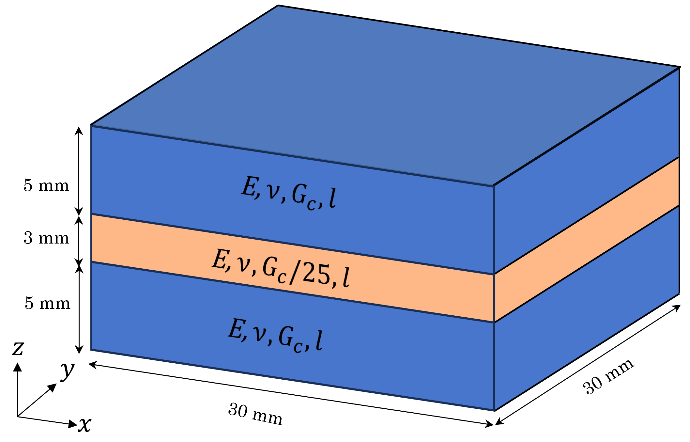
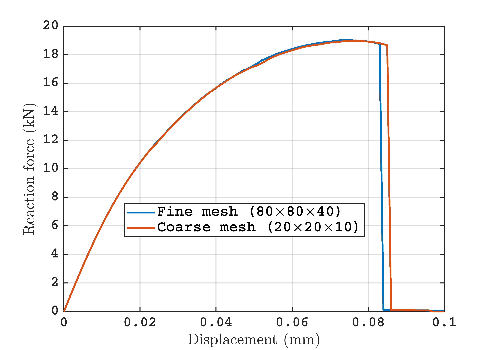

# Phase-field Fracture in 3D

## Motivation
This program implements the hybrid phase-field model of Ambati et al. [1] in deal.II using adaptive mesh refinement and parallel computing capabilities.
Phase-field models have been proven to be effective in modeling complicated fractures because of their ability to model crack branching, merging, and fragmentation.
Despite this, these models are mostly limited to 2D because of the high computational cost, as these models require very fine meshes to resolve the diffused representation of the crack.
This code explores the use of parallel computing and adaptive mesh refinement to model fracture propagation using the hybrid phase-field model.

@dealiiTutorialDOI{10.5281/zenodo.14682543,https://zenodo.org/badge/DOI/10.5281/zenodo.14682543.svg}

## Governing equations

The model this program solves is that of Ambati et al. [1], see there for more information. In short,
the model describes the growth of a crack as an object is successively strained. The deformation
of the solid is described by the usual force balance appropriate for quasi-static deformation:

@f{align*}{
\nabla\cdot\boldsymbol{\sigma}
(\boldsymbol{\varepsilon}(\boldsymbol{u}),d) = \mathbf{0}
@f}
with Dirichlet boundary conditions
@f{align*}{
\boldsymbol{u} = \boldsymbol{u}_D \text{ on  } \Gamma_D
@f}

The crack is tracked by a "damage field" $d$ that is a smoothed version of a history field $\mathcal{H}^{+}$
that corresponds to accumulated strain at a quadrature point:
@f{align*}{
-l^2 \nabla^2 d+d=\frac{2 l}{G_c}(1-d) \mathcal{H}^{+}
@f} with the boundary condition
@f{align*}{
\left(G_{c} l\right) \nabla d \cdot \boldsymbol{n}=\mathbf{0}.
@f}
Here, $\boldsymbol{u}, d$ represent the displacement and damage(crack) fields, $l$ is the length scale parameter, $G_c$ is the critical energy release rate and $\mathcal{H}^{+}$ is the history field variable.

## To run the Code
After running `cmake .`, run `make release` or `make debug` to switch between `release` and `debug`mode. Compile using `make`.
Run the executable by using `make run` on the command line.
Run the executable on 'n' processes using 'mpirun -np $n$ ./phase_field'. For example 'mpirun -np 40 ./phase_field' runs the program on 40 processes.
## Numerical example
The program currently models fracture propagation in a 3-layered material subjected to equibiaxial loading along $+x$ and $+y$ directions. The problem setup is shown in the following picture:

Results are compared for two different initial meshes, the finer $80\times80\times40$ mesh and the coarser $20\times20\times10$ mesh. The following picture shows results for the fracture patterns and the load-displacement curves for the 2 meshes:


An animation of how the crack system in this setup evolves can be found [here](./doc/polyhedral_cracks.mp4) (left: coarse mesh; right: fine mesh).

## References
[1]
```
@article{Ambati2015,
  title={A review on phase-field models of brittle fracture and a new fast hybrid formulation},
  author={Ambati, Marreddy and Gerasimov, Tymofiy and De Lorenzis, Laura},
  journal={Computational Mechanics},
  volume={55},
  pages={383--405},
  year={2015},
  publisher={Springer},
 doi={10.1007/s00466-014-1109-y} 
}
```
