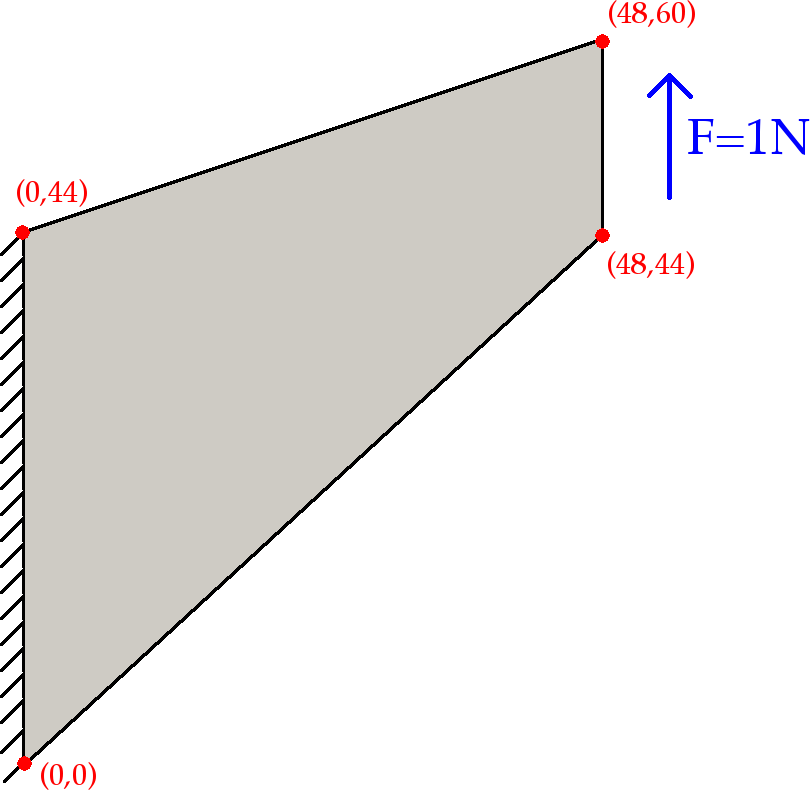
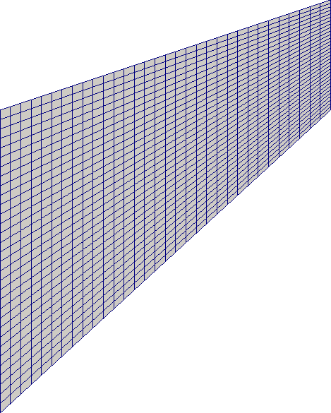
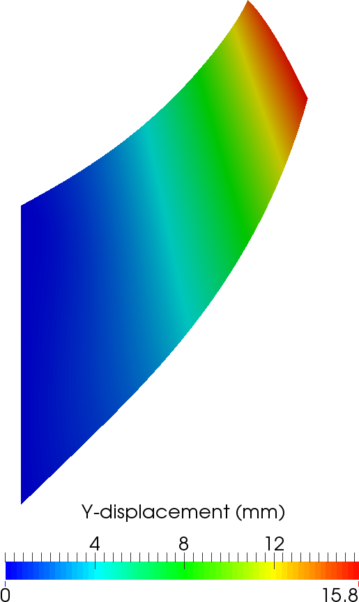

# Gallery Entry: deal.II-Quasi-static_Finite_strain_Compressible_Elasticity


## Overview
The Cook membrane (or cantilever) problem is a classic benchmark test for 
finite element formulations for solid mechanics. It is typically used to 
test for and demonstrate the shear-locking (or locking-free) behaviour of 
a finite element ansatz under quasi-incompressible conditions. 
As it is so widely referred to in the literature on finite-strain elasticity, 
we reproduce the example here.
However, we consider on the compressible case to avoid many of the complexities
that arise in `step-44`, which provides an efficient approach to deal with
the quasi-incompressible case.

### A classical approach to solving the cook membrane problem.

In this work we take a classical approach to solving the equations governing 
quasi-static finite-strain compressible elasticity, with code based on 
`step-44`. The formulation adopted here is that seen in many texts on solid 
mechanics and can be used as the starting point for extension into many 
topics such as material anisotropy, rate dependence or plasticity, or even as
a component of multi-physics problems.

The basic problem configuration is summarised in the following image.
A beam of specific dimensions is fixed at one end and a uniform traction load
is applied at the other end such that the total force acting on this surface
totals 1 Newton. Displacement in the third coordinate direction (out of plane)
is prevented in order to impose plane strain conditions.



Note that we perform a three-dimensional computation as two-dimensional 
elasticity corresponds to neither plane-strain nor plane-stress conditions.

 
## Requirements
* Version 8.2.1 or greater of `deal.II`


## Compiling and running
Similar to the example programs, run
```
cmake -DDEAL_II_DIR=/path/to/deal.II .
```
in this directory to configure the problem.  
You can switch between debug and release mode by calling either
```
make debug
```
or
```
make release
```
The problem may then be run with
```
make run
```


## Recommended Literature
* C. Miehe (1994), Aspects of the formulation and finite element implementation of large strain isotropic elasticity International Journal for Numerical Methods in Engineering 37 , 12, 1981-2004;
* G.A. Holzapfel (2001), Nonlinear Solid Mechanics. A Continuum Approach for Engineering, John Wiley & Sons;
* P. Wriggers (2008), Nonlinear finite element methods, Springer;
* T.J.R. Hughes (2000), The Finite Element Method: Linear Static and Dynamic Finite Element Analysis, Dover. 

The derivation of the finite-element problem, namely the definition and 
linearisation of the residual and their subsequent discretisation are quite 
lengthy and involved. Thankfully, the classical approach adopted in this work is
well documented and therefore does not need to be reproduced here. 
We refer the reader to, among many other possible  texts, Holzapfel (2001) and 
Wriggers (2008) for a detailed description of the approach applied in this work. 
It amounts to a reduction and slight reworking of `step-44` (accounting for 
the removal of the two additional fields used therein). We also refer the reader 
to `step-44` for a brief overview of the continuum mechanics and kinematics 
related to solid mechanics.

## Results
These results were produced using the following material properties: 
* Shear modulus is 422.5kPa 
* Poisson ratio is 0.3

The 32x32x1 discretised reference geometry looks as follows: 



And an example of the displaced solution is given in the next image.



Below we briefly document the tip displacement as predicted for different
discretisation levels and ansatz for the displacement field.
A direct comparison of the following results can be made with those found 
in Miehe (1994).

#### Number of degrees of freedom

Elements per edge |        Q1       |        Q2
:---------------: | :-------------: | :-------------:
1                 |  24             | 81
2                 |  54             | 225
4                 |  150            | 729
8                 |  486            | 2601
16                |  1734           | 9801
32                |  6534           | 38025
64                |  25350          | 149769

#### Tip y-displacement (in mm)

Elements per edge |        Q1       |        Q2
:---------------: | :-------------: | :-------------:
1                 | 5.15            | 12.19
2                 | 8.72            | 13.83
4                 | 12.02           | 14.22
8                 | 13.61           | 14.30
16                | 14.13           | 14.32
32                | 14.28           | 14.33
64                | 14.32           | 14.33
