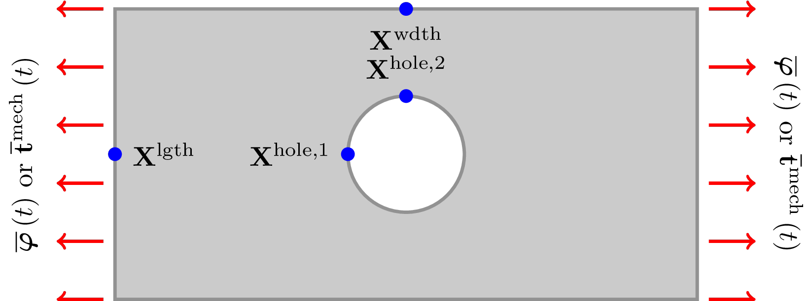
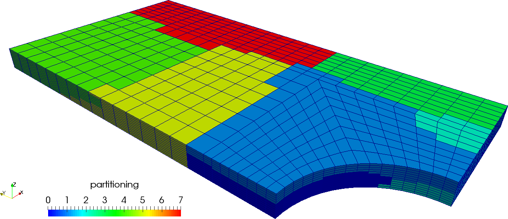
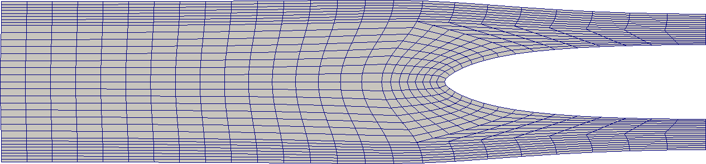
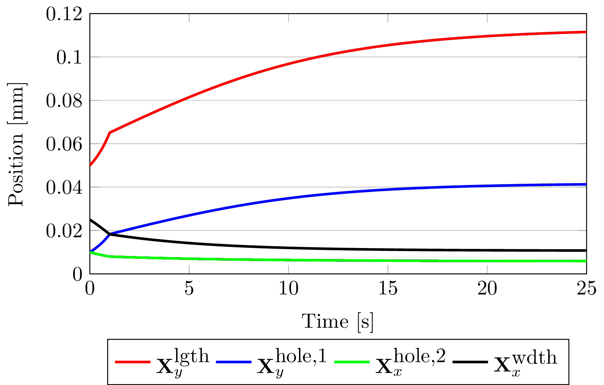
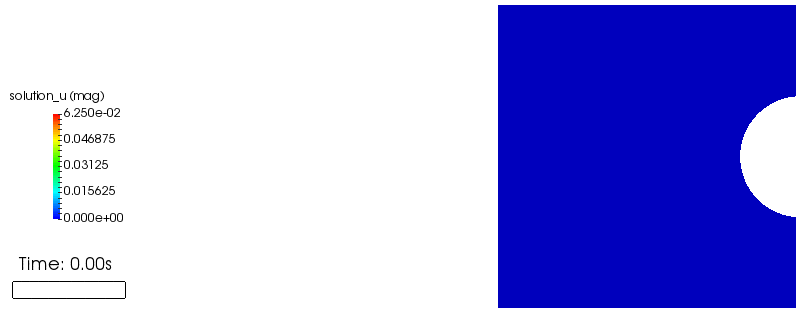

## Overview
Many rubber-like materials are not only near-incompressible in nature, but also exhibit a viscoelastic response (within the tested load and time scales).
In this example, we extend the near-incompressible rate-independent constitutive used in step-44 (which implements three-field quasi-static quasi-incompressible finite elasticity) to one that displays rate-dependent behavior.
It may seem that there is a contradiction of terms here, so lets clarify by saying the the problem remains "quasi-static" in the sense that inertial terms remain insignificant, even though the material response itself is rate-dependent.
This implies that, for these fictitious material parameters, it is assumed that the timescale for material relaxation is much longer than that of elastic wave propagation.

We've also taken the opportunity to extend the code first shown in step-44 to parallel (the primary reason for this contribution), using `Metis` as a grid partitioner and `Trilinos` for linear algebra.
As a motivation as to why one might still choose to use `Metis` (also associated with parallel::shared::Triangulation in step-18, although this triangulation is not used in this instance) over `p4est` (also associated with parallel::distributed::Triangulation) as a grid partitioner, at this point in time it is not possible to use the `hp` finite-element in conjunction with the distributed grid, meaning that this code could not, for example, be readily extended to the application shown in

* J-P. V. Pelteret, D. Davydov, A. McBride, D. Vu, P. Steinmann,  Computational electro-elasticity and magneto-elasticity for quasi-incompressible media immersed in free space. International Journal for Numerical Methods in Engineering, 2016, 108, 1307-1342. DOI: [10.1002/nme.5254](http://doi.org/10.1002/nme.5254)

The discerning reader will observe that we've chosen to employ `deal.II`'s built in solvers as opposed to using `Trilinos` solvers.
This is because the system matrices `K_Jp` and `K_pJ`, although block diagonal and well conditioned, and for some reason (perhaps pertaining to the negative definite nature of these blocks, or that the entries are very small in magnitude) `Trilinos` solvers are not sufficiently robust to compute inverse matrix-vector multiplication with.
We do stress, however, that to date **no great attempt has been made by the author to overcome this issue** other than by making an entirely different choice of solver.

### Finite deformation of a thin strip with a hole.

Various permutations of the problem of an elastomeric strip with a centered cut-out can be found in the literature for solid mechanics, in particular (but not limited to) that pertaining to

* incompressible elasticity
* elasto-plasticity
* electro-elasticity
* thermo-elasticity.

Here we implement another permutation (one that is not necessarily benchmarked elsewhere), simply for demonstration purposes. The basic problem configuration is summarized in the following image.



A thin strip of material with a circular hole is (in `3d`) constrained in the `Z` direction and loaded in the direction of its long edge.
In our implementation, this load is applied to the `+Y` surface and may either be displacement control (a `Dirichlet` condition) or a traction load (a `Neumann` boundary condition).
Due to the symmetry of both the geometry and load, the problem can be simplified by modeling only an eighth of the geometry in `3d` or a quarter in `2d`.
By doing so, it it necessary to then implement symmetry conditions on the surfaces coincident with the `X-Z` and `Y-Z` planes (and the `X-Y` plane in `3d`).
The `+X` surface, and that of the hole itself, remain traction-free.

In three dimensions, the geometry (and a potential partitioning over 8 processors) looks as follows:



Note that, for this particular formulation, the two-dimensional case corresponds to neither plane-strain nor plane-stress conditions.

## Requirements
* Version `8.5.0` or greater of `deal.II`
* `C++11` and `MPI` must be enabled
* The following packages must also be enabled:
  * `Metis`
  * `Trilinos`

## Compiling and running
Similar to the example programs, run
```
cmake -DDEAL_II_DIR=/path/to/deal.II .
```
in this directory to configure the problem.  
You can switch between debug and release mode by calling either
```
make debug
```
or
```
make release
```
The problem may then be run in serial mode with
```
make run
```
and in parallel (in this case, on `4` processors) with
```
mpirun -np 4 ./viscoelastic_strip_with_hole
```

This program can be run in `2d` or `3d`; this choice can be made by making
the appropriate changes in the `main()` function.


## Recommended Literature
* C. Miehe (1994), Aspects of the formulation and finite element implementation of large strain isotropic elasticity. International Journal for Numerical Methods in Engineering 37 , 12, 1981-2004. DOI: [10.1002/nme.1620371202](http://doi.org/10.1002/nme.1620371202);
* G.A. Holzapfel (2001), Nonlinear Solid Mechanics. A Continuum Approach for Engineering, John Wiley & Sons. ISBN: [978-0-471-82319-3](http://eu.wiley.com/WileyCDA/WileyTitle/productCd-0471823198.html);
* P. Wriggers (2008), Nonlinear finite element methods, Springer. DOI: [10.1007/978-3-540-71001-1](http://doi.org/10.1007/978-3-540-71001-1);
* T.J.R. Hughes (2000), The Finite Element Method: Linear Static and Dynamic Finite Element Analysis, Dover. ISBN: [978-0486411811](http://store.doverpublications.com/0486411818.html)

The derivation of the finite-element problem, namely the definition and linearization of the residual and their subsequent discretization are quite lengthy and involved.
However, this is already detailed in step-44, some of the aforementioned literature, as well as
* J-P. V. Pelteret, A computational neuromuscular model of the human upper airway with application to the study of obstructive sleep apnoea. PhD Thesis, University of Cape Town, 2013. [http://hdl.handle.net/11427/9519](http://hdl.handle.net/11427/9519)

and need not be repeated here.
As for the viscoelastic constitutive law (which satisfies the dissipation inequality through the definition of an internal variable that we denote as `Q` in the code), this is derived and presented in detail in
* C. Linder, M. Tkachuk & C. Miehe, A micromechanically motivated diffusion-based transient network model and its incorporation into finite rubber viscoelasticity. Journal of the Mechanics and Physics of Solids, 2011, 59, 2134-2156. DOI: [10.1016/j.jmps.2011.05.005](http://doi.org/10.1016/j.jmps.2011.05.005)

In particular, the relevant equations from Linder et al.'s work that are implemented in this work are equations 47, 54 and 56.
Note that the time discretization for the rate-dependent internal variable for this single dissipative mechanism is only first-order accurate.

## Results

To begin, here is a comparison of the initial grid for the `2d` version of the problem (mirrored about the x-axis and rotated `90` degrees anti-clockwise)


and of the final, displaced grid after the load has been applied and the material is in a (near-completely) relaxed state.



These results, as well as those that follow, were produced using the following material properties:
* The Poisson ratio is `0.4995`
* The elastic shear modulus is `80MPa`
* The viscoelastic shear modulus is `160MPa`
* The viscoelastic relaxation time is `2.5s`

while the boundary conditions were configured in the following manner:
* The "driving" boundary condition on the short-side (`+Y` face) is
  of the `Neumann` variety
* The applied hydrostatic pressure is `-150Pa` (i.e. a tensile load)
* The load ramp time is `1s`

The following chart highlights the displacement of several vertices and clearly illustrates the viscoelastic nature of the material.



During the initial phase, the load is applied over a period of time much shorter than the material's characteristic relaxation time.
The material therefore exhibits a very stiff response, and relaxes as the load remains constant for the remainder of the simulation.
This deformation that occurs under constant load is commonly known as creep.

We've been lazy and stopped the simulation slightly prematurely, but it is clear that the material's displacement is moving asymptotically towards a equilibrium solution.
You can also check what the true resting load state is by removing the dissipative mechanism (setting its shear modulus to zero) and rerunning the simulation with the material then exhibiting rate-independent behavior.
Note that in this case, the number of time step over which the load is applied must likely be increased in order to ensure stability of the nonlinear problem.

### Animations

Just in case you found the presented chart a little dry and undigestible, below are a couple of animations that demonstrate the viscoelastic nature of the material in a more visually appealing manner.

**Animation of the evolution of the displacement field**


**Animation of the evolution of the pressure field**

