# Introduction

This program is used to solve the generalized Swift-Hohenberg equation

$$\frac{\partial u}{\partial t} = ru - (k_c + \Delta)^2 u + g_1 u^2 - u^3$$

where $k_c$ is the wave number, $r$ is some fixed constant, and
$g_1$ is a parameter which determines the behavior of the solutions.
Note that the equation is simply called the Swift-Hoheneberg equation if
$g_1 = 0$. For this solver, we chose $k_c = 1$ and $r = 0.3$.
Choosing $k_c$ to be 1 will mean that our solutions have a pattern
wavelength of $2\pi$. We choose $r = 0.3$ because solutions are
reasonably well behaved for small values of $r$ and $g_1$, but there
are interesting behaviors that occur when $g_1$ is smaller or larger
than $r$ in magnitude, so this allows us room to vary $g_1$ and
explore these behavior. To summarize, this code solves:

$$\frac{\partial u}{\partial t} = 0.3u - (1 + \Delta)^2 u + g_1 u^2 - u^3$$

# Discretization and Solving the Bilaplacian

The equation has two aspects which are challenging to solve: the
nonlinear terms $g_1u^2 - u^3$ and the Bilaplacian operator
$(1 + \Delta)^2$, which introduces $4^{th}$ derivatives. To deal
with the Bilaplacian, we introduce a variable $v$ and construct a
system of PDEs:

$$\begin{aligned}
    \frac{\partial u}{\partial t} &= 0.3u - (1 + \Delta) v + g_1 u^2 - u^3\\
    (1 + \Delta)u &= v
\end{aligned}$$

We can solve these two equations simultaneously by treating our
finite elements as vector valued, and interpretting our system of
equations as a single vector-valued PDE. We can handle the nonlinear
terms by treating them fully explicitly. If we discretize in time and
Backrange terms, our system of equations becomes 

$$\begin{aligned}
        (1 - kr)U_n + k(1 + \Delta)V_n &= U_{n-1} + kg_1U_{n-1}^2 - kU_{n-1}^3\\
        (1 + \Delta)U_n - V_n &= 0
\end{aligned}$$ 

where $k$ is the discrete timestep, $U_n$ and
$V_n$ are the solutions for $u$ and $v$ at the current timestep,
and $U_{n-1}$ and $V_{n-1}$ are the solutions for $u$ and $v$ at
the previous timestep. We then reframe this system as a vector valued
problem

$$\begin{aligned}
    \begin{pmatrix}
            1 - kr & k(1 + \Delta)\\
            1 + \Delta & -1
        \end{pmatrix}
        \begin{pmatrix}
            U_n\\
		    V_n
        \end{pmatrix} &= \begin{pmatrix}
            U_{n-1} + kg_1U_{n-1}^2 - kU_{n-1}^3\\
		0
        \end{pmatrix}
\end{aligned}$$

As usual, we multiply each side of the equation by a
test function 

$$\overrightarrow\varphi_i = \begin{pmatrix}
    \phi_i\\
    \psi_i
\end{pmatrix}$$

to get the equation

$$\begin{aligned}
    \begin{pmatrix}
            \phi_i\\ 
                \psi_i
        \end{pmatrix}\cdot\begin{pmatrix}
            1 - kr & k(1 + \Delta)\\
            1 + \Delta & -1
        \end{pmatrix}
        \begin{pmatrix}
            U_n\\ V_n
        \end{pmatrix} &= \begin{pmatrix}
            \phi_i\\
		\psi_i
        \end{pmatrix}\cdot\begin{pmatrix}
            U_{n-1} + kg_1U_{n-1}^2 - kU_{n-1}^3\\
		0
        \end{pmatrix}\\
\end{aligned}$$

and then expand our solution vector in this basis

$$\begin{aligned}
    \sum_j u_j\begin{pmatrix}
            \phi_i\\
		    \psi_i
        \end{pmatrix}\cdot\begin{pmatrix}
            1 - kr & k(1 + \Delta)\\
            1 + \Delta & -1
        \end{pmatrix}
        \begin{pmatrix}
            \phi_j\\
            \psi_j
        \end{pmatrix} &= \begin{pmatrix}
            \phi_i\\
		    \psi_i
        \end{pmatrix}\cdot\begin{pmatrix}
            U_{n-1} + kg_1U_{n-1}^2 - kU_{n-1}^3\\
		0
        \end{pmatrix}
\end{aligned}$$

The last step is to expand out the matrix multiplication
and dot products, integrate, and apply the divergence theorem to obtain
a single equation:

$$\begin{aligned}
    \sum_j u_j [(1 - kr)\phi_i\phi_j + k\phi_i\psi_j - k\nabla\phi_i\nabla\psi_j + \psi_i\phi_j - \nabla\psi_i\nabla\psi_j - \psi_i\psi_j] &= \phi_i(U_{n-1} + kg_1U_{n-1}^2 - kU_{n-1}^3)
\end{aligned}$$

This last equation represents matrix multiplication of the
solution vector by the $i^{th}$ row of the system matrix, and the left
hand side without the summation or $u_j$ term is what we use to
compute the $(i, j)^{th}$ entry of the system matrix.

# Boundary Conditions and Choosing a Suitable Domain

This code implements both zero Dirichlet and zero Neumann boundary
conditions. Both these conditions affect the patterns that form. To
minimize this effect, we use Neumann boundary conditions and we choose
the boundary to be some multiple of the wave number. For example, this
code chooses the square mesh to have a side length of $6\cdot 2\pi$.
For all other domains used, we chose a domain size with a similar area
to that of the square. For instance, we solve on a torus with outer
radius 9 and inner radius 4 because this results in exactly the same
area as the square. Note that this is not strictly necessary for the
code to function, but does make it easier to compare results between
different geometries.

# Initial Conditions and Parameters

The code implements two main types of initial conditions: random initial
conditions, and creating a small initial hot spot. The SH equation is
interesting because it describes pattern formation and
self-organization, so choosing random initial conditions allows for this
to be observed. Note that the results shown below were all run with the
initial seed 314, which was arbitrarily chosen. Setting a fixed seed is
useful for comparing pattern formation with different choices of
parameters in the SH equation.

The hot spot initial condition is useful for the opposite reason: it is
very simple, but it lets us see what happens to a single pattern
\"wavelength\" as it propagates along our surface. This is particularly
useful in distinguishing the effect of curvature and geometry on pattern
propagation.

As previously mentioned, we chose $k_c = 1$ and $r = 0.3$ for this
code. We then let $g_1$ be the parameter that we change to vary the
patterns formed. On the plane, increasing the value of $g_1$ allows
for the formation of hexagonal grids rather than just ripples. Varying
$g_1$ does something similar to patterns on a curved manifold, though
with notably different effects in some cases. Increasing $g_1$ also
causes the solution to grow larger in magnitude at certain points.

# Checking Convergence

We checked the convergence of this code using 3 tests: we confirmed that
a constant initial condition remained constant and converged to a
solution that was verified using an ordinary differential equation, we
checked that solutions on the square converged across mesh refinements,
and we checked that solutions converged over refinements of the timestep
on the finest mesh.

Below are the results of several runs of constant initial conditions

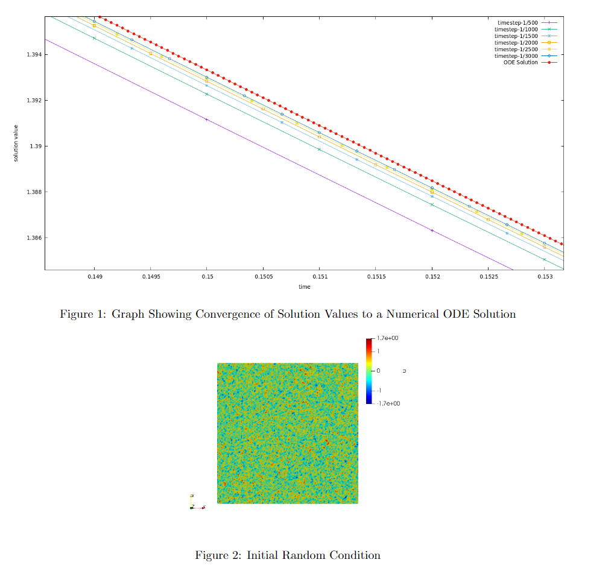

We also validated that given a fixed random start on a very fine mesh,
refining the timestep resulted in the same final solution. The initial
condition for each is shown above, While the final solutions are shown in the matrix below. Note that the
timestep begins at 1/25 and the denominator increases by 25 across each
row, to a max of 1/200 in the bottom right:

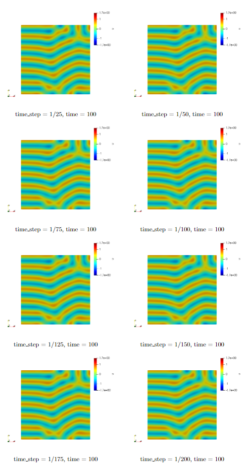

We validated that solutions converged across mesh refinement by defining
psuedorandom functions
$\displaystyle f(x) = \sum_{n=1}^{10} C_n \sin\left(\frac{16x}{3i}\right)$
and
$\displaystyle g(y) = \sum_{n=1}^{10} D_n \sin\left(\frac{16y}{3i}\right)$,
where $C_i$ and $D_i$ are randomly chosen in the range
$(-\sqrt{r}, \sqrt{r})$. The overall pseudorandom function is
$h(x) = f(x)g(y)$. Note that the period of the sine waves was chosen
so that the smallest wave could be resolved by a mesh refinement of 7 or
higher. The following matrix shows the initial and final solution
ranging from a refinement of 0 to a refinement of 7:

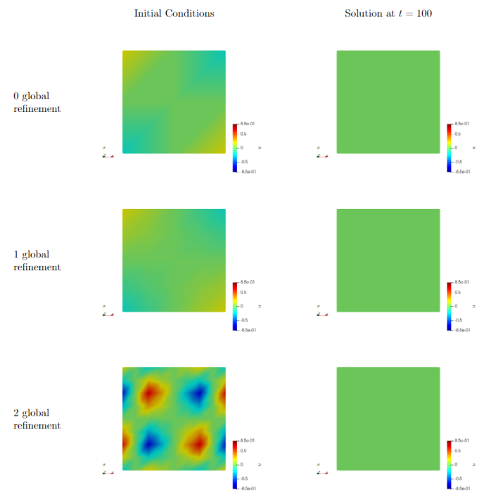

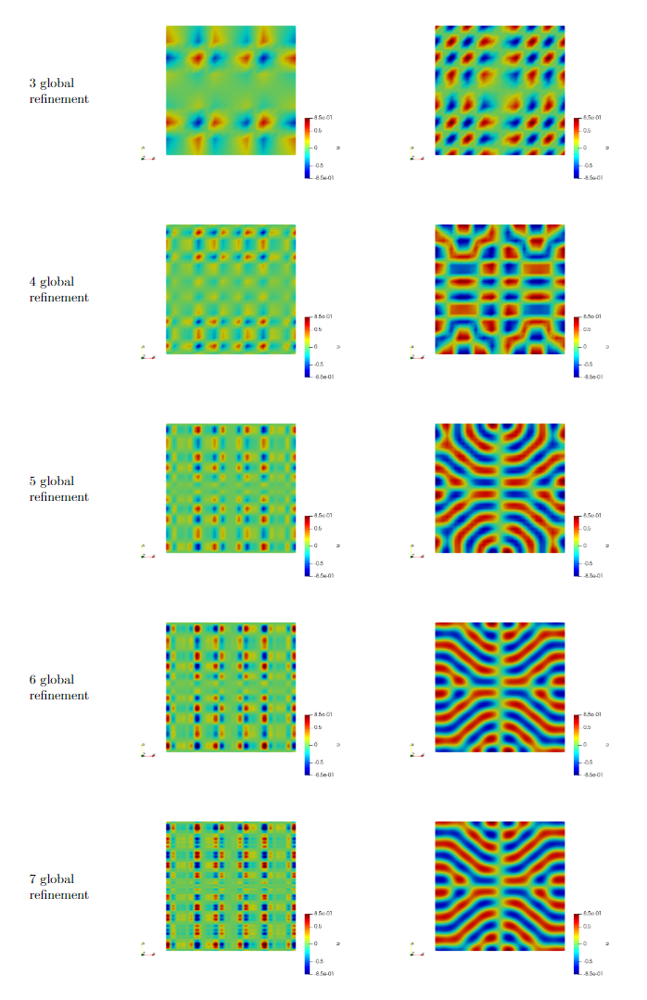

# Results

We can see the effects of varying the $g_1$ parameter and the effects
of curvature using the hot spot initial condition. On the plane, an
initial hot spot creates one ripple wave, which breaks into discrete
pieces as $g_1$ is increased. In the matrix below, $g_1$ is
increased by 0.2 starting from 0 to a maximum value of 1.4. Note that
each final solution is at 100 time units:

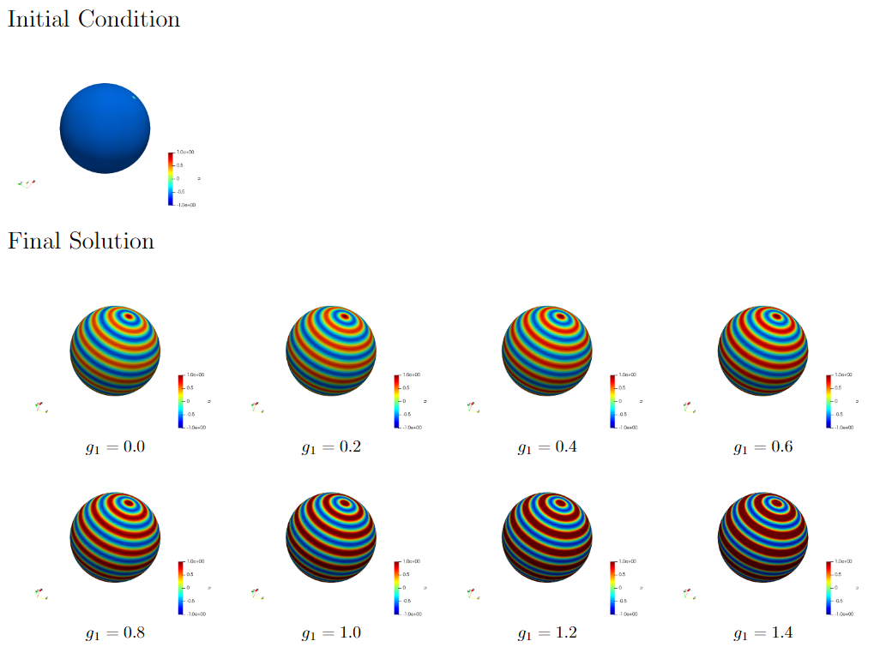

On the cylinder, the front looks similar to the square, but the back has
an overlapping wave pattern:

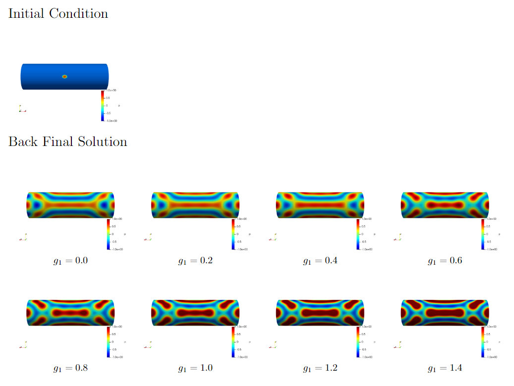

On the sphere, the hot spot generates a single wave. Note that this may
be due to the fact that our sphere has a surface area proportional to
the period of our pattern wave.

On the torus, the pattern propagates similar to the cylinder, with some
minor imperfections

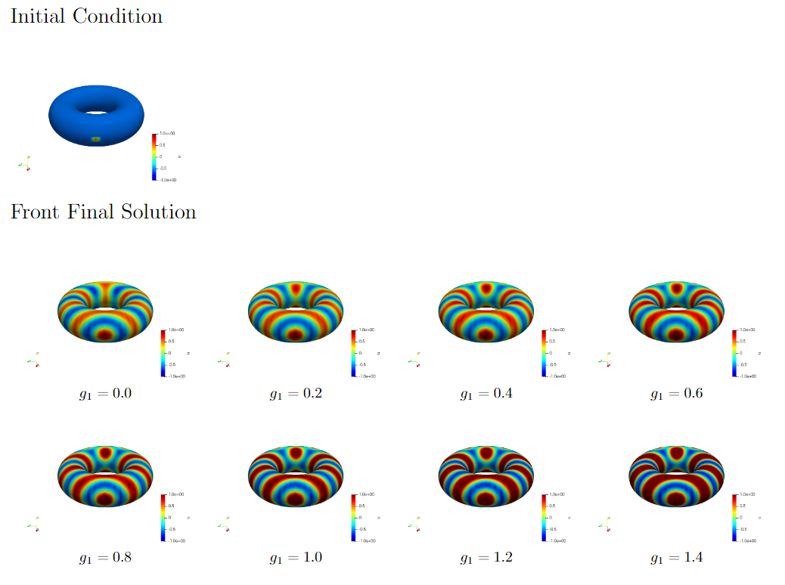

But on the back side of the torus, we see wave overlapping and spot
patterns forming

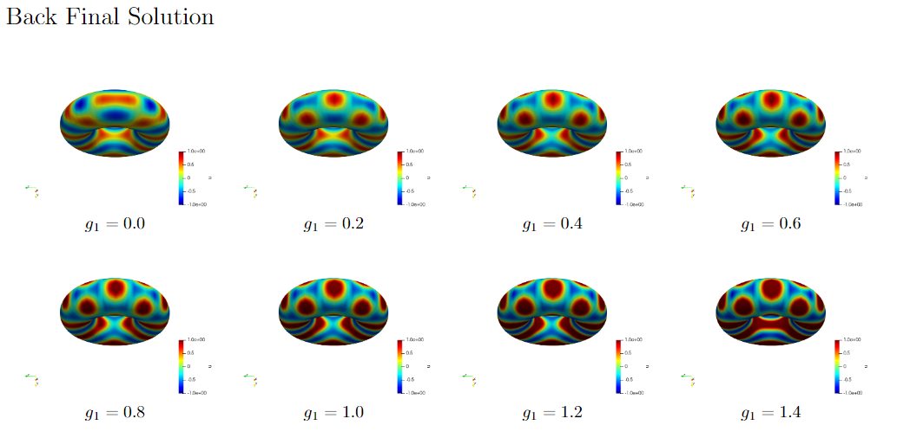

On shapes with stranger curvature, we can see that the pattern wave has
a tendency to break apart when crossing lines of curvature. This shape
was made by warping the boundary of a cylinder by a cosine wave, and is
equivalent to the surface of revolution bounded by
$1 + 0.5\cos(\frac{\pi}{10}x)$

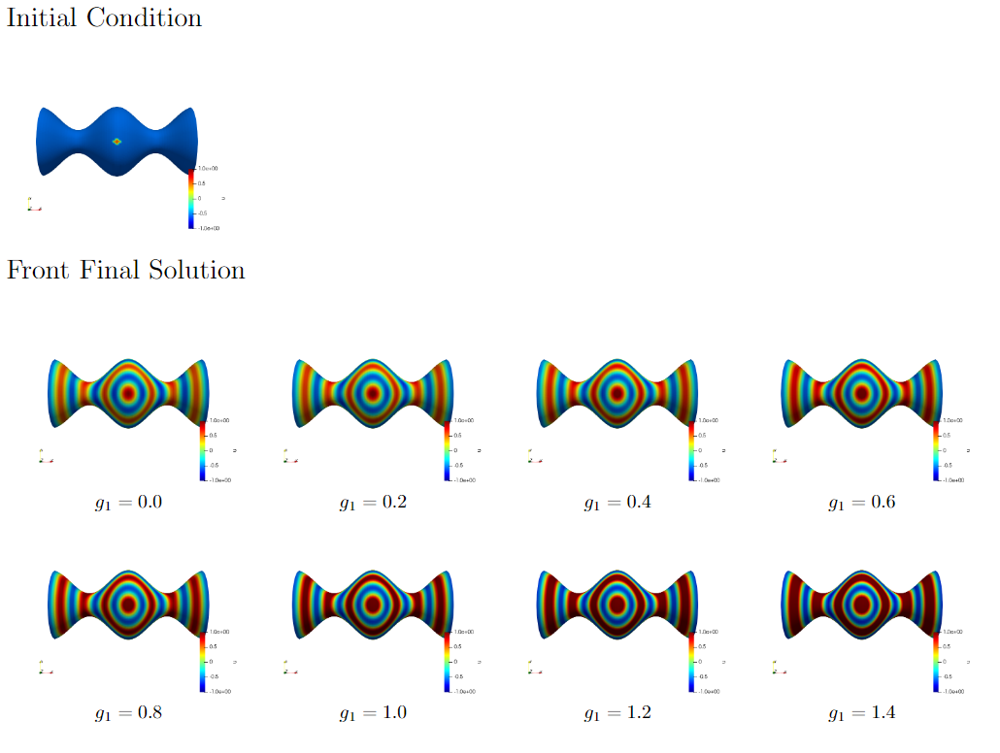

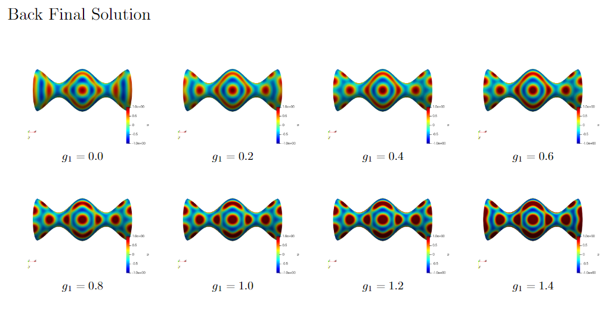

Finally, here is a small selection of random initial conditions and the
patterns that form. Each image sequence was taken at times 0, 10, 25,
50, and 100:

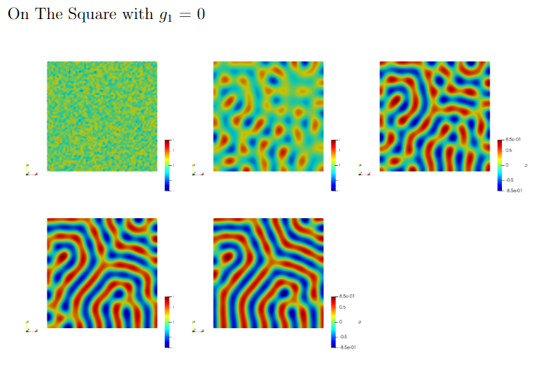

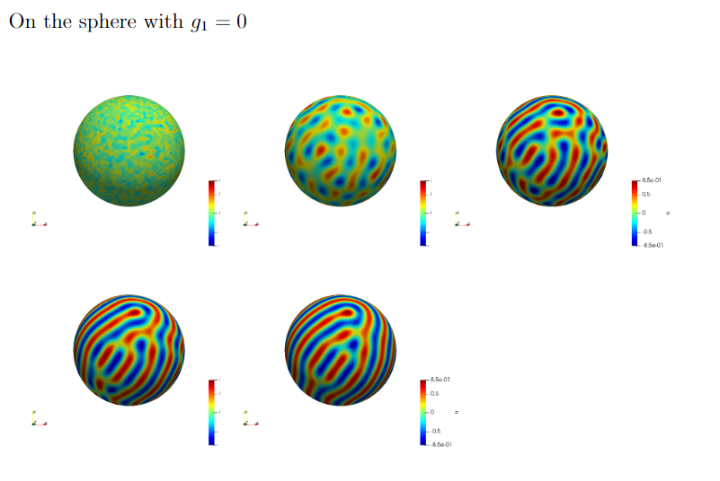

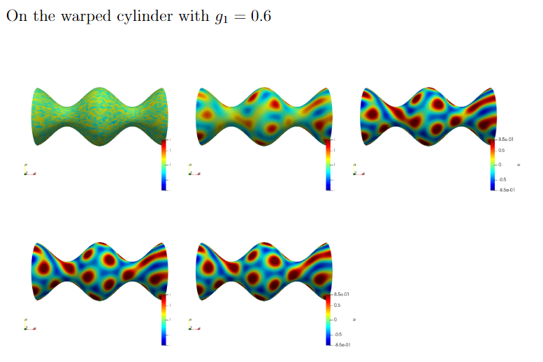