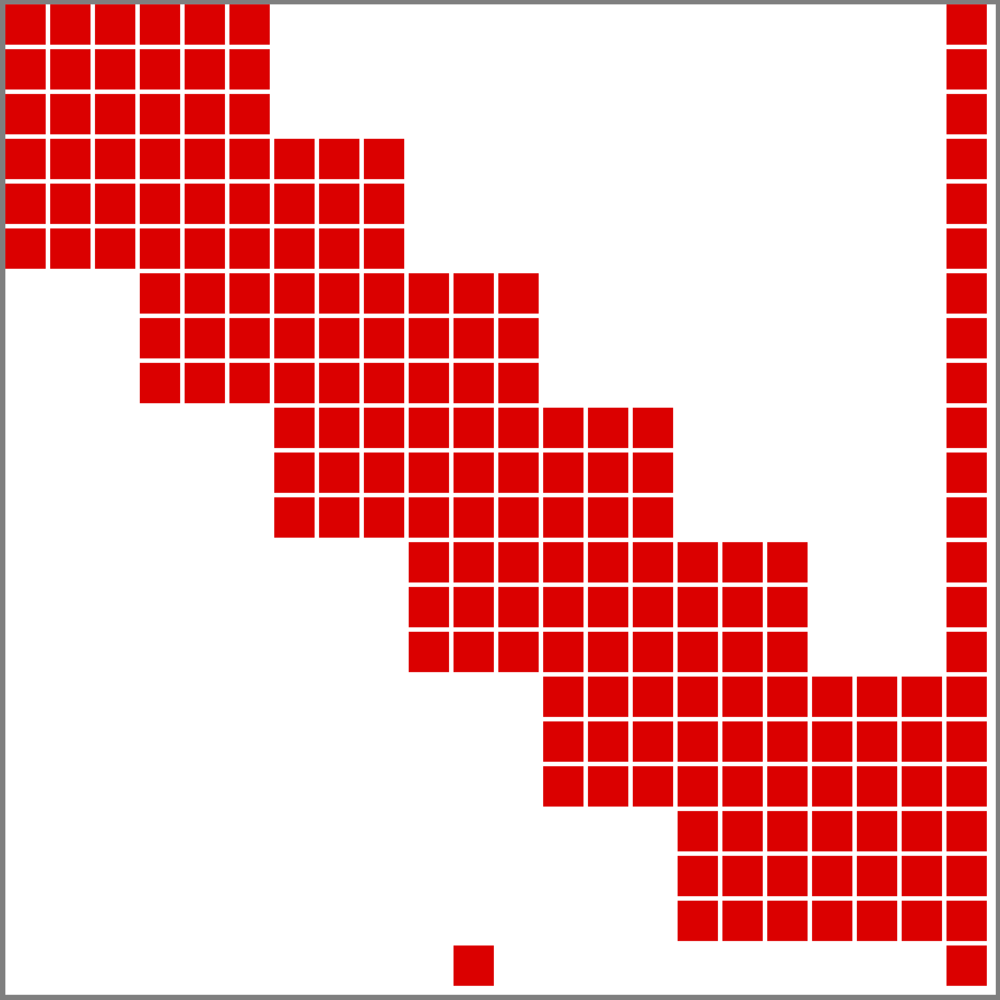
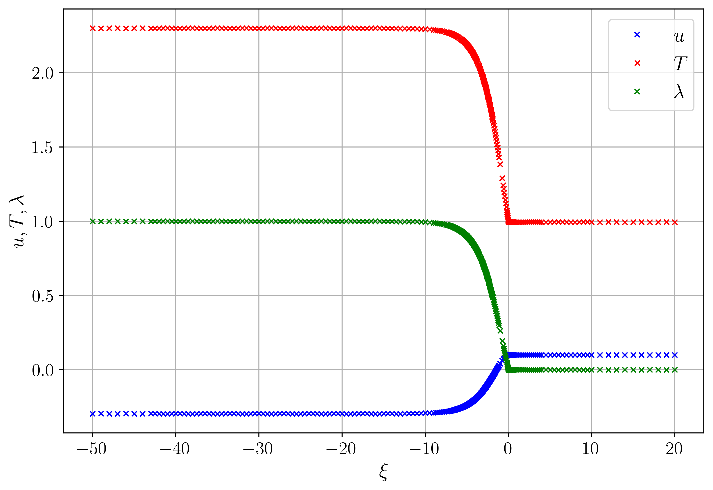
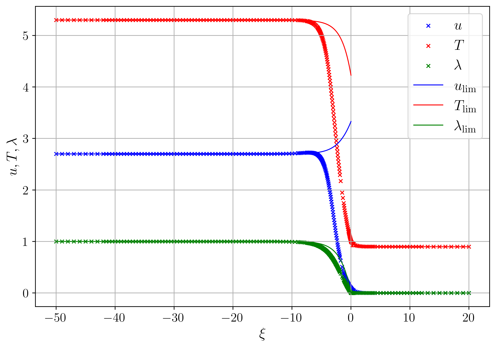
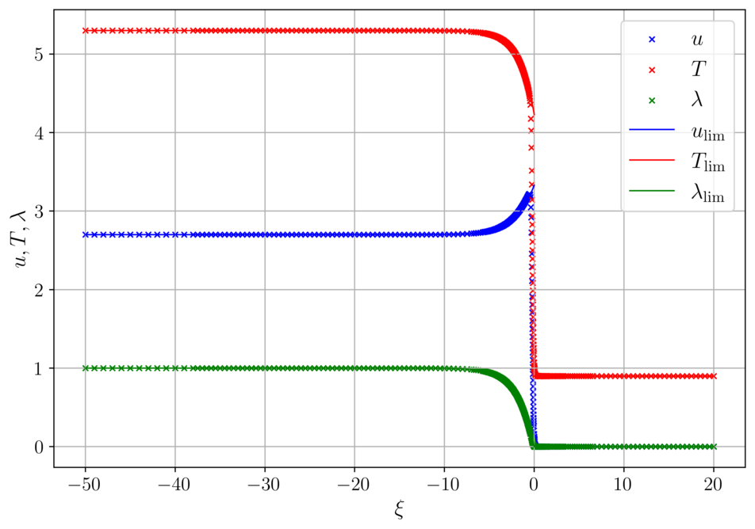

# Traveling-wave solutions of a qualitative model for combustion waves

This program demonstrates the use of adaptive finite elements to compute traveling-wave solutions of partial differential equations. One of the challenges in solving this type of problem is the presence of an unknown wave speed. Below we show how to overcome this.


## Building, compiling and running
To run the program, enter the following commands from the current directory:
```
mkdir build && cd build
cmake ..
make
./main ../ParametersList.prm
```

## Problem
To illustrate the algorithm for the computation of traveling-wave profiles, we consider a combustion model described in [1]. In a moving reference frame of a steadily propagating wave we have the following nondimensionalized system:
@f{align*}{
    - c u_{\xi} + (1 + \epsilon u) u_{\xi} &= -\dfrac{\epsilon}{2} T_{\xi} + \dfrac{4 \delta}{3 \epsilon} \Pr u_{\xi \xi}, \\
    - c(T_{\xi} - u_{\xi}) &= q \omega + \delta T_{\xi \xi}, \\
    - c \lambda_{\xi} &= \omega + \dfrac{\delta}{\text{Le}} \lambda_{\xi \xi}.
@f}
Here, $u$ is the pressure, $T$ is the temperature, $\lambda$ is the reaction-progress variable, varying from $0$ in the fresh mixture to $1$ in the burnt products, $c > 0$ is the unknown wave speed, $\Pr$ and $\mathrm{Le}$ are the Prandtl and Lewis numbers, $q$ is the energy of heat release. The model parameters $\epsilon$ and $\delta$ determine the strength of nonlinearity and dissipative effects. The reaction rate $\omega$ is taken as
@f{align*}{
\omega = k (1 - \lambda) \exp(-\theta / T) \, \mathrm{H}(T - T_{\mathrm{ign}}),
@f}
with activation energy $\theta$, ignition temperature $T_{\mathrm{ign}}$, constant of the reaction rate $k$, and the Heaviside
step function $\mathrm{H}$.

The boundary conditions at $\xi = -\infty$ are
@f{align*}{
    u_{\xi} = 0, \ T = T_l, \ \lambda = 1,
@f}
and at $\xi = +\infty$ are
@f{align*}{
    u = u_r, \ \lambda = 0.
@f}
The right boundary condition for temperature is $T = T_r$ for detonation waves (supersonic regime, i.e. $c > 1$) and $T_{\xi} = 0$ for deflagration waves (subsonic regime, i.e. $c < 1$).

Because of translational invariance, we need to impose another constraint on the system to fix a particular solution. So we choose the following centering condition: $T(0) = T_{\mathrm{ign}}$.


## Numerical algorithm

### Newton–Raphson iteration scheme
The nonlinear boundary value problem is solved numerically on a finite interval $I = [l, r]$ $\left(|l|, |r| \gg 1 \right)$, using a Newton–Raphson iteration scheme, similar to one, described in deal.II tutorial [step-15](https://www.dealii.org/current/doxygen/deal.II/step_15.html). The main difference from step-15 is that we have an additional scalar unknown, the front velocity $c$. So the algorithm has to be modified to take this feature into account.

Rewriting the system in a vector form
@f{align*}{
    \mathbf{F}(u, T, \lambda, c) = 
    \left(\begin{array}{c}
         \dfrac{4 \delta}{3 \epsilon} \Pr u_{\xi \xi} - u_{\xi} (1 - c + \epsilon u) -\dfrac{\epsilon}{2} T_{\xi}  \\[7pt]
         \delta T_{\xi \xi} + c(T_{\xi} - u_{\xi}) + q \omega \\[5pt]
         \dfrac{\delta}{\text{Le}} \lambda_{\xi \xi} + c \lambda_{\xi} + \omega
    \end{array} \right)
    = 0,
@f}
we define a Newton–Raphson iteration as
@f{align*}{
    \mathbf{F'}(\mathbf{x}^k, \mathbf{dx}^k) = - \mathbf{F}(\mathbf{x}^k),
@f}

@f{align*}{
    \mathbf{x}^{n+1} = \mathbf{x}^{n} + \alpha^k \mathbf{dx}^k,
@f}
where $k$ is the step number, $\mathbf{x}^k = (u^k, T^k, \lambda^k, c^k)^{\top}$ is a vector argument, $\mathbf{dx}^k = (du^k, dT^k, d\lambda^k, dc^k)^{\top}$ is an increment, $\alpha^k$ is some damping parameter for managing the global convergence behavior and $\mathbf{F'}(\mathbf{x}^k, \mathbf{dx}^k)$ is the directional derivative, defined as 
@f{align*}{
    \mathbf{F'}(\mathbf{x}, \mathbf{dx}) = \dfrac{\mathrm{d}}{\mathrm{d} \varepsilon} \Big|_{\varepsilon=0} \mathbf{F}(\mathbf{x} &+ \varepsilon \mathbf{dx}).
@f}

The system to be solved at every iteration step to obtain the increment $\mathbf{dx}^k = (du^k, dT^k, d\lambda^k, dc^k)^{\top}$ can be represented in matrix vector notation as follows
@f{align*}{
    \begin{pmatrix}
    \dfrac{4 \delta}{3 \epsilon} \Pr \partial_{\xi \xi} - (1 - c + \epsilon u)\partial_{\xi} - \epsilon u_{\xi} & -\dfrac{\epsilon}{2} \partial_{\xi} & 0 & u_{\xi} \\[9pt]
    -c \partial_{\xi} & \delta \partial_{\xi \xi} + c \partial_{\xi} + q \kappa_1 & q \kappa_2 &  T_{\xi} - u_{\xi} \\[9pt]
    0 & \kappa_1 & \dfrac{\delta}{\text{Le}} \partial_{\xi \xi} + c \partial_{\xi} + \kappa_2 &  \lambda_{\xi}
    \end{pmatrix} 
    \begin{pmatrix}
        du \\[9pt]
        dT \\[9pt]
        d\lambda \\[9pt]
        dc
    \end{pmatrix} = -\begin{pmatrix}
        f_1 \\[9pt]
        f_2 \\[9pt]
        f_3
    \end{pmatrix},
@f}
where
@f{align*}{
    \kappa_1 &= k (1 - \lambda) \exp(-\theta / T) \left[ \dfrac{\theta }{T^2} \, \text{H}(T - T_{\text{ign}}) + \delta(T - T_{\text{ign}}) \right], \\
    \kappa_2 &= - k \exp(-\theta / T) \, \text{H}(T - T_{\text{ign}}),
@f}
in which $\delta(\cdot)$ is a Dirac delta function, and $f_i \, (i=1,2,3)$ are the components of the vector function $\mathbf{F}(u, T, \lambda, c)$. The term $\delta(T - T_{\text{ign}})$ can be rewritten as 
@f{align*}{
    \delta(T - T_{\text{ign}}) = \frac{\delta(\xi)}{|T'(0)|}.
@f}

We choose the initial guess $\mathbf{x}^0$ to include the appropriate boundary values, therefore the update $\mathbf{dx}^k$ uses homogeneous Dirichlet or Neumann boundary conditions.

### Weak formulation
We multiply both sides of the equation for $\mathbf{dx}^k$ with vector valued test function $\mathbf{v} = (v_1, v_2, v_3)^{\top}$ and integrate over the domain $\Omega$ to obtain a scalar equation
@f{align*}{
    J(\mathbf{dx}, \mathbf{v}) = -b(\mathbf{v}).
@f}

@f{align*}{
    J(\mathbf{dx}, &\mathbf{v}) = \int \limits_{\Omega} \mathbf{v} \cdot \mathbf{F'}(\mathbf{x}, \mathbf{dx}) \, d\xi = \\
    = &\dfrac{4 \delta}{3 \epsilon} \Pr (-\partial_{\xi} v_1, \partial_{\xi} du) + (v_1, - (1 - c + \epsilon u)\partial_{\xi} du - \epsilon u_{\xi} du -\dfrac{\epsilon}{2} \partial_{\xi} dT + u_{\xi} dc) + \\ 
    &+ \delta (-\partial_{\xi} v_2, \partial_{\xi} dT) + (v_2, -c \, \partial_{\xi} du + c \, \partial_{\xi} dT + q \kappa_1 dT + q \kappa_2 d\lambda + T_{\xi} dc - u_{\xi} dc) + \\
    &+ \dfrac{\delta}{\text{Le}} (-\partial_{\xi} v_3, \partial_{\xi} d\lambda) + (v_3, \kappa_1 dT + c \partial_{\xi} d\lambda + \kappa_2 d\lambda + \lambda_{\xi} dc).
@f}

@f{align*}{
    b(\mathbf{v}) = \int \limits_{\Omega} &\mathbf{v} \cdot \mathbf{F}(\mathbf{x}) \, d\xi = \\
    = &\dfrac{4 \delta}{3 \epsilon} \Pr (-\partial_{\xi} v_1, u_{\xi}) + (v_1, - u_{\xi} (1 - c + \epsilon u) -\dfrac{\epsilon}{2} T_{\xi}) + \\
    &+ \delta (-\partial_{\xi} v_2, T_{\xi}) + (v_2, c(T_{\xi} - u_{\xi}) + q \omega) + \\
    &+ \dfrac{\delta}{\text{Le}} (-\partial_{\xi} v_3, \lambda_{\xi}) + (v_3, c \lambda_{\xi} + \omega).
@f}
In the above expressions second derivatives disappear due to integration by parts with homogeneous Dirichlet and Neumann boundary conditions. The solution is sought as an expansion
@f{align*}{
    \begin{pmatrix}
        du \\[9pt]
        dT \\[9pt]
        d\lambda \\[9pt]
        dc
    \end{pmatrix} = 
    \sum \limits_{i = 1}^{3N} 
    U_{i}\begin{pmatrix}
        \phi_i^1 \\[9pt]
        \phi_i^2 \\[9pt]
        \phi_i^3 \\[9pt]
        0
    \end{pmatrix} +
    U_{3N + 1}\begin{pmatrix}
        0 \\[9pt]
        0 \\[9pt]
        0 \\[9pt]
        1
    \end{pmatrix} \quad \in \quad V_p \times V_p \times V_p \times \mathbb{R}.
@f}
where $V_p$ is a finite element space of continuous, piecewise polynomials of degree $p$. The set of vector functions $(\phi_i^1, \phi_i^2, \phi_i^3)^{\top} \in  V_p^3$ form the basis of the corresponding space. We then choose test functions $\mathbf{v}$ to be the same as the basis functions, and obtain the linear system $J U = b$. Elements of the matrix and the right-hand side are computed according to following formulas:
@f{align*}{
    J_{ij} = &\dfrac{4 \delta}{3 \epsilon} \Pr (-\partial_{\xi} \phi_i^1, \partial_{\xi} \phi_j^1) + (\phi_i^1, - (1 - c + \epsilon u)\partial_{\xi} \phi_j^1 - \epsilon u_{\xi} \phi_j^1 -\dfrac{\epsilon}{2} \partial_{\xi} \phi_j^2) + \\ 
    &+ \delta (-\partial_{\xi} \phi_i^2, \partial_{\xi} \phi_j^2) + (\phi_i^2, -c \, \partial_{\xi} \phi_j^1 + c \, \partial_{\xi} \phi_j^2 + q \kappa_1 \phi_j^2 + q \kappa_2 \phi_j^3) + \\
    &+ \dfrac{\delta}{\text{Le}} (-\partial_{\xi} \phi_i^3, \partial_{\xi} \phi_j^3) + (\phi_i^3, \kappa_1 \phi_j^2 + c \partial_{\xi} \phi_j^3 + \kappa_2 \phi_j^3), 
@f}

@f{align*}{
    J_{i, 3N + 1} = (\phi_i^1, u_{\xi}) + (\phi_i^2, T_{\xi} - u_{\xi}) + (\phi_i^3, \lambda_{\xi}),
@f}

@f{align*}{
    b_{i} = &\dfrac{4 \delta}{3 \epsilon} \Pr (-\partial_{\xi} \phi_i^1, u_{\xi}) + (\phi_i^1, - u_{\xi} (1 - c + \epsilon u) -\dfrac{\epsilon}{2} T_{\xi}) + \\
    &+ \delta (-\partial_{\xi} \phi_i^2, T_{\xi}) + (\phi_i^2, c(T_{\xi} - u_{\xi}) + q \omega) + \\
    &+ \dfrac{\delta}{\text{Le}} (-\partial_{\xi} \phi_i^3, \lambda_{\xi}) + (\phi_i^3, c \lambda_{\xi} + \omega),
@f}
for $i, j < 3N + 1$.

In order for the system to have a unique solution, we need to supplement it with one more equation, corresponding to the constraint $T(0) = T_{\text{ign}}$. The initial approximation to the solution is set so as to satisfy this condition, so we just need the computed increment function $dT$ to be zero at the specified point. Thus, we add a row of zeros with a value of 1 in the position corresponding to $dT(0)$ to the matrix $J$ and set $b_{3N + 1} = 0$.

The resulting sparsity pattern structure has the form shown in the figure below.


The integration of the terms with $\kappa_1$ need special attention because of the Dirac delta function. If $U_n$ and $U_m$ are the degrees of freedom, associated with the vertex $\xi = 0$ (i.e., $\phi_n^2(0) = 1$ and $\phi_m^3(0) = 1$), we get
@f{align*}{
(\phi_n^2, q (k (1 - \lambda) \exp(-\theta / T) \delta(T - T_{\text{ign}})) \phi_n^2) = \dfrac{q k (1 - \lambda(0)) \exp(-\theta / T(0))}{|T'(0)|}
@f}
and
@f{align*}{
(\phi_m^3, (k (1 - \lambda) \exp(-\theta / T) \delta(T - T_{\text{ign}})) \phi_n^2) = \dfrac{k (1 - \lambda(0)) \exp(-\theta / T(0))}{|T'(0)|}.
@f}


### Initial guess
The initial guess for detonation wave is obtained from the following problem
@f{align*}{
    u_{\xi} (- c + 1 + \epsilon u) &= -\dfrac{\epsilon}{2} T_{\xi} , \\
    - c(T_{\xi} - u_{\xi}) &= q \omega, \\
    - c \lambda_{\xi} &= \omega,
@f}
which is the limiting case of the system at $\delta = 0$. The problem reduces to the nonlinear initial value problem
@f{align*}{
    \lambda_{\xi} = -\dfrac{k}{c} (1 - \lambda) \exp \left( \dfrac{-\theta}{T(\lambda)} \right), 
@f}
with initial condition $\lambda(0) = 0$; see [1] for details.

For the deflagration case, the initial guess is taken piecewise constant for $u$ and $T$, and
@f{align*}{
    \lambda(\xi) = 
    \begin{cases}
    -\exp \left(\xi (1 - c) \Big/ \left(\dfrac{4 \delta}{3 \epsilon} \Pr \right) \right) + 1 \quad &\mathrm{for}\ \xi \in [l, 0],  \\
    0 \quad &\mathrm{for}\ \xi \in (0, r]
    \end{cases}
@f}
for the reaction-progress variable. The value in the interval $(0, 1)$ is chosen as the initial guess for the front velocity $c$.


### Boundary conditions
In the numerical solution, the boundary conditions described in the [beginning](#problem) are imposed at the ends of the interval $I$. In addition, a homogeneous Neumann condition is applied to the function $d\lambda$ at the left boundary.


## Program

### Parameters
The calculation parameters are set in the `ParametersList.prm` file. To reproduce the results obtained below, you can run the program with the parameter files `ParametersListDeflagrationSlow.prm`, `ParametersListDeflagrationFast.prm` and `ParametersListDetonation.prm`.

### Class `TravelingWaveSolver`
`TravelingWaveSolver` is the main class for computation of the traveling-wave profiles.

The implementation of Newton's method is based on that described in [step-77](https://www.dealii.org/current/doxygen/deal.II/step_77.html) and relies on SUNDIALS' [KINSOL](https://computing.llnl.gov/projects/sundials/kinsol) package. Because of the additional unknown, the front velocity, we expand the Jacobi matrix by one column and one row (`jacobian_matrix_extended`), and add one more element to the solution vector (`current_solution_extended`). After completing the Newton iterations, we split the resulting extended solution vector `current_solution_extended` into two parts: the solution vector `current_solution`, corresponding to $(u, T, \lambda)$, and the front velocity `current_wave_speed`. After that the adaptive mesh refinement is performed using the `current_solution` vector, which is very important for resolving a narrow transition layer with a large solution gradient in the vicinity of zero. The [KellyErrorEstimator](https://www.dealii.org/current/doxygen/deal.II/classKellyErrorEstimator.html) is used as a refinement indicator.

### Function `calculate_profile`
The full calculation cycle is done in the `calculate_profile` function. First, we construct an initial guess to the solution depending on the selected wave type and store the result as an object of type `SolutionStruct`. This object, along with the problem parameters, is then passed to the constructor of the `TravelingWaveSolver` class to calculate the traveling wave.

Decreasing the dissipation parameter $\delta$ leads to the appearance of large gradients in solutions in the neighborhood of zero. As a consequence, Newton's method becomes more sensitive to the initial data and ceases to converge. To solve this problem, the `calculate_profile` function implements the method of continuation by the $\delta$ parameter (for an example, see [step-57](https://www.dealii.org/current/doxygen/deal.II/step_57.html)). The solution and the refined triangulation are saved after each step of the method using the `get_solution` and `get_triangulation` functions and then passed to the next step.


### Error estimation
Integration of the [governing equations](#problem) over the real line gives the following relations:
@f{align*}{
    u_l (1 - c) + \frac{\epsilon}{2} u_l^2 + \frac{\epsilon}{2} T_l &=  u_r (1 - c) + \frac{\epsilon}{2} u_r^2 + \frac{\epsilon}{2} T_r , \\
    T_l - u_l &= T_r - u_r + q.
@f}
These relations let us express any two parameters of $c, T_l, T_r, u_l, u_r$ in terms of the remaining three. Thus, we can write
@f{align*}{
    u_l &= (T_l - T_r) + u_r - q, \\
    c &= 1 + \epsilon \left( u_r - \dfrac{(q - (T_l - T_r))^2 + (T_l - T_r)}{2 (q - (T_l - T_r))} \right).
@f}
This means that since we choose the three parameters $T_l, T_r, u_r$ for the detonation case ourselves, the above formulas give us the exact values of $c$ and $u_l$. These can be used to obtain the value of the error in the calculated $c$ and $u_l$.

For the deflagration case, however, we can only choose two parameters, $T_l$ and $u_r$. The remaining three are determined during the solution, so the formulas can only give us an error estimate.


### Initial guess
To get the initial condition for detonation, we have to solve the nonlinear initial value problem for $\lambda$ we mentioned earlier. This is done in the `LimitSolution` class. Numerical integration is performed using the [odeint](https://www.boost.org/doc/libs/1_85_0/libs/numeric/odeint/doc/html/index.html) library of the [Boost](https://www.boost.org) with its interface in `IntegrateSystem.h`.


## Results

To visualize the computed profiles, one can use gnuplot typing

`plot for [i=2:4] "solution_filename" using 1:i w p title word("u T lambda", i-1)`

or execute the python script `plot.py` 

`python plot.py "solution_filename"`

### Slow deflagration for $\delta = 0.01$
The calculated wave speed is $c = 0.0909$.


### Fast deflagration for $\delta = 0.01$
The calculated wave speed is $c = 0.8252$.



### Detonation for $\delta = 0.01$ and $\delta = 0.001$
The calculated wave speed in both cases is the same $c = 1.216481$, as expected. Solid lines represent the detonation profile for the ideal case, when $\delta=0$. 






## Acknowledgments

I would like to thank my friend Oleg Rogozin for introducing me to the deal.II library and the world of finite elements.


## References

1. [Goldin A.Y., Magomedov S.M., Faria L.M., Kasimov A.R. Study of a qualitative model for combustion waves: Flames, detonations, and deflagration-to-detonation transition. Computers & Fluids 2024; 273:106213.](https://doi.org/10.1016/j.compfluid.2024.106213)