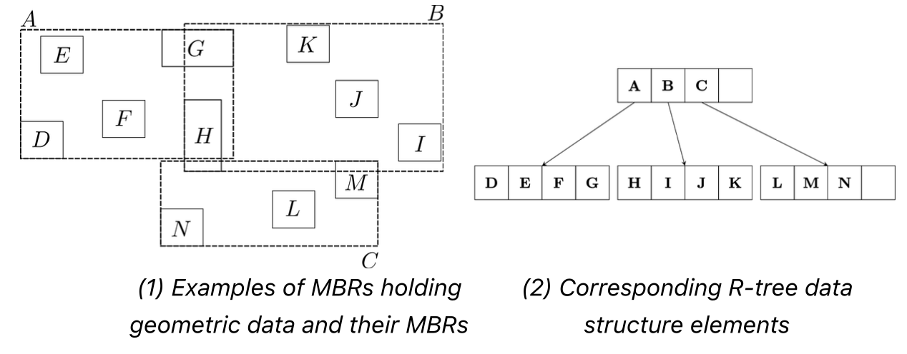
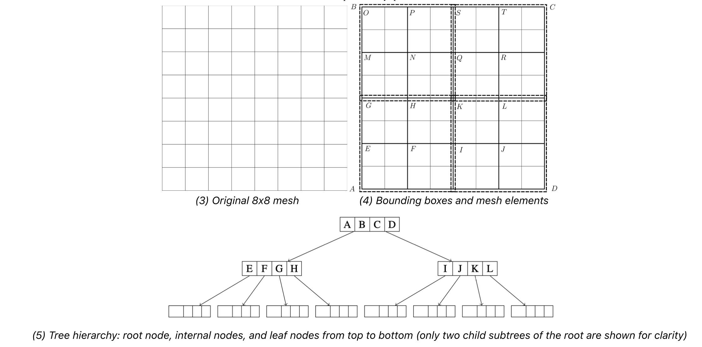
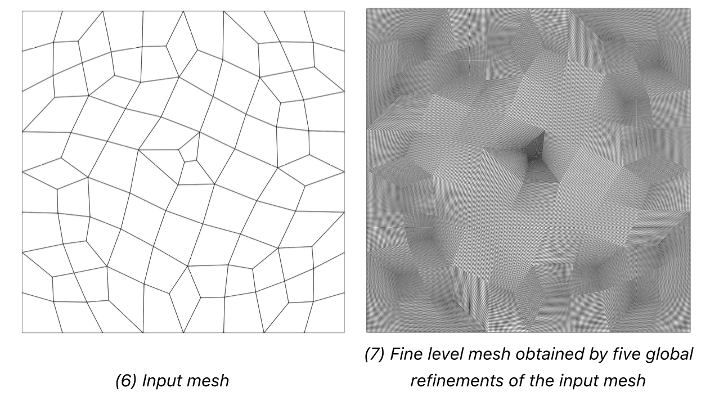
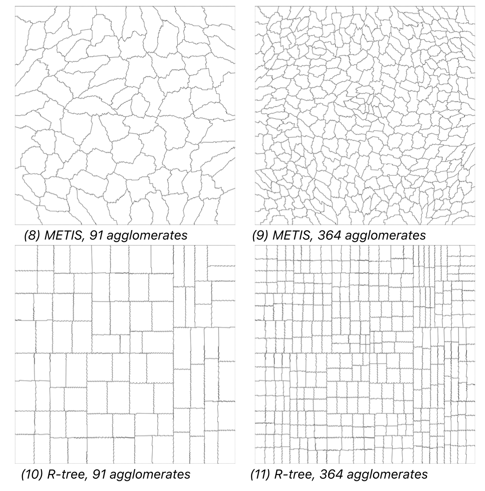
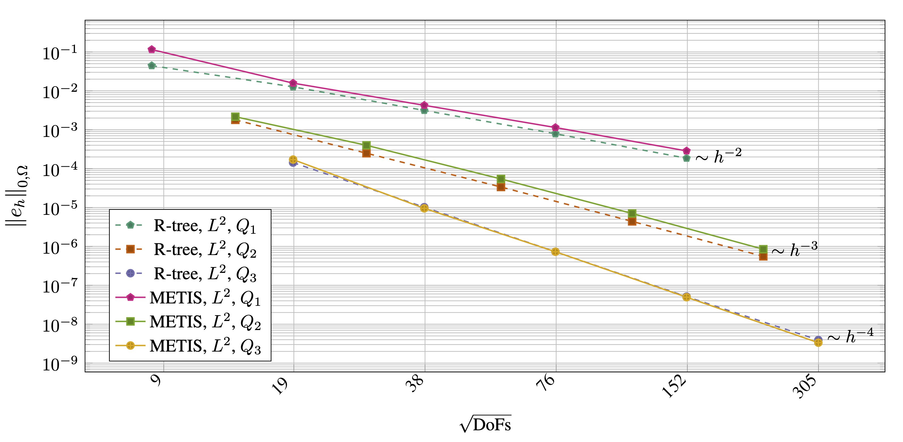
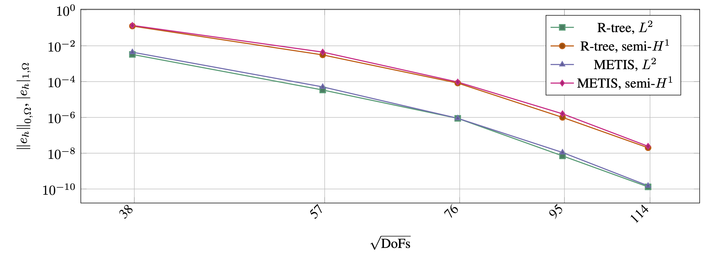
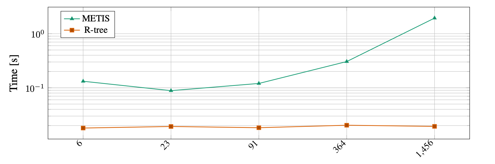
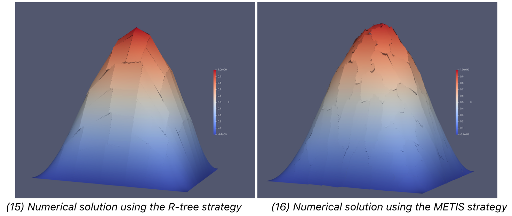

# Polytopic Mesh DG Solver for Poisson

This program solves a Poisson problem on an agglomerated polytopal mesh
using a symmetric interior penalty discontinuous Galerkin (SIPDG) method.
Agglomerates are constructed by an R-tree based spatial indexing
strategy, following the approach proposed in [1].
In addition, a graph-based METIS partitioner is also provided in this program for comparison.

## Running the code:

As in the tutorial programs, type

`cmake -DDEAL_II_DIR=/path/to/deal.II .`

on the command line to configure the program. After that, you can compile with `make` and run with either `make run` or with

`./agglomeration_poisson`

on the command line.

## Program output

Running the program produces two kinds of output:

- terminal output (text summary),
- visualization files (`.vtu`).

The program prints a short summary including:

- the finite element degree (`FE degree`);
- the triangulation size (`Size of tria`);
- the agglomeration construction time (rtree/metis build time);
- the number of agglomerated subdomains (`N subdomains`);
- the number of DoFs per cell;
- the assembly time;
- a convergence table with `#DoFs`, `L2 error`, and `H1 error`.

The program writes the following `.vtu` files for each run:

- `grid_input_mesh.vtu`, containing the input mesh from gmsh;
- `grid_fine_mesh_refined.vtu`, containing the globally refined fine mesh;
- `grid_<partitioner>_<n_subdomains>.vtu`, containing the agglomerated mesh
  partition information (cell-wise agglomeration labels);
- `interpolated_solution_<partitioner>_<n_subdomains>.vtu`, containing the
  numerical solution interpolated to the fine grid together with agglomerate
  labels for visualization.

These files can be visualized in ParaView to inspect both the agglomeration
structure and the computed solution.

## Problem description:

We consider the Poisson problem in a bounded, simply connected domain
$\Omega \subset \mathbb{R}^d$, $d = 2,3$.
The strong formulation reads
@f{align*}{
  -\Delta u &= f  && \text{in } \Omega, \\
           u &= u_D && \text{on } \partial\Omega,
@f}
where the right-hand side satisfies $f \in L^2(\Omega)$ and the prescribed
Dirichlet data satisfy $u_D \in H^{1/2}(\partial\Omega)$.

The corresponding weak formulation is: find $u \in H^1(\Omega)$ with
$u = u_D$ on $\partial\Omega$ such that
@f{align*}{
  \int_{\Omega} \nabla u \cdot \nabla v \,\mathrm d\mathbf{x}
  =\int_{\Omega} f\, v \,\mathrm d\mathbf{x}
  \qquad \text{for all } v \in H_0^1(\Omega).
@f}

## SIPDG discretization on agglomerated polytopic meshes:

We discretize the weak formulation by a symmetric interior penalty
discontinuous Galerkin (SIPDG) method on the agglomerated polytopal mesh
$T_h$, whose elements $K \in T_h$ are mutually disjoint
open polygons (for $d=2$) or polyhedra (for $d=3$).
The mesh skeleton is defined by
@f{align*}{
  \Gamma := \bigcup_{K \in T_h} \partial K.
@f}
The mesh skeleton $\Gamma$ is decomposed into $(d-1)$–dimensional simplices $F$ representing the mesh faces, shared by at most two elements. These are distinct from elemental interfaces, which are defined as the simply connected components of the intersection between the boundary of an element and either a neighboring element or $\partial \Omega$. As such, an interface between two elements may consist of more than one face, separated by hanging nodes/edges shared by those two elements only. We denote by $\Gamma_{\mathrm{int}}$ the union of all interior faces, and by $\Gamma_{\mathrm D} := \Gamma \cap \partial\Omega$ the union of Dirichlet boundary faces.

In practice, the polytopic mesh is obtained by agglomeration, so that each element $K \in T_h$ is the union of a collection of leaf cells. For each agglomerated element $K$, we associate an axis-aligned bounding box $B_K$. On $B_K$ we define the standard polynomial space $Q_p(B_K)$ spanned by tensor-product Lagrange polynomials of degree $p$ in each coordinate direction. Since $K \subset B_K$, the basis on $K$ is defined by restricting each basis function to $K$. In the implementation, this corresponds to using the deal.II finite element `FE_DGQ` on the bounding box and taking its restriction to the agglomerated element. The global discrete space $V_h$ is then obtained by assembling these local spaces in a discontinuous manner over all $K \in T_h$. For $u_h, v_h \in V_h$ we use the broken gradient $\nabla_h$ and the standard jump and average operators $[\![\cdot]\!]$ and $\{\!\!\{\cdot\}\!\!\}$ on faces.

The DG formulation reads: find $u_h \in V_h$ such that
@f{align*}{
  B(u_h,v_h) = l(v_h)
  \qquad \forall\, v_h \in V_h,
@f}
with
@f{align*}{
  B(u_h,v_h)
  &=
  \int_{\Omega} \nabla_h u_h \cdot \nabla_h v_h \,\mathrm d\mathbf{x}
  \\
  &\quad
  - \int_{\Gamma}
    \Bigl(
      \{\!\!\{\nabla u_h\}\!\!\} \cdot [\![v_h]\!]
      +
      \{\!\!\{\nabla v_h\}\!\!\} \cdot [\![u_h]\!]
    \Bigr)\,\mathrm d s
  \\
  &\quad
  + \int_{\Gamma} \sigma \,[\![u_h]\!] \cdot [\![v_h]\!] \,\mathrm d s,
@f}
and
@f{align*}{
  l(v_h)
  =
  \int_\Omega f\, v_h \,\mathrm d\mathbf{x}
  +
  \int_{\Gamma_{\mathrm D}}
    u_D \bigl(\sigma v_h - \nabla v_h \cdot \mathbf n\bigr)\,\mathrm d s.
@f}

The penalty parameter is chosen as
@f{align*}{
  \sigma(\mathbf x) = C_\sigma
  \begin{cases}
    \dfrac{(p+1)(p+d)}{ h_{B_K} }, &
      \text{if } \mathbf x \in \partial K \cap \partial\Omega, \\[0.5em]
    \dfrac{(p+1)(p+d)}{\min\{h_{B_K}^+,h_{B_K}^-\}}, &
      \text{if } \mathbf x \in \Gamma_{\mathrm{int}},
  \end{cases}
@f}
where $h_{B_K}^\pm$ denote the diameters of the bounding boxes associated with the two elements sharing the interior face. In this program, we set $C_\sigma = 10$.

This scheme is well posed and admits optimal-order a priori error
estimates. More precisely, assuming that $u|_K \in H^{s+1}(K)$ for all
$K \in T_h$ and some $1 \le s \le p$, there exists a constant
$C > 0$, independent of $h$, such that
@f{align*}{
  \|u - u_h\|_{L^2(\Omega)}
  \le C\, h^{s+1} \, |u|_{H^{s+1}(\Omega)},
@f}
and
@f{align*}{
  \|\nabla(u - u_h)\|_{L^2(\Omega)}
  \le C\, h^{s} \, |u|_{H^{s+1}(\Omega)}.
@f}
We refer to [2] for details of the analysis.

## Agglomeration strategies
Agglomeration is a natural mechanism for constructing polytopic meshes.
This program supports two strategies for generating agglomerates,
corresponding to the choices `metis` and `rtree`. In this example, we
mainly focus on the `rtree` strategy, which is the method developed and
introduced in the work [1].

### R-tree-based agglomeration
#### Basic idea and data structure
In the `rtree` option, axis-aligned bounding boxes of all fine cells are
inserted into a spatial R-tree. Agglomerates are obtained by grouping the
cells whose bounding boxes belong to the same node at a user-selected
extraction level of the tree. This purely geometric strategy does not
require external graph partitioners and is typically fast and scalable.
The number and shape of the agglomerates are determined by the R-tree
structure and the chosen level.

This approach is particularly suitable for multilevel methods, where a *nested*
agglomerated hierarchy is desirable.

At the data-structure level, we distinguish leaf nodes and internal nodes:

- **Leaf nodes** store the geometric objects (here, mesh cells or their bounding boxes).
- **Internal nodes** store:
  - a pointer (or reference) to a child node,
  - a bounding box that encloses all entries contained in that child subtree.

As a result, each internal node represents a spatial grouping of the objects below it.

#### Design targets
The R-tree is used here as a geometry-aware structure for organizing cell bounding boxes into hierarchical groups.
Our construction is guided by the classical R*-tree criteria of Beckmann et al. [3], namely:
- **Minimize box area**: reduce the area covered by each bounding box,
- **Minimize overlap**: reduce overlap between neighboring boxes,
- **Improve shape-regularity**: reduce box perimeters (equivalently, favor more shape-regular boxes).

These criteria improve the spatial quality of the hierarchy and typically lead to better grouping and query behavior.

To make the R-tree construction more intuitive, we first illustrate the relation
between geometric objects, their minimum bounding rectangles (MBRs), and the
corresponding R-tree hierarchy. The left image shows geometric objects together
with their enclosing MBRs, while the right image shows the associated tree
structure (leaf and internal nodes). This visual example helps explain how the
hierarchical grouping is later used to extract agglomerates.

#### Agglomeration extraction

The construction of an R-tree spatial index on an arbitrary fine grid provides a natural agglomeration strategy with the following features:

- it is fully automated, robust, and dimension-independent;
- it produces a nested hierarchy of agglomerates;
- the resulting agglomerates are closely aligned with their axis-aligned bounding boxes.

These properties make the R-tree approach an attractive alternative to graph-based agglomeration methods.

Given a collection of fine-level cells, or of cut-cell bounding boxes, the agglomeration procedure is as follows:

- **Step 1: Build the R-tree**  
  Construct an R-tree from the set of bounding boxes associated with the fine-level cells.

- **Step 2: Select a target level**  
  Choose a tree level $l$ with $1\le l \le L$ to control the agglomeration granularity.

- **Step 3: Collect leaf descendants**  
  For each node on level $l$, recursively traverse its children until leaf nodes are reached.

- **Step 4: Agglomerate by common ancestor**  
  Merge leaf cells that belong to the same subtree, that is, those sharing the same ancestor at level $l$.

This yields a nested hierarchy with natural parent-child relations across levels and, by repeating the extraction at different levels, produces a sequence of nested agglomerated meshes that can be used in multilevel solvers and preconditioners.

For the agglomeration workflow considered here, the R-tree-based extraction has the following practical features:

- **Level-independent extraction cost (observed):** the wall-clock time is approximately constant with respect to the chosen extraction level.
- **Boost.Geometry backend:** the implementation relies on the `Boost.Geometry` R-tree.
- **Custom traversal logic:** the hierarchy traversal required for agglomeration is not directly exposed, so a custom node visitor is implemented.

In the present setting, this makes the R-tree approach particularly convenient for constructing nested agglomerated meshes in multilevel finite element and DG settings.

For illustration, the following images show R-tree-based agglomeration on a structured fine mesh:

Figures (3)-(5) show, respectively, the original fine mesh, the blocks induced by the R-tree on the cell bounding boxes, and the corresponding tree structure.
### METIS-based partitioning
In the `metis` option, the adjacency graph of the fine mesh is constructed
with one vertex per cell and edges between face-neighboring cells.
This graph is then partitioned by the multilevel graph partitioner METIS
into a prescribed number of parts, and each part defines one agglomerate;
see [4] for details.

## Test case:

We consider the Poisson problem on the unit square $\Omega = (0,1)^2$
with the manufactured exact solution
@f{align*}{
  u(x,y) = \sin(\pi x)\sin(\pi y).
@f}
The corresponding right-hand side is
@f{align*}{
  f(x,y) = 2\pi^2 \sin(\pi x)\sin(\pi y).
@f}
This manufactured solution allows us to compute the global
$L^2$- and $H^1$-seminorm errors of the discrete solution in order to
assess the quality of the numerical approximation.

In this example, we start from an unstructured initial mesh and then perform five global refinement steps. The resulting meshes are shown below.

Agglomerates are then constructed from the fine level mesh by METIS and by the
R-tree strategy, leading to different polytopal meshes. The following images
compare the resulting agglomerates corresponding to two
different agglomeration levels (91 and 364 agglomerates).

<h4>Comparison of agglomeration strategies</h4>

These plots illustrate how the two strategies distribute and shape the
agglomerates starting from the same fine level mesh. In particular, the R-tree approach produces
geometry-driven groupings induced by the spatial hierarchy, while METIS
produces graph-based partitions of the cell adjacency graph.

To assess the discretization accuracy, we next compare the error behavior under
mesh refinement or increasing the polynomial degree. The plots below are obtained by
collecting the program outputs over multiple runs and post-processing the
reported error data.

*(12) h-convergence for Q_p elements (p=1,2,3) with METIS and R-tree agglomeration*

The figure reports the $L^2$-norm error with respect to the
manufactured solution. Optimal convergence rates are observed for all
polynomial degrees and for both agglomeration strategies. In addition, the
curves associated with the R-tree approach are marginally lower than or
comparable to those obtained with METIS-based partitioning.

We next compare p-convergence for the two agglomeration strategies in both
the $L^2$-norm and the $H^1$-seminorm.

*(13) Convergence under p-refinement for METIS and R-tree agglomeration (p = 1,2,3,4,5)*

 
In addition to accuracy, the cost of constructing the agglomerated polytopal
meshes is also relevant in practice. The following timing plot compares the
wall-clock time required by the R-tree and METIS strategies. The timing values
are collected from the program outputs and summarized in post-processing.

*(14) Wall-clock time (seconds) for building polytopal grids with R-tree and METIS*

Finally, the program also outputs VTU files for visualization in ParaView. Figures (15) and (16) show the solution computed on 91 agglomerates and then interpolated back onto the fine mesh, for the R-tree and METIS strategies, respectively, visualized in ParaView using Warp By Scalar together with the Surface representation.

## References
* [1] Marco Feder, Andrea Cangiani and Luca Heltai (2025), R3MG: R-tree based agglomeration of polytopal grids with applications to multilevel methods. DOI: [10.1016/j.jcp.2025.113773](https://doi.org/10.1016/j.jcp.2025.113773)

* [2] Daniele Antonio  Di Pietro and Alexandre Ern (2012), Mathematical Aspects of Discontinuous Galerkin Methods. DOI: [10.1007/978-3-642-22980-0](https://doi.org/10.1007/978-3-642-22980-0)

* [3] Norbert Beckmann, Hans-Peter Kriegel, Ralf Schneider and Bernhard Seeger (1990), The R*-tree: an efficient and robust access method for points and rectangles. DOI: [10.1145/93597.98741](https://doi.org/10.1145/93597.98741)

* [4] George Karypis and Vipin Kumar (1998), A fast and high quality multilevel scheme for partitioning irregular graphs. DOI: [10.1137/S1064827595287997](https://doi.org/10.1137/S1064827595287997)
