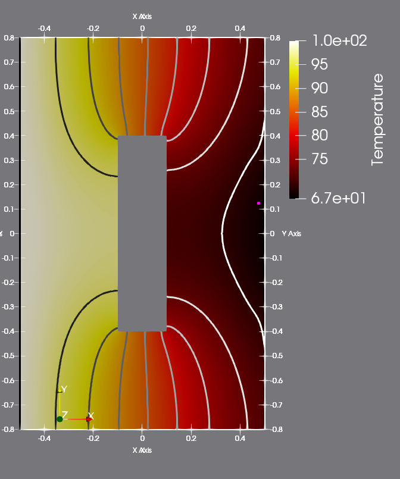
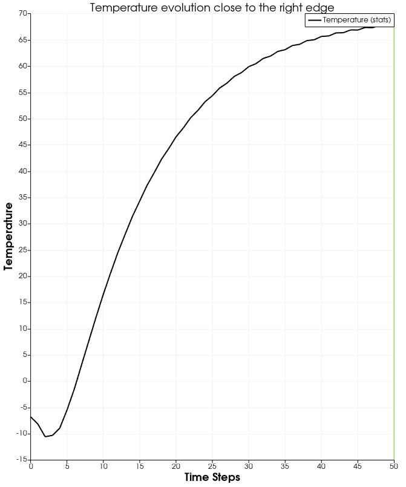

Nonlinear heat transfer with TRILINOS
======================================

# Introduction
This application uses automatic differentiation to develop the residual and the jacobian for a simple transient non-linear heat transfer problem. The nonlinear solution is then done using TRILINOS NOX. The nonlinearity arises due to the dependence of thermal conductivity on the temperature. This example can be found in the following [link](https://www.mathworks.com/help/pde/ug/heat-transfer-problem-with-temperature-dependent-properties.html). 

# About the folders
The source codes are there in the `source/` folder. Note that the geometry and its mesh are present in `mesh/` folder. The `output/` folder will contain the vtu files from the run. The folder `include/` contains all the header files needed. Further, the file `CMakeLists.txt` is added so that you can run the programme as  

	cmake .
  	make all
  	make run

# Documentation

In this example, we solve  a simple  transient nonlinear heat transfer equation. The nonlinearity is due to the temperature dependence of the thermal conductivity.  Two main aspects covered by this example are (a) it develops the residual and the jacobian using automatic differentiation and (b) solves the nonlinear equations using TRILINOS NOX. The actual code contains the comments which will explain how these aspects are executed. Here, we give the full derivation and set up the equations. We also provide explanations to some of the functions important for this applicaiton. 


## Strong form

### Governing equations

We solve now a non-linear differential equation governing the heat transfer in a 2D domain using a combination of Automatic Differentiation and TRILINOS NOX in this example. The link for the original problem can be found [here](https://www.mathworks.com/help/pde/ug/heat-transfer-problem-with-temperature-dependent-properties.html). We shall consider the finite element model of the following differential equation
@f[
	\rho C_p \frac{\partial T(x,y)}{\partial t} = \nabla \cdot k \nabla T + f
@f]
subjected to appropriate boundary conditions. For the sake of convenience, we will write the previous equation as
@f[
	\rho C_p \dot{T} = \left( k T_{,i} \right)_{,i} + f
@f]
The nonlinearity arises because the thermal conductivity is a function of the temperature $T$. We will write down the functional form of this dependence later.


### Boundary conditions and domain

Please see [this link](https://www.mathworks.com/help/pde/ug/heat-transfer-problem-with-temperature-dependent-properties.html) for the actual domain over which the differential equation in solved. The `.geo` and `.msh` file for the domain can be found in the `mesh` folder. The boundary conditions are as follows: Left end (domain id 1) is fixed at $100^\circ$C and the right end (domain id 3) has a outgoing flux of magnitude 10. All other material parameters are defined in file `source/nonlinear_heat_cons_des.cc` 


## Weak form

The weak form of the equation over a typical finite element $\Omega_e$ with boundary $\Gamma_e$ is written as 
@f[
	\int_{\Omega_e} w \left(\rho C_p \dot{T}- \left( k T_{,i} \right)_{,i} - f \right) dx dy = 0
@f]
which becomes
@f[
	\int_{\Omega_e} w \rho C_p \dot{T}- \left( w \left( k T_{,i} \right)_{,i} +  w f \right) dx dy = 0 
@f]
integrating by parts we get
@f[
	\int_{\Omega_e} w \rho C_p \dot{T} dx dy - \int_{\Omega_e} \left( -w_{,i} \left( k T_{,i} \right) +  w f \right)  dx dy -\int_{\Gamma_e} w kT_{,i}n_{i}ds^e = 0 
@f]
Clearly, $k T_{,i}n_i$ is nothing but the heat flux along the boundary $\Gamma_e$, which we write as $q_{\Gamma^e}$. $ds^e$ is an infinitesimal element along the boundary. Hence, we have
@f[
	\int_{\Omega_e} w \rho C_p \dot{T} dx dy - \int_{\Omega_e} \left( -w_{,i} \left( k T_{,i} \right) +  w f \right)  dx dy -\int_{\Gamma_e} w q_{\Gamma^e}ds^e = 0 
@f]
We now consider the approximation for $T = \psi_J T_J$, where summation is implied over the repeated indices (Summation over all nodes in the finite element). $\psi_J$ is the shape function. We hence get the finite element model taking ($w=\psi_I$) as
@f[
\dot{T}_J	\int_{\Omega_e}\rho C_p \psi_I  \psi_J  dx dy + \int_{\Omega_e} \left( \psi_{I,i} \left( k \psi_{J,i}T_J \right) - \psi_I f \right)  dx dy -\int_{\Gamma_e} \psi_I q_{\Gamma^e}ds^e = 0 
@f]
we note the $k$ is now also a function of $T$, hence we actually have 
@f[
	\dot{T}_J	\int_{\Omega_e}\rho C_p \psi_I  \psi_J  dx dy + \int_{\Omega_e} \left( \psi_{I,i} \left( k (\psi_PT_P) \psi_{J,i}T_J \right) - \psi_I f \right)  dx dy -\int_{\Gamma_e} \psi_I q_{\Gamma^e}ds^e = 0 
@f]
calling $\int_{\Gamma_e} \psi_I q_{\Gamma^e}ds^e$ as $Q_I$, we have
@f[
	\dot{T}_J	\int_{\Omega_e}\rho C_p \psi_I  \psi_J  dx dy + \int_{\Omega_e} \left( \psi_{I,i} \left( k (\psi_PT_P) \psi_{J,i}T_J \right) - \psi_I f \right)  dx dy -Q_I = 0 
@f]
@f[
	\dot{T}_J	\int_{\Omega_e}\rho C_p \psi_I  \psi_J  dx dy + \int_{\Omega_e} \left( \psi_{I,i} \left( k (\psi_PT_P) \psi_{J,i}T_J \right) - \psi_I f \right)  dx dy -Q_I =0 
@f]
We write this in matrix form as
@f[
	M_{IJ}\dot{T}_J + L_I - Q_I=0 
@f]
@f[
		\underbrace{\left( \int_{\Omega_e}\rho C_p \psi_I  \psi_J  dx dy \right)}_{M_{IJ}} \dot{T}_J + \underbrace{\int_{\Omega_e} \left( \psi_{I,i} \left( k (\psi_PT_P) \psi_{J,i}T_J \right) - \psi_I f \right)  dx dy}_{L_I} -Q_I = 0 
@f]
Since, this a time dependent problem, let us write the spatially discretized (matrix) form at times $s$ and $s+1$ as follows. This will allow us write the time marching schemes for the problem. 
@f{eqnarray}{
		M_{IJ}^s\dot{T}_J^{s} + L_I^{s} - Q_I^{s}=0  \\
		M_{IJ}^{s+1}\dot{T}_J^{s+1} + L_I^{s+1} - Q_I^{s+1}=0 
@f}
We will consider the case where $M_{IJ}$ and $Q_I$ are both independent of time. Hence, we have
@f{eqnarray}{
	M_{IJ}\dot{T}_J^{s} + L_I^{s} - Q_I=0 \\
	M_{IJ}\dot{T}_J^{s+1} + L_I^{s+1} - Q_I=0
@f}


## Time marching

Consider the following approximation for the time derivative
@f[
	\Delta t \left( \left(1-\alpha \right)\dot{T}_J^{s} + \alpha \dot{T}_J^{s+1} \right) = T_J^{s+1} - T_J^{s}
@f]
where $\Delta t$ is the time step and $\alpha$ is  $0<\alpha<1$. Multiplying the previous equation with $M_{IJ}$ we get, 
@f[
  	\Delta t \left(1-\alpha \right) M_{IJ}\dot{T}_J^{s} + 	\Delta t \alpha M_{IJ}\dot{T}_J^{s+1}  = M_{IJ}T_J^{s+1} - M_{IJ}T_J^{s}
@f]
combining terms properly,
@f[
	 	\Delta t \alpha M_{IJ}\dot{T}_J^{s+1} - M_{IJ}T_J^{s+1}  =  - M_{IJ}T_J^{s} - \Delta t \left(1-\alpha \right) M_{IJ}\dot{T}_J^{s} 
@f]
We now use equations from above to get, 
@f[
	\Delta t \alpha \left( -L_I^{s+1}+Q_I \right) - M_{IJ}T_J^{s+1}  =  - M_{IJ}T_J^{s} - \Delta t \left(1-\alpha \right) \left( -L_I^s+Q_I\right) 
@f]
expanding
@f[
	- \alpha \Delta t L_I^{s+1} -M_{IJ}T_{J}^{s+1} = -M_{IJ}T_{J}^s + \Delta t \left( 1-\alpha \right) L_I^s-\Delta t \alpha Q_I -\Delta t \left(1-\alpha \right) Q_I
@f]
which gives
@f[
	 \alpha \Delta t L_I^{s+1} + M_{IJ}T_{J}^{s+1} = M_{IJ}T_{J}^s - \Delta t \left( 1-\alpha \right) L_I^s+\Delta t \alpha Q_I +\Delta t \left(1-\alpha \right) Q_I
@f]
giving
@f[
 M_{IJ}T_{J}^{s+1} +	\alpha \Delta t L_I^{s+1}  = M_{IJ}T_{J}^s - \Delta t \left( 1-\alpha \right) L_I^s+ \Delta t Q_I
@f]
Now we have
@f[
	\boxed{
		M_{IJ}T_{J}^{s+1} +	\alpha \Delta t L_I^{s+1}  - M_{IJ}T_{J}^s + \Delta t \left( 1-\alpha \right) L_I^s - \Delta t Q_I
	}
@f]
We want to find $T_K$s so that the previous equation is satisfied for every time step $s+1$, in essence we want to find out $T_K^{{s+1}}$. Consequently, for values of $T_K^{{s+1}}$ which do not satisfy the equation, we will have a residual for each time step $s+1$. Hence, we have 
@f[
	\boxed{
	M_{IJ}T_{J}^{s+1} +	\alpha \Delta t L_I^{s+1}  - M_{IJ}T_{J}^s + \Delta t \left( 1-\alpha \right) L_I^s - \Delta t Q_I = R_I^{s+1}
}
@f]
is the residual at the $s+1$$^{th}$ time step. After assembling, we need to find the $T_{J}^{s+1}$ that essentially makes the assembled $R_I^{s+1}$ go to zero. Numerically, we will require some norm of the residual to go to zero. Note that the residual we developed is local to the element. This will have to be assembled in the usual manner before solving. *We again note that $T_K^{s}$ are all known from the previous time step $s$.*


## The Jacobian

The solution (i.e. to find $T_K^{{s+1}}$) which make the residual to go to zero, can be found using the Newton Raphson's technique. For this we need to calculate the *Jacobian* or the *Tangent stiffness* matrix  which involves calculating 
 $\frac{\partial R_I^{s+1}}{\partial T_{Q}^{s+1}}$. From the final equation above, we get, 
@f{eqnarray}{
J_{IQ}^{{s+1}}=\frac{\partial R_I^{s+1}}{\partial T_{Q}^{s+1}} = M_{IJ}\delta_{JQ} + \alpha \Delta t \frac{\partial L_I^{s+1}}{\partial T_Q}\\
J_{IQ}^{{s+1}}=\frac{\partial R_I^{s+1}}{\partial T_{Q}^{s+1}} = M_{IQ} + \alpha \Delta t \frac{\partial L_I^{s+1}}{\partial T_Q} 
@f}
This differentiation, is very simple for this problem. But it is not difficult to imagine situations, where this is terribly complicated and algebraically involved. Again, the terms which have a superfix $s$ depend on values of $T_H$ known from the previous step $s$ and hence are known values and not variables; we do not need to differentiate the residual with respect to these known quantities. We know that 
@f[
	\int_{\Omega_e} \left( \psi_{I,i} \left( k (\psi_PT_P) \psi_{J,i}T_J \right) - \psi_I f \right)  dx dy = L_I^{s+1}
@f]
So,
@f[
	\frac{\partial L_I^{s+1}}{\partial T_Q} = \int_{\Omega_e} \left( \psi_{I,i}\psi_{J,i}  \frac{\partial k}{\partial T_Q} T_J  + \psi_{I,i}\psi_{J,i} k \delta_{JQ} \right)  dx dy 
@f]
if we now assume $k = a+bT+cT^2$, with $a,b$ and $c$ being constants, we have,
@f[
	k = a + b  (\psi_R T_R) + c \left( \psi_Y T_Y \right)^2
@f]
then
@f{eqnarray}{
	\frac{\partial k}{\partial T_Q} = b\psi_R\delta_{RQ} + 2c  (\psi_Y T_Y) \psi_Y\delta_{YQ} \\
	\frac{\partial k}{\partial T_Q} = b\psi_Q + 2c  (\psi_Y T_Y) \psi_Q
@f}
and hence we get
@f[
	\frac{\partial L_I^{s+1}}{\partial T_Q} = \int_{\Omega_e} \left( \psi_{I,i} (\psi_{J,i}T_J)  (b\psi_Q + 2c  (\psi_Y T_Y) \psi_Q)   + \psi_{I,i}\psi_{Q,i}(a + b  (\psi_R T_R) + c \left( \psi_Y T_Y)^2 \right) \right)  dx dy 
@f]
Then, $J_{IQ}^{{s+1}}$ can be written using the definition of $J_{IQ}^{s+1}$. It is this calculation of the Jacobian which is often complicated and we intend to automate it using the /Automatic differentiation/ facility. These are implemented in the functions `compute_residual()` and `compute_jacobian()`. These functions are described in detail next. 


## The functions compute_residual() and compute_jacobian()

The functions `compute_residual()` and `compute_jacobian()` compute the residuals and the jacobian, respectively. These are done with automatic differentiation from TRILINOS. For dealii tutorials on these, please see step-71 and step-72. The residual is computed in such a way that the a single line will actually differentiate it and calculate the jacobian given by the definition of $J_{IQ}^{s+1}$. While the difference between `compute_residual()` and `compute_jacobian()` is minimal and could have been incorporated in a single function, we separate them in this implementation, because we want to use the nonlinear solver provided by TRILINOS (NOX) to actually perform the Newton Raphson iteration. For further details on this (Nonlinear solvers) aspect, please see step-77 of the dealii tutorial. We describe some aspects of the `compute_residual()` and `compute_jacobian()` here. 


### The compute_residual() function

The `compute_residual()` function actually takes in two arguments. `evaluation_point` and `residual`, both by reference. We will discuss this in some detail as we elaborate the function. 

The following lines 

```
/*
 * Created by Narasimhan Swaminathan on 20 Jun 2024.
*/
#include "allheaders.h"
#include "nonlinear_heat.h"
/**
 * This function sets up the residual in a format to allow automatic differentiation to calculate the Jacobian.
 * #evaluation_point is the point (solution) where we need to evaluate this residual.
 * @param evaluation_point Point where the residual is to be evaluated.
 * @param residual The residual vector to be used in the non-linear solution process.
 */
void nonlinear_heat::compute_residual(const Vector<double> & evaluation_point, Vector<double> & residual)
{
    /**
     * The following lines should be clear. We need the FEFaceValues<2> definition, because, we want to apply Newmann boundary conditions
     * to the right end.
     */
    const QGauss<2> quadrature_formula(
            fe.degree + 1);/**< Define a quadrature to perform the integration over the 2D finite element */
    const QGauss<1> face_quadrature_formula(fe.degree+1); //Define quadrature for integration over faces */
    FEValues<2> fe_values(fe,
                          quadrature_formula,
                          update_values | update_gradients |
                          update_quadrature_points |
                          update_JxW_values); /*!< Define what aspects of inside the finite element you need for this problem*/

    FEFaceValues<2> fe_face_values(fe,face_quadrature_formula,update_values|update_quadrature_points|
                                                              update_normal_vectors | update_JxW_values);
    const unsigned int dofs_per_cell = fe.dofs_per_cell; /*!< Number of degree of freedom per cell*/
    const unsigned int n_q_points = quadrature_formula.size();/*!< Number of quadrature points over the domain of the finite element*/
    const unsigned int n_q_f_points = face_quadrature_formula.size();/*!< Number of quadrature point over the boundary of a finite element*/
    /**
     * #cell_rhs holds the local rhs. That is the residual evaluated at the
     * #evaluation_point.
     */
    Vector<double> cell_rhs(dofs_per_cell); /*!<Defining a local (residual) vector*/

```
should be fairly straightforward. The variable `cell_rhs` holds the local (for an element or a cell) residual. Note that we use the `FEFaceValues<2>` as we will need to apply the Neuman boundary conditions on the right hand side of the domain. 

The lines below  define the *Number type* we want to use to define our variables so that they are suitable for automatic differentiation. Here, we are using variables that will allow /automatic differentiation/. (The other option is symbolic differentiation using SYMENGINE package. Here we are using the automatic differentiation using SACADO.)

```
    using ADHelper = Differentiation::AD::ResidualLinearization<Differentiation::AD::NumberTypes::sacado_dfad,double>;
    using ADNumberType = typename ADHelper::ad_type;

```

The following lines are once again straightforward to understand. 
```
    const FEValuesExtractors::Scalar t(
            0);
    std::vector<types::global_dof_index> local_dof_indices(
            dofs_per_cell); /*!< Local to Global Degree of freedom indices */
    /**
     * #consol now holds the #converged_solution at the Gauss points of a current cell. These are of the double type i.e., regular numbers.
     */

    std::vector<double> consol(n_q_points); /* Converged solution at the Gauss points from the previous time step*/

```
We only comment that the variable `consol` holds the values of the variable `converged_solution` at the gauss points of the current, active cell. Similarly, the variable `consol_grad` holds the values of the gradients of the `converged_solution` at the gauss points. The variable `converged_solution` refers is solution at the previous time step (time step $s$). 


In following lines the variables `old_solution` and `old_solution_grad` are 
crucial. They define the variables of the  appropriate number type using which we will define our residual, so that it is suitable for the automatic differentiation.  `old_solution` is a solution variable of the appropriate number type with respect to which we need to define the residual and then differentiate it to get the Jacobian. For ease of understanding, one may consider this variable to be a special variable, that will look like this
@f[
	\text{old_solution} =
	\begin{bmatrix}
		\psi_i (\zeta_1,\eta_1) d_i\\
		\psi_i (\zeta_2,\eta_2) d_i\\
		\psi_i (\zeta_3,\eta_3) d_i\\
		\psi_i (\zeta_4,\eta_4) d_i
	\end{bmatrix}
@f] 
where $\psi_i$ are the shape functions and $d_i$ is some way of representing   the primary variable in the problem (in this case the temperature). Could be viewed as something like a symbol, which could be used to define functions and then differentiated later.  `old_solution` holds the values in the corresponding gauss points and the repeated indices in the previous equation indicate summation over the nodes. Similarly, the variable `old_solution_grad` holds the corresponding gradients. 
```
    std::vector<ADNumberType> old_solution(
            n_q_points); /* Current solution at the Gauss points at this iteration for the current time*/
    /**
     * #concol_grad now holds the #converged_solution at the Gauss points of the current cell. These are regular numbers.
     */
    std::vector<Tensor<1, 2>> consol_grad(
            n_q_points); /* Converged gradients of the solutions at the Gauss points from the previous time step */
    std::vector<Tensor<1, 2,ADNumberType>> old_solution_grad(
            n_q_points);


```

The lines
```
    ComponentMask t_mask = fe.component_mask(t);
    /**
     * Actual, numerical residual.
     */
    residual = 0.0;

```
are straightforward to understand. The vector `residual` will hold the *numerical* value of the residual and is hence initialized to be zero. 

The lines
```
    for (const auto &cell: dof_handler.active_cell_iterators())
    {
        cell_rhs = 0;
        fe_values.reinit(cell);
        cell->get_dof_indices(local_dof_indices);
        const unsigned int n_independent_variables = local_dof_indices.size();
        const unsigned int n_dependent_variables = dofs_per_cell;

```
should be clear. In the following line we inform how many independent and dependent variables we will have. 
```
        ADHelper ad_helper(n_independent_variables, n_dependent_variables);

```
then, in the following line we tell the system, at which point it should numerically evaluate the residual. This is the point given by `evaluation_point`, which will contain the solution that is getting iterated to find the actual solution for each time step.
```
        ad_helper.register_dof_values(evaluation_point,local_dof_indices);

```

Now the lines
```
        const std::vector<ADNumberType> &dof_values_ad = ad_helper.get_sensitive_dof_values();
        fe_values[t].get_function_values_from_local_dof_values(dof_values_ad,
                                         old_solution);
        fe_values[t].get_function_gradients_from_local_dof_values(dof_values_ad,
                                            old_solution_grad);

```
the actual storage of the values of the shape functions and its derivatives at the gauss points is taking place in the variables `old_solution` and `old_solution_grad`. 

In the lines 
```
        fe_values[t].get_function_values(converged_solution, consol);
        fe_values[t].get_function_gradients(converged_solution, consol_grad);

```
the values of the `converged_solution` and its gradients get stored in the variables `consol` and `con_sol_grad`.

Then in the lines
```
        for (unsigned int q_index = 0; q_index < n_q_points; ++q_index)
        {
            for (unsigned int i = 0; i < dofs_per_cell; ++i)
            {
                /**
                 * We here define the entire residual using all intermediate variables, which are also of the type ADNumberType.
                 */
                ADNumberType MijTjcurr = Cp*rho*fe_values[t].value(i,q_index)*old_solution[q_index];
                ADNumberType MijTjprev = Cp*rho*fe_values[t].value(i,q_index)*consol[q_index];
                ADNumberType k_curr = a + b*old_solution[q_index] + c*std::pow(old_solution[q_index],2);
                ADNumberType k_prev = a + b*consol[q_index] + c*std::pow(consol[q_index],2);
                ADNumberType Licurr =  alpha * delta_t *  (fe_values[t].gradient(i,q_index)*k_curr*old_solution_grad[q_index]);
                ADNumberType Liprev =  (1-alpha) * delta_t *  (fe_values[t].gradient(i,q_index)*k_prev*consol_grad[q_index]);
                residual_ad[i] +=  (MijTjcurr+Licurr-MijTjprev+Liprev)*fe_values.JxW(q_index);
            }
        }
            /**

```
the actual evaluation of the residual is taking place. Note that each intermediate variable used is of the `ADNumberType`. Further, the residual is stored in a variable called `residual_ad[i]` because it is also of the special type that will be suitable for differentiation. Note that the symbols in the residual equation in this document and the variables used in the code, map in the following manner. The residual is pasted below again
@f[
	\boxed{
		M_{IJ}T_{J}^{s+1} +	\alpha \Delta t L_I^{s+1}  - M_{IJ}T_{J}^s + \Delta t \left( 1-\alpha \right) L_I^s - \Delta t Q_I = R_I^{s+1}
	}
@f]

- $M_{IJ}T_{J}^{s+1}$ $\rightarrow$ `MijTjcurr`
- $M_{IJ}T_{J}^{s}$ $\rightarrow$ `MijTjprev`
- $L_I^{s+1}$ $\rightarrow$ `Licurr`
- $L_I^{s}$ $\rightarrow$ `Liprev`
- $R_I^{s+1}$ $\rightarrow$ `residual_ad[i]`

then the following lines implement the Neumann boundary conditions
```
        for (unsigned int face_number = 0;face_number<GeometryInfo<2>::faces_per_cell; ++face_number)
        {

            if (cell->face(face_number)->boundary_id() == 3)
            {
                fe_face_values.reinit(cell, face_number);
                for (unsigned int q_point=0;q_point<n_q_f_points;++q_point)
                {
                    for (unsigned int i =0;i<dofs_per_cell;++i)
                        /**
                         * The Newumann boundary condition (-10) is applied to the right edge, with boundary id 3.
                         */
                        residual_ad[i]+= -delta_t*(-10)*fe_face_values[t].value(i,q_point)*fe_face_values.JxW(q_point);

                }
            }
        }

```

Now 
```
        ad_helper.register_residual_vector(residual_ad);

```
actually tells the `ad_helper` that this is the residual it should use, and the line
```
        ad_helper.compute_residual(cell_rhs);

```
evaluates the residual at the appropriate point, which is the `evaluation_point`. Then
```
        cell->get_dof_indices(local_dof_indices);

        for (unsigned int i =0;i < dofs_per_cell; ++i)
            residual(local_dof_indices[i])+= cell_rhs(i);

    }

```
are used to calculate the global `residual` from the local `cell_rhs`. Now `residual` is numerical and not of the special number type. Finally, lines
```
    for(const types::global_dof_index i: DoFTools::extract_boundary_dofs(dof_handler,t_mask,{1}))
        residual(i) = 0;

    std::cout << " The Norm is :: = " << residual.l2_norm() << std::endl;
}

``` 
are routine, in particular, it makes the global degrees of freedom, where the dirichlet boundary conditions are applied to be zero.


### The compute_jacobian() function

The `compute_jacobian()` only takes in the `evaluation_point` as an input and is identical to the 
`compute_residual()` except for some minor modification. In particular the line
```
        ad_helper.compute_linearization(cell_matrix);

``` 
computes the actual jacobian by performing the automatic differentiation and evaluates it at the `evaluation_point`. The remaining lines are routine and should be straightforward. 


## General ideas involved in solving coupled nonlinear equations using Newton Raphson's technique
Consider that we have the equations 
@f{eqnarray}{
	f_i^1(p_j^{{s+1}}, T_j^{{s+1}})=0 \\
	f_i^2(p_j^{{s+1}}, T_j^{{s+1}})=0 
@f}
are coupled non-linear algebraic equations in the variables $p_j$ and $T_j$. In the  problem we are trying to solve, we only have one unknown, but this set of derivation clarifies what one should do for coupled problems as well.

We need to solve the set equations immediately above using Newton-Raphson's technique. Now suppose we have 4 noded linear element, with values as $p_1^{{s+1}},p_2^{{s+1}},p_3^{{s+1}},p_4^{{s+1}}$ and $T_1^{{s+1}},T_2^{{s+1}},T_3^{{s+1}},T_4^{{s+1}}$, then actually $f_i^1$ and $f_i^2$ are 
@f{eqnarray}{
	f_i^1(p_1^{{s+1}},p_2^{{s+1}},p_3^{{s+1}},p_4^{{s+1}},T_1^{{s+1}},T_2^{{s+1}},T_3^{{s+1}},T_4^{{s+1}})=0 \\
	f_i^2(p_1^{{s+1}},p_2^{{s+1}},p_3^{{s+1}},p_4^{{s+1}},T_1^{{s+1}},T_2^{{s+1}},T_3^{{s+1}},T_4^{{s+1}})=0
@f}
Also, note that $i$ goes from 1 to 4 for $f^1$ and from 1 to 4 for $f^2$. For the Newton Raphson's technique, we have to find the Jacobian. This is written explicitly below for clear understanding. 
@f[
	J_{pq}=-
	\begin{bmatrix}
		\frac{\partial f^1_1}{\partial p^{s+1}_1} & \frac{\partial f^1_1}{\partial p^{s+1}_2} & \frac{\partial f^1_1}{\partial p^{s+1}_3} & \frac{\partial f^1_1}{\partial p^{s+1}_4} & \frac{\partial f^1_1}{\partial T^{s+1}_1} & \frac{\partial f^1_1}{\partial T^{s+1}_2}&\frac{\partial f^1_1}{\partial T^{s+1}_3}&\frac{\partial f^1_1}{\partial T^{s+1}_4}\\
		
		\frac{\partial f^1_2}{\partial p^{s+1}_1} & \frac{\partial f^1_2}{\partial p^{s+1}_2} & \frac{\partial f^1_2}{\partial p^{s+1}_3} & \frac{\partial f^1_2}{\partial p^{s+1}_4} & \frac{\partial f^1_2}{\partial T^{s+1}_1} & \frac{\partial f^1_2}{\partial T^{s+1}_2}&\frac{\partial f^1_2}{\partial T^{s+1}_3}&\frac{\partial f^1_2}{\partial T^{s+1}_4}\\
		
		\frac{\partial f^1_3}{\partial p^{s+1}_1} & \frac{\partial f^1_3}{\partial p^{s+1}_2} & \frac{\partial f^1_3}{\partial p^{s+1}_3} & \frac{\partial f^1_3}{\partial p^{s+1}_4} & \frac{\partial f^1_3}{\partial T^{s+1}_1} & \frac{\partial f^1_3}{\partial T^{s+1}_2}&\frac{\partial f^1_3}{\partial T^{s+1}_3}&\frac{\partial f^1_3}{\partial T^{s+1}_4}\\
		
		\frac{\partial f^1_4}{\partial p^{s+1}_1} & \frac{\partial f^1_4}{\partial p^{s+1}_2} & \frac{\partial f^1_4}{\partial p^{s+1}_3} & \frac{\partial f^1_4}{\partial p^{s+1}_4} & \frac{\partial f^1_4}{\partial T^{s+1}_1} & \frac{\partial f^1_4}{\partial T^{s+1}_2}&\frac{\partial f^1_4}{\partial T^{s+1}_3}&\frac{\partial f^1_4}{\partial T^{s+1}_4}\\
		%================================================================
		\frac{\partial f^2_1}{\partial p^{s+1}_1} & \frac{\partial f^2_1}{\partial p^{s+1}_2} & \frac{\partial f^2_1}{\partial p^{s+1}_3} & \frac{\partial f^2_1}{\partial p^{s+1}_4} & \frac{\partial f^2_1}{\partial T^{s+1}_1} & \frac{\partial f^2_1}{\partial T^{s+1}_2}&\frac{\partial f^2_1}{\partial T^{s+1}_3}&\frac{\partial f^2_1}{\partial T^{s+1}_4}\\
		
		\frac{\partial f^2_2}{\partial p^{s+1}_1} & \frac{\partial f^2_2}{\partial p^{s+1}_2} & \frac{\partial f^2_2}{\partial p^{s+1}_3} & \frac{\partial f^2_2}{\partial p^{s+1}_4} & \frac{\partial f^2_2}{\partial T^{s+1}_1} & \frac{\partial f^2_2}{\partial T^{s+1}_2}&\frac{\partial f^2_2}{\partial T^{s+1}_3}&\frac{\partial f^2_2}{\partial T^{s+1}_4}\\
		
		\frac{\partial f^2_3}{\partial p^{s+1}_1} & \frac{\partial f^2_3}{\partial p^{s+1}_2} & \frac{\partial f^2_3}{\partial p^{s+1}_3} & \frac{\partial f^2_3}{\partial p^{s+1}_4} & \frac{\partial f^2_3}{\partial T^{s+1}_1} & \frac{\partial f^2_3}{\partial T^{s+1}_2}&\frac{\partial f^2_3}{\partial T^{s+1}_3}&\frac{\partial f^2_3}{\partial T^{s+1}_4}\\
		
		\frac{\partial f^2_4}{\partial p^{s+1}_1} & \frac{\partial f^2_4}{\partial p^{s+1}_2} & \frac{\partial f^2_4}{\partial p^{s+1}_3} & \frac{\partial f^2_4}{\partial p^{s+1}_4} & \frac{\partial f^2_4}{\partial T^{s+1}_1} & \frac{\partial f^2_4}{\partial T^{s+1}_2}&\frac{\partial f^2_4}{\partial T^{s+1}_3}&\frac{\partial f^2_4}{\partial T^{s+1}_4}
	\end{bmatrix}
@f]
We use the Jacobian evaluated at the values of the variables ($p_j^{{s+1}}$, $T_j^{{s+1}}$) at the /previous iteration/ (denoted by the variable `present_solution` in the code) to obtain a new value of the required vector. That is
@f[
	\begin{bmatrix}
		p_1^{s+1}\\
		p_2^{s+1}\\
		p_3^{s+1}\\
		p_4^{s+1}\\
		T_1^{s+1}\\
		T_2^{s+1}\\
		T_3^{s+1}\\
		T_4^{s+1}
	\end{bmatrix}^{k+1}
	=
	\begin{bmatrix}
		p_1^{s+1}\\
		p_2^{s+1}\\
		p_3^{s+1}\\
		p_4^{s+1}\\
		T_1^{s+1}\\
		T_2^{s+1}\\
		T_3^{s+1}\\
		T_4^{s+1}
	\end{bmatrix}^{k}-
	\begin{bmatrix}
		\frac{\partial f^1_1}{\partial p^{s+1}_1} & \frac{\partial f^1_1}{\partial p^{s+1}_2} & \frac{\partial f^1_1}{\partial p^{s+1}_3} & \frac{\partial f^1_1}{\partial p^{s+1}_4} & \frac{\partial f^1_1}{\partial T^{s+1}_1} & \frac{\partial f^1_1}{\partial T^{s+1}_2}&\frac{\partial f^1_1}{\partial T^{s+1}_3}&\frac{\partial f^1_1}{\partial T^{s+1}_4}\\
		
		\frac{\partial f^1_2}{\partial p^{s+1}_1} & \frac{\partial f^1_2}{\partial p^{s+1}_2} & \frac{\partial f^1_2}{\partial p^{s+1}_3} & \frac{\partial f^1_2}{\partial p^{s+1}_4} & \frac{\partial f^1_2}{\partial T^{s+1}_1} & \frac{\partial f^1_2}{\partial T^{s+1}_2}&\frac{\partial f^1_2}{\partial T^{s+1}_3}&\frac{\partial f^1_2}{\partial T^{s+1}_4}\\
		
		\frac{\partial f^1_3}{\partial p^{s+1}_1} & \frac{\partial f^1_3}{\partial p^{s+1}_2} & \frac{\partial f^1_3}{\partial p^{s+1}_3} & \frac{\partial f^1_3}{\partial p^{s+1}_4} & \frac{\partial f^1_3}{\partial T^{s+1}_1} & \frac{\partial f^1_3}{\partial T^{s+1}_2}&\frac{\partial f^1_3}{\partial T^{s+1}_3}&\frac{\partial f^1_3}{\partial T^{s+1}_4}\\
		
		\frac{\partial f^1_4}{\partial p^{s+1}_1} & \frac{\partial f^1_4}{\partial p^{s+1}_2} & \frac{\partial f^1_4}{\partial p^{s+1}_3} & \frac{\partial f^1_4}{\partial p^{s+1}_4} & \frac{\partial f^1_4}{\partial T^{s+1}_1} & \frac{\partial f^1_4}{\partial T^{s+1}_2}&\frac{\partial f^1_4}{\partial T^{s+1}_3}&\frac{\partial f^1_4}{\partial T^{s+1}_4}\\
		%================================================================
		\frac{\partial f^2_1}{\partial p^{s+1}_1} & \frac{\partial f^2_1}{\partial p^{s+1}_2} & \frac{\partial f^2_1}{\partial p^{s+1}_3} & \frac{\partial f^2_1}{\partial p^{s+1}_4} & \frac{\partial f^2_1}{\partial T^{s+1}_1} & \frac{\partial f^2_1}{\partial T^{s+1}_2}&\frac{\partial f^2_1}{\partial T^{s+1}_3}&\frac{\partial f^2_1}{\partial T^{s+1}_4}\\
		
		\frac{\partial f^2_2}{\partial p^{s+1}_1} & \frac{\partial f^2_2}{\partial p^{s+1}_2} & \frac{\partial f^2_2}{\partial p^{s+1}_3} & \frac{\partial f^2_2}{\partial p^{s+1}_4} & \frac{\partial f^2_2}{\partial T^{s+1}_1} & \frac{\partial f^2_2}{\partial T^{s+1}_2}&\frac{\partial f^2_2}{\partial T^{s+1}_3}&\frac{\partial f^2_2}{\partial T^{s+1}_4}\\
		
		\frac{\partial f^2_3}{\partial p^{s+1}_1} & \frac{\partial f^2_3}{\partial p^{s+1}_2} & \frac{\partial f^2_3}{\partial p^{s+1}_3} & \frac{\partial f^2_3}{\partial p^{s+1}_4} & \frac{\partial f^2_3}{\partial T^{s+1}_1} & \frac{\partial f^2_3}{\partial T^{s+1}_2}&\frac{\partial f^2_3}{\partial T^{s+1}_3}&\frac{\partial f^2_3}{\partial T^{s+1}_4}\\
		
		\frac{\partial f^2_4}{\partial p^{s+1}_1} & \frac{\partial f^2_4}{\partial p^{s+1}_2} & \frac{\partial f^2_4}{\partial p^{s+1}_3} & \frac{\partial f^2_4}{\partial p^{s+1}_4} & \frac{\partial f^2_4}{\partial T^{s+1}_1} & \frac{\partial f^2_4}{\partial T^{s+1}_2}&\frac{\partial f^2_4}{\partial T^{s+1}_3}&\frac{\partial f^2_4}{\partial T^{s+1}_4}
	\end{bmatrix}^{-1}
	\begin{bmatrix}
		f_1^{1}\\
		f_2^{1}\\
		f_3^{1}\\
		f_4^{1}\\
		f_1^{2}\\
		f_2^{2}\\
		f_3^{2}\\
		f_4^{2}
	\end{bmatrix}^{k}
@f]
The $J_{pq}$ is evaluated with values obtained at the $k^{th}$ iteration. To avoid taking the inverse, we solve the following, for the changes $\Delta p$ and $\Delta T$.
@f[
	\begin{bmatrix}
		\frac{\partial f^1_1}{\partial p^{s+1}_1} & \frac{\partial f^1_1}{\partial p^{s+1}_2} & \frac{\partial f^1_1}{\partial p^{s+1}_3} & \frac{\partial f^1_1}{\partial p^{s+1}_4} & \frac{\partial f^1_1}{\partial T^{s+1}_1} & \frac{\partial f^1_1}{\partial T^{s+1}_2}&\frac{\partial f^1_1}{\partial T^{s+1}_3}&\frac{\partial f^1_1}{\partial T^{s+1}_4}\\
		
		\frac{\partial f^1_2}{\partial p^{s+1}_1} & \frac{\partial f^1_2}{\partial p^{s+1}_2} & \frac{\partial f^1_2}{\partial p^{s+1}_3} & \frac{\partial f^1_2}{\partial p^{s+1}_4} & \frac{\partial f^1_2}{\partial T^{s+1}_1} & \frac{\partial f^1_2}{\partial T^{s+1}_2}&\frac{\partial f^1_2}{\partial T^{s+1}_3}&\frac{\partial f^1_2}{\partial T^{s+1}_4}\\
		
		\frac{\partial f^1_3}{\partial p^{s+1}_1} & \frac{\partial f^1_3}{\partial p^{s+1}_2} & \frac{\partial f^1_3}{\partial p^{s+1}_3} & \frac{\partial f^1_3}{\partial p^{s+1}_4} & \frac{\partial f^1_3}{\partial T^{s+1}_1} & \frac{\partial f^1_3}{\partial T^{s+1}_2}&\frac{\partial f^1_3}{\partial T^{s+1}_3}&\frac{\partial f^1_3}{\partial T^{s+1}_4}\\
		
		\frac{\partial f^1_4}{\partial p^{s+1}_1} & \frac{\partial f^1_4}{\partial p^{s+1}_2} & \frac{\partial f^1_4}{\partial p^{s+1}_3} & \frac{\partial f^1_4}{\partial p^{s+1}_4} & \frac{\partial f^1_4}{\partial T^{s+1}_1} & \frac{\partial f^1_4}{\partial T^{s+1}_2}&\frac{\partial f^1_4}{\partial T^{s+1}_3}&\frac{\partial f^1_4}{\partial T^{s+1}_4}\\
		%================================================================
		\frac{\partial f^2_1}{\partial p^{s+1}_1} & \frac{\partial f^2_1}{\partial p^{s+1}_2} & \frac{\partial f^2_1}{\partial p^{s+1}_3} & \frac{\partial f^2_1}{\partial p^{s+1}_4} & \frac{\partial f^2_1}{\partial T^{s+1}_1} & \frac{\partial f^2_1}{\partial T^{s+1}_2}&\frac{\partial f^2_1}{\partial T^{s+1}_3}&\frac{\partial f^2_1}{\partial T^{s+1}_4}\\
		
		\frac{\partial f^2_2}{\partial p^{s+1}_1} & \frac{\partial f^2_2}{\partial p^{s+1}_2} & \frac{\partial f^2_2}{\partial p^{s+1}_3} & \frac{\partial f^2_2}{\partial p^{s+1}_4} & \frac{\partial f^2_2}{\partial T^{s+1}_1} & \frac{\partial f^2_2}{\partial T^{s+1}_2}&\frac{\partial f^2_2}{\partial T^{s+1}_3}&\frac{\partial f^2_2}{\partial T^{s+1}_4}\\
		
		\frac{\partial f^2_3}{\partial p^{s+1}_1} & \frac{\partial f^2_3}{\partial p^{s+1}_2} & \frac{\partial f^2_3}{\partial p^{s+1}_3} & \frac{\partial f^2_3}{\partial p^{s+1}_4} & \frac{\partial f^2_3}{\partial T^{s+1}_1} & \frac{\partial f^2_3}{\partial T^{s+1}_2}&\frac{\partial f^2_3}{\partial T^{s+1}_3}&\frac{\partial f^2_3}{\partial T^{s+1}_4}\\
		
		\frac{\partial f^2_4}{\partial p^{s+1}_1} & \frac{\partial f^2_4}{\partial p^{s+1}_2} & \frac{\partial f^2_4}{\partial p^{s+1}_3} & \frac{\partial f^2_4}{\partial p^{s+1}_4} & \frac{\partial f^2_4}{\partial T^{s+1}_1} & \frac{\partial f^2_4}{\partial T^{s+1}_2}&\frac{\partial f^2_4}{\partial T^{s+1}_3}&\frac{\partial f^2_4}{\partial T^{s+1}_4}
	\end{bmatrix}
	\begin{bmatrix}
		\Delta p_1^{s+1}\\
		\Delta p_2^{s+1}\\
		\Delta p_3^{s+1}\\
		\Delta p_4^{s+1}\\
		\Delta T_1^{s+1}\\
		\Delta T_2^{s+1}\\
		\Delta T_3^{s+1}\\
		\Delta T_4^{s+1}
	\end{bmatrix}=
	\begin{bmatrix}
		f_1^{1}\\
		f_2^{1}\\
		f_3^{1}\\
		f_4^{1}\\
		f_1^{2}\\
		f_2^{2}\\
		f_3^{2}\\
		f_4^{2}
	\end{bmatrix}^{k}
@f]
This is written as
@f[
	J_{pq}\{\Delta solution\}^{k+1}=\{function\}^{k}
@f]
Then add this to the value of 
@f[
	\begin{bmatrix}
		p_1^{s+1}\\
		p_2^{s+1}\\
		p_3^{s+1}\\
		p_4^{s+1}\\
		T_1^{s+1}\\
		T_2^{s+1}\\
		T_3^{s+1}\\
		T_4^{s+1}
	\end{bmatrix}^{k}
@f]
We keep doing this, until the $L_2$-error of the vector is small. Determining whether the norm is small can be done using either
@f[
	||(function)^k||<\delta^0 ||function^0||
@f]
or
@f[
	||(function)^k||<tol
@f]
where $tol$ is some small number. In the code, we use the second of these two choices. The final converged solution in the one that satisfies the set of equations and is called by the variable `converged_solution` in the code. This iterative process is carried out for every time step. The variable `present_solution` is given the value of `converged_solution` at the beginning of the iteration of a given time step, so that it serves as a better initial guess for the nonlinear set of equations for the next time step.


### The run() function

The function which implements the nonlinear solver is the `run()` function for every time step. In particular the lines
```
            typename TrilinosWrappers::NOXSolver<Vector<double>>::AdditionalData additional_data;
            additional_data.abs_tol = target_tolerance;
            additional_data.max_iter = 100;
            TrilinosWrappers::NOXSolver<Vector<double>> nonlinear_solver(
                    additional_data);

            /**
             * Defines how the NOX solver should calculate the residual and where it needs to evaluate it.
             */
            nonlinear_solver.residual =
                    [&](const Vector<double> &evaluation_point,
                        Vector<double> &residual) {
                        compute_residual(evaluation_point, residual);
                    };

            /**
             * Sets up the jacobian, which will be called whenever solve_with_jacobian() is invoked.
             */

            nonlinear_solver.setup_jacobian =
                    [&](const Vector<double> &current_u) {
                        compute_jacobian(current_u);
                    };
            /**
             * Solve the nonlinear problem with the jacobian.
             */

            nonlinear_solver.solve_with_jacobian = [&](const Vector<double> &rhs,
                                                       Vector<double> &dst,
                                                       const double tolerance) {
                solve(rhs, dst, tolerance);
            };
            /**
             * #present_solution is used as an initial guess. Then the non-linear solver is called. The solver now repeatedly
             * solves the set of equations until convergence and stores the final (converged) solution in #present_solution.
             */
            nonlinear_solver.solve(present_solution);
        }

```
Here, one needs to give how the residual is to be calculated and at what point, how the jacobian is to be calculated and at what point and finally, how to solve the linear system occurring during each iteration. These are given as `lambda` functions. 

The lines
```
            typename TrilinosWrappers::NOXSolver<Vector<double>>::AdditionalData additional_data;
            additional_data.abs_tol = target_tolerance;
            additional_data.max_iter = 100;
            TrilinosWrappers::NOXSolver<Vector<double>> nonlinear_solver(
                    additional_data);

```
setup the solver and give any basic data needed, such as the tolerance to converge or the maximum number of iterations it can try. 

The lines
```
            nonlinear_solver.residual =
                    [&](const Vector<double> &evaluation_point,
                        Vector<double> &residual) {
                        compute_residual(evaluation_point, residual);
                    };

```
essentially, defines the function from where the residual will be calculated. Notice here that the `compute_residual()` function is called with `evaluation_point` and `residual`. 

Similarly, the lines,
```
            nonlinear_solver.setup_jacobian =
                    [&](const Vector<double> &current_u) {
                        compute_jacobian(current_u);
                    };

```
define the function from where the jacobian will be calculated. Note that it takes in a variable `current_u` which will be the `evaluation_point` for the computing the jacobian. Thus, the actual points for evaluating the jacobian and the residual need not be the same. 

The lines
```
            nonlinear_solver.solve_with_jacobian = [&](const Vector<double> &rhs,
                                                       Vector<double> &dst,
                                                       const double tolerance) {
                solve(rhs, dst, tolerance);
            };

```
tells the solution needs to be done with the jacobian using the function `solve()`. 

Then the line
```
            nonlinear_solver.solve_with_jacobian = [&](const Vector<double> &rhs,
                                                       Vector<double> &dst,
                                                       const double tolerance) {
                solve(rhs, dst, tolerance);
            };

```
actually calls the nonlinear solver.

For details as to how these lambda functions work together, please see step-77 and also the file `tests/trilinos/step-77-with-nox.cc`. Overall, the variable `present_solution` is presented as an initial guess to the non-linear solver, which performs the iteration and gives the final converged solution in the same variable. Hence, this will be the converged solution for the current step and this assignment happens in the following line
```
        converged_solution = present_solution;

```.
The variable `present_solution` is assigned the value of `converged_solution` from the previous time step to serve as an initial guess. This is done in line 45. 
```
            present_solution = converged_solution;

```


## Results

The results are essentially the time evolution of the temperature throughout the domain. The first of the pictures below shows the temperature distribution at the final step, i.e. at time $t=5$. This should be very similar to the figure at the bottom on the page [here](https://www.mathworks.com/help/pde/ug/heat-transfer-problem-with-temperature-dependent-properties.html). We also plot the time evolution of the temperature at a point close to the right edge of the domain indicated by the small magenta dot (close to $(0.49, 0.12)$) in the second of the pictures below. This is also simlar to the second figure at the [bottom of this page](https://www.mathworks.com/help/pde/ug/heat-transfer-problem-with-temperature-dependent-properties.html). There could be minor differences due to the choice of the point. Further, note that, we have plotted in the second of the pictures below the temperature as a function of time steps instead of time. Since the $\Delta t$ chosen is 0.1, 50 steps maps to $t=5$ as in the link.



Contour plot of the temperature at the final step



Evolution of temperature at a point close to the right edge $\approx (0.49, 0.12)$

In closing, we give some ideas as to how the residuals and the jacobians are actually calculated in a finite element setting. 


## Evaluating the function at previous iterations

For solving the linear equation every iteration, we have to evaluate the right hand side functions ($f_i^1$ and $f_i^2$) at the values  $p$ and $T$ had at their previous iteration. For instance, in the current problem consider the final equation above (we only have only one function $f_I$ in this case), which is 
@f[
		M_{IJ}T_{J}^{s+1} +	\alpha \Delta t L_I^{s+1}  - M_{IJ}T_{J}^s + \Delta t \left( 1-\alpha \right) L_I^s - \Delta t Q_I = R_I^{s+1}
@f]
Each term is written in the following manner. We write it for only one term to illustrate the details. 
Consider $\alpha \Delta t L_I^{s+1} $
@f[
\alpha \Delta t	\int_{\Omega_e} \left( \psi_{I,i} \left( k (\psi_PT_P) \psi_{J,i}T_J \right) - \psi_I f \right)  dx dy = L_I^{s+1}
@f]
to be specific
@f[
	\alpha \Delta t	\int_{\Omega_e} \left( \psi_{I,i} \left( k (\psi_PT_P^{s+1}) \psi_{J,i}T_J^{s+1} \right) - \psi_I f \right)  dx dy = L_I^{s+1}
@f]
again, the term $\psi_{J,i} T_J^{{s+1}}$ is nothing but the value of gradient of $T^{{s+1}}$ at whatever point the gradient of $\psi_{J}$ is evaluated in. We write this gradient as $\nabla T^{{s+1}}(x,y)$. Similarly, $\psi_PT_P^{{s+1}}$ is the value of the temperature at the point where $\psi_P$ is evaluated and we call it $T^{{s+1}}$. While evaluating these terms to calculate the residual, we will use Gauss quadrature and this evaluation of this integral would become something like
@f[
L_I^{{s+1}} =	\Delta t \alpha \sum_{h} \nabla \psi_I (\xi_h,\eta_h) \cdot k(T^{{s+1}}) \nabla  T^{{s+1}}(\xi_h,\eta_h) w_hJ_h
@f]
where $h$ runs over the total number of quadrature points in the finite element and $w_hJ_h$ takes care of appropriate weights needed and other corrections needed to due to transforming the finite element onto a master element (See any finite element book for details). All other terms can also be calculated in a similar manner to obtain the per-element residual from the first equation in this section. This has to assembled over all finite elements to get the global residual.

Similar evaluations have to be done to obtain the Jacobian as well. In the current case, the per element Jacobian is given by
@f[
	J^e_{IQ} = \frac{\partial R_I^{s+1}}{\partial T_{Q}^{s+1}} = M_{IQ} + \alpha \Delta t \frac{\partial L_I^{s+1}}{\partial T_Q}
@f]
which is written as
@f[
	J_{IQ}^e = \int_{\Omega_e}\rho C_p \psi_I  \psi_J  dx dy  +
	\alpha \Delta t \int_{\Omega_e} \left( \psi_{I,i} (\psi_{J,i}T_J)  (b\psi_Q + 2c  (\psi_Y T_Y) \psi_Q)   + \psi_{I,i}\psi_{Q,i}(a + b  (\psi_R T_R) + c \left( \psi_Y T_Y) \right)^2 \right)  dx dy 
@f]
which are evaluated using gauss quadrature by summing the functions after evaluation at the gauss points. Once again, the terms $\psi_{J,i}T_J$ and $\psi_R T_R$ are the values of the gradients of the temperature and the temperature itself at the Gauss points. 


# The dealii steps
To understand this application, step-71, step-72 and step-77 are needed. 
