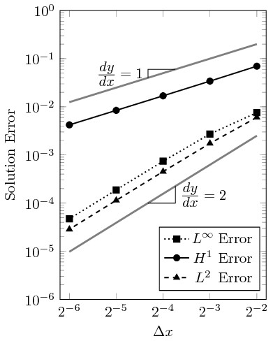
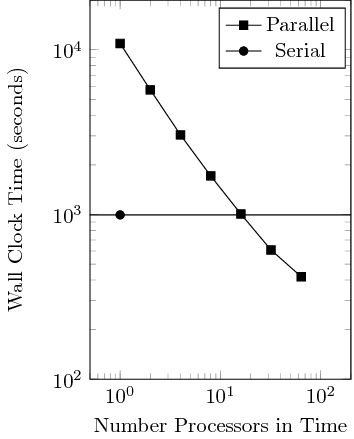

Overview
========

Over the last few years, the clock speed per processor core has stagnated.
This stagnation has lead to the design of larger core counts in high performance computing machines.
As a result of these developments, increased concurrency in numerical algorithms must be developed in order to take advantage of this architecture style.
Perhaps the largest bottleneck in concurrency for time-dependent simulations is traditional time integration methods.
Traditional time integration methods solve for the time domain sequentially, and as the spatial grid is refined a proportionally larger number of time steps must be taken to maintain accuracy and stability constraints.
While solving the time domain sequentially with a traditional time integration method is an optimal algorithm of order $\mathcal{O}(n)$, the $n$ time steps are not solved concurrently.

The goal of this project is to make use of the [XBraid library](https://computing.llnl.gov/projects/parallel-time-integration-multigrid) from Lawrence Livermore National Laboratory to solve the time domain in parallel using multigrid reduction in time techniques.
The XBraid library is implemented in C and aims to be a non-intrusive method to implement parallel time marching methods into existing codes.

Implementation
==============

XBraid introduction
-------------------

In order to use the XBraid library, several data structures and functions must be implemented and provided to the XBraid solver struct.
The two required data structures are the app and vector structures.
In general, the app struct contains the time independent data and the vector struct contains the time dependent data.
For this initial example, the time independent data includes the mesh which is fixed for all time steps, and the time dependent data is the solution state vector.
The functions tell XBraid how to perform operations on the data type used by your solver, in this case deal.II uses the Vector data type.
These operations include how to initialize the data at a given time, how to sum the data, and how to pack and unpack linear buffers for transmission to other processors via MPI.
The XBraid documentation should be read for a full list of functions that must be implemented and the details of what the function should do.

The typical format is the function is called with arguments of the app struct, one or more vector structs, and a status struct that contains information on the current status of the XBraid simulation (the current multigrid iteration, the level the function is being called from, the time and timestep number, etc.).

Perhaps the most important function is the step function.
This function tells XBraid how to advance the solution forward in time from the initial to the final times given in the status struct.
This method uses a traditional time integration method such as the fourth order explicit Runge Kutta method.

deal.II details
---------------

The solver used in this example is based off the heat equation solver from the step-26 tutorial of deal.II.
The HeatEquation class becomes member data to XBraid’s app struct, and XBraid’s vector struct becomes a wrapper for deal.II’s Vector data type.
The HeatEquation class cannot simply be used as is though as it contains both time dependent and time independent member data.
In order to simplify the problem the adaptive mesh refinement is removed.
Theoretically XBraid is capable of working with adaptive mesh refinement and in fact contains support for time refinement (which is also not used for simplicity).
All adaptive mesh refinement functionality is removed from the solver.
The time-dependent solution state vectors are also removed from the HeatEquation member data.
That time-dependent data will be provided at each timestep by XBraid via the vector struct.

Governing Equations {#math-details}
-------------------

In the default mode, this code solves the heat equation,
@f{align}
  \frac{\partial u}{\partial t} - \Delta u = f(\boldsymbol{x},t), \qquad \forall\boldsymbol{x}\in\Omega,t\in\left(
  0,T \right),
@f}
with initial conditions,
@f{align}
  u(\boldsymbol{x},0) = u_0(\boldsymbol{x}) = 0, \qquad \forall \boldsymbol{x}\in\Omega,
@f}
and Dirichlet boundary conditions,
@f{align}
  u(\boldsymbol{x},t) = g(\boldsymbol{x},t) = 0, \qquad \forall \boldsymbol{x}\in\partial\Omega,t\in\left( 0,T \right)
@f}
and forcing function,
@f{align}
  f(\mathbf x, t) = \left\{
  \begin{array}{ll}
    \chi_1(t) & \text{if  \(x>0.5\) and \(y>-0.5\)} \\
    \chi_2(t) & \text{if \(x>-0.5\) and \(y>0.5\)}
  \end{array}
  \right.
@f}
with,
@f{align}
  \chi_1(t) = \exp\left(-0.5\frac{(t-0.125)^2}{0.005}\right)
@f}
and,
@f{align}
  \chi_2(t) = \exp\left(-0.5\frac{(t-0.375)^2}{0.005}\right)
@f}
for some time $t$.
The forcing function is a Gaussian pulse in time that is centered around 0.125 time units for $\chi_1$ and 0.375 time units for $\chi_2$.
A Gaussian function was chosen because it is a continuous function in time and so the solution state can be compared bit-wise with the serial-in-time solution.

Method of Manufactured Solutions
--------------------------------

The method of manufactured solutions is used to test the correctness of the implementation.
In the method of manufactured solutions, we create a solution $u_h$ to the heat equation, then compute the boundary conditions, initial conditions, and forcing functions required to generate that solution.
This method is explained further in the step-7 tutorial of deal.II.
The created solution used is,
@f{align}
  u_h = \exp\left( -4\pi^2t \right) \cos(2 \pi x) \cos(2 \pi y), \qquad \forall \boldsymbol{x} \in \Omega \cup \partial\Omega
@f}
with derivatives,
@f{align}
  \frac{\partial u}{\partial t} &= -4 \pi^2 \exp{-4\pi 2t} \cos(2 \pi x)\cos(2 \pi y), \\
  -\Delta u &= 8 \pi^2 \exp\left(-4\pi^2t\right)\cos(2 \pi x)\cos(2 \pi y) \\
  \frac{\partial u}{\partial x} &= -2\pi \exp\left(-4\pi^2t\right)\sin(2\pi x)\cos(2\pi y) \\
 \frac{\partial u}{\partial x} &= -2 \pi \exp\left(-4\pi^2t\right)\cos(2\pi x)\sin(2\pi y)
@f}
and therefore we specify the forcing term, initial conditions, and boundary conditions of the governing equations as,
@f{align}
  f(\boldsymbol{x},t) &= 4 \pi^2 \exp\left(-4\pi^2t\right)\cos(2 \pi x)\cos(2 \pi y), &&\forall\boldsymbol{x}\in\Omega,t\in\left( 0,T \right), \\
  u_0(\boldsymbol{x}) &= \cos(2 \pi x)\cos(2\pi y), &&\forall \boldsymbol{x}\in\Omega, \\
  g(\boldsymbol{x},t) &= \exp\left(-4\pi^2t\right)\cos(2 \pi x)\cos(2\pi y), &&\forall \boldsymbol{x} \in \partial\Omega.
@f}

The manufactured solution is run on progressively more refined grids and the solution generated by the finite element method is compared to the exact solution $u_h$.
The convergence rate of the error is calculated with
@f{align}
  \Delta \epsilon_n = \frac{\ln{\epsilon_{n-1}/\epsilon_{n}}}{\ln{\frac\Delta x_{n-1}/\Delta x_{n}}}
@f}
where $\Delta \epsilon_n$ is the convergence rate of error $\epsilon$ between a mesh $n$ and coarser mesh $n-1$ that have a refinement ratio of $r_n$.
Shown in Table 1 are the errors of the $\textrm{L}^2$, $\textrm{H}^1$, and $\textrm{L}^\infty$ norms as the mesh is refined, and shown in Table 2 is the convergence rate.
The $\Delta t$ is reduced by a factor of 2 for every global refinement of the mesh.

| cycles | # cells | # dofs | $\textrm{L}^2$-error | $\textrm{H}^1$-error | $\textrm{L}^\infty$-error |
| :----: | :-----: | :----: | :------------------: | :------------------: | :-----------------------: |
| 125    | 48      | 65     | 6.036e-03            | 6.970e-02            | 7.557e-03                 |
| 250    | 192     | 225    | 1.735e-03            | 3.414e-02            | 2.721e-03                 |
| 500    | 768     | 833    | 4.513e-04            | 1.690e-02            | 7.410e-04                 |
| 1000   | 3072    | 3201   | 1.140e-04            | 8.426e-03            | 1.877e-04                 |
| 2000   | 12288   | 12545  | 2.859e-05            | 4.209e-03            | 4.715e-05                 |

| cycles | # cells | # dofs | Slope $\textrm{L}^2$ | Slope $\textrm{H}^1$ | Slope $\textrm{L}^\infty$ |
| :----: | :-----: | :----: | :------------------: | :------------------: | :-----------------------: |
| 125    | 48      | 65     | ---                  | ---                  | ---                       |
| 250    | 192     | 225    | 1.798                | 1.030                | 1.474                     |
| 500    | 768     | 833    | 1.943                | 1.014                | 1.877                     |
| 1000   | 3072    | 3201   | 1.985                | 1.004                | 1.981                     |
| 2000   | 12288   | 12545  | 1.995                | 1.001                | 1.993                     |

The convergence rate is plotted as a function of the grid spacing in the figure below.
As can be seen, the slope converges at a second order rate for the $\textrm{L}^2$ and $\textrm{L}^\infty$ norms and at a first order rate for the $\textrm{H}^1$ norms.
This is expected behavior as second order finite elements are used.



Code Organization
-----------------

#### The src directory

The entry point of the code is in parallel\_in\_time.cc and sets up XBraid for a simulation.
The XBraid setup involves initializing the app struct and configuring XBraid for the desired number of timesteps, number of iterations, and so forth.
The functions implemented for XBraid’s use are declared in `BraidFuncs.hh` and defined in `BraidFuncs.cc`.
The HeatEquation class and all deal.II functionality is declared in `HeatEquation.hh` and defined in `HeatEquationImplem.hh`.
Since HeatEquation is a class template, its definition file `HeatEquationImplem.hh` is included at the bottom of `HeatEquation.hh`.
Lastly various helper functions and variables such as the current processor id and the output stream are declared in `Utilities.hh` and defined in `Utilities.cc`.

#### The test directory

This directory contains tests to be built and run with CMake.
These tests verify the correct implementation of the various functions.

#### The doc directory

This directory is for storing further documentation of the code.
Not much is in this directory right now as most of the documentation is in the Readme or in comments of the source code files.
Documentation is generated from the Readme and code comments by deal.II’s documentation process.

Compiling
=========

To compile, you need deal.II and XBraid to be installed with development headers somewhere on your system.
Some implementation of MPI such as OpenMPI with development headers must also be installed.
The source code for deal.II is available at [deal.II’s website](https://dealii.org/) and the source code for XBraid is available at [LLNL’s website](https://computation.llnl.gov/projects/parallel-time-integration-multigrid).
See the documentation of each package for compilation and installation instructions.

Depending on where they are installed, `parallel_in_time` may need help finding these libraries.
To find deal.II, `parallel_in_time` first looks in typical deal.II install directories followed by one directory up (`../`), two directories up (`../../`), and lastly in the environment variable `DEAL_II_DIR`.
In contrast, XBraid currently does not have any default locations to look for and so the environment variable `BRAID_DIR` must be specified.
For MPI, `parallel_in_time` looks in standard installation folders only, for that reason I recommend you install MPI with your package manager.

A compile process of the parallel in time code may look like,

```
  mkdir build
  cd build
  BRAID_DIR=/path/to/braid/ cmake ../
  make
```

There is currently no option to install parallel\_in\_time anywhere.
The binaries are generated in the bin folder, and tests are placed into the test folder.
Options that can be passed to CMake for parallel\_in\_time include:

```
  CMAKE_BUILD_TYPE=Debug/Release
  DO_MFG=ON/OFF
  USE_MPI=ON/OFF
```

The build type specifies whether to compile with debugging symbols,
assertions, and optimizations or not.

The option for manufactured solutions (DO\_MFG) switches from solving the “standard” heat equation to solving a known solution heat equation so that the correctness of the code can be tested.

Lastly the MPI option is only used to specify where to write output information when using the pout() function from the `Utilities.hh` file.
If USE\_MPI is set to ON, then every processor writes to its own file called pout.&lt;\#&gt; where &lt;\#&gt; is the processor number.
If USE\_MPI is set to OFF, then every processor writes to stdout.

Running
=======

Once parallel\_in\_time has been compiled, the program can be run by calling the binary generated in `./build/bin/`.
The test can be run by calling ctest from inside the `build/` directory.
Unless the output path has been changed in the source code (currently hard coded), then the output files will be placed into the folder the command was called from.

There are no argument parameters for any of the binaries or tests.

Results
=======

To test the performance, a strong scaling study is run.
The spatial grid is fixed at 3201 degrees of freedom, and the spatial grid consists of 25,000 uniform timesteps.
No spatial parallelization is used and the grid is fixed for all timesteps.
The parallel in time solution is solved using XBraid’s multigrid reduction in time algorithm on 1, 2, 4, 16, 32, and 64 processors.
The serial in time solution is run on a single processor using traditional sequential time stepping.
The results are shown in figure below.
Running the multigrid algorithm on a single processor takes about an order of magnitude longer to run on a single processor than the serial algorithm on a single processor.
At 16 processors the multigrid algorithm the wall clock time is approximately the same for the serial algorithm as for the multigrid algorithm, and for 32 and 64 processors in time the wall clock is faster by about a factor of 2 for 64 processors.



Conclusions
===========

Using 64 times as many processors results in a speedup factor of approximately 2.
This is a fairly heavy computational cost for a slight speedup.
For comparison, in the reference paper they achieved a speedup of approximately 10 times when using 256 times as many processors as their serial case when solving the heat equation in two dimensions.
A similar increase in processors may be needed to increase the speedup factor of this code from 2 to 10.
The choice of whether to use serial in time or parallel in time largely rests in the size of problem being solved, the amount of computing resources available, and the urgency of the problem being solved.
Increasing the required number of timesteps will benefit the parallel in time algorithm provided enough extra resources are available.

Future Work
===========

There are many routes available for future work.
First there are many optimizations that could be made to speed up the existing code base such as exploring the different multigrid cycles and finding the optimal load balancing.
Ultimately those optimizations will probably only result in marginal gains per the reference paper.
Allowing XBraid to prolong and restrict the spatial grid may be one of the more promising avenues of improvement.

Future work that is of interest to the authors of XBraid is the development of adaptive mesh refinement (AMR) in a parallel in time algorithm.
A particular challenges with parallel-in-time AMR is the time subcylcing that occurs in spatial subdomains with sequential time stepping.
This code base does not use spatial subdomains with AMR and so could provide an easier understanding of the coarsening and refining of the time domain.
